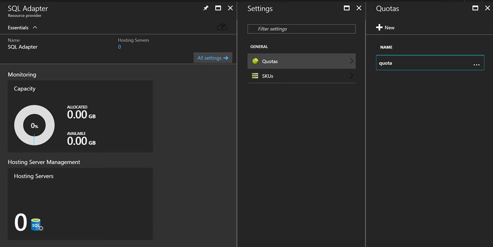

# Add hosting servers for use by the SQL adapter
You can use SQL instances on VMs inside of your Azure Stack, or an instance outside of your Azure Stack environment, provided the resource provider can connect to it. The general requirements are:

* The SQL instance must be dedicated for use by the RP and tenant workloads. You cannot use a SQL instance that is being used by any other consumer, including App Services.
* The RP adapter is not domain joined and can only connect using SQL authentication.
* You must configure an account with appropriate privileges for use by the RP.
* Network traffic from the RP to SQL uses port 1433, and cannot be changed.
* The RP and tenants such as Web Apps use the tenant network, so connectivity to the SQL instance on this network is required. This requirement typically means the IP for your SQL instances must be on a public network.
* Management of the SQL instances and their hosts is up to you; the RP does not perform patching, backup, credential rotation, etc.
* SKUs can be used to create different classes of SQL abilities, such as performance, AlwaysOn, etc.


A number of SQL IaaS virtual machine images are available through the Marketplace Management feature. Make sure you always download the latest version of the SQL IaaS Extension before you deploy a VM using a Marketplace item. The SQL images are the same as the SQL VMs that are available in Azure. For SQL VMs created from these images, the IaaS extension and corresponding portal enhancements provide features such as automatic patching and backup capabilities.

There are other options for deploying SQL VMs, including templates in the [Azure Stack Quickstart Gallery](https://github.com/Azure/AzureStack-QuickStart-Templates).

![NOTE] Any hosting servers installed on a multi-node Azure Stack must be created from a tenant subscription. They can't be created from the Default Provider Subscription. They must be created from the tenant portal or from a PowerShell session with an appropriate login. All hosting servers are chargeable VMs and must have appropriate SQL licenses. The service administrator _can_ be the owner of that subscription.


### Required Privileges

You can create a new administrative user with less than full sysadmin privileges. The specific operations that need to be allowed are:
1.	Database: Create, Alter, With Containment (AlwaysOn only), Drop, Backup
 
2.	Availability Group: Alter, Join, Add/Remove Database

3.	Login: Create, Select, Alter, Drop, Revoke

4.	Select Operations: \[master\].\[sys\].\[availability_group_listeners\] (AlwaysOn), sys.availability_replicas (AlwaysOn), sys.databases, \[master\].\[sys\].\[dm_os_sys_memory\], SERVERPROPERTY, \[master\].\[sys\].\[availability_groups\] (AlwaysOn), sys.master_files


## Provide capacity by connecting to a standalone hosting SQL server
You can use standalone (non-HA) SQL servers using any edition of SQL Server 2014 or SQL Server 2016. Make sure you have the credentials for an account with system admin privileges.

To add a standalone hosting server that is already provisioned, follow these steps:

1. Sign in to the Azure Stack admin portal as a service administrator

2. Click **Browse** &gt; **ADMINISTRATIVE RESOURCES** &gt; **SQL Hosting Servers**


	The **SQL Hosting Servers** blade is where you can connect the SQL Server Resource Provider to actual instances of SQL Server that serve as the resource provider’s backend.



3. Fill the form with the connection details of your SQL Server instance.

	

    > [!NOTE]
    > As long as the SQL instance can be accessed by the tenant and admin Azure Resource Manager, it can be placed under control of the resource provider. The SQL instance __must__ be allocated exclusively to the RP.

4. As you add servers, you must assign them to a new or existing SKU to differentiate service offerings. For example, you can have a SQL Enterprise instance providing:
  - database capacity
  - automatic backup
  - reserve high-performance servers for individual departments
  - and so on
  The SKU name should reflect the properties so that tenants can place their databases appropriately. All hosting servers in a SKU should have the same capabilities.

	An example:

	

>[!NOTE]
SKUs can take up to an hour to be visible in the portal. You cannot create a database until the SKU is fully created.

## Provide capacity using SQL AlwaysOn instances
Configuring SQL AlwaysOn instances requires additional steps and involves at least three VMs (or physical machines). 

> [!NOTE]
> The SQL adapter RP _only_ supports SQL 2016 SP1 Enterprise or later instances for AlwaysOn, as it requires new SQL features such as automatic seeding. In addition to the preceding common list of requirements:

* You must provide a file server in addition to the SQL AlwaysOn computers. There is an [Azure Stack Quickstart template](https://github.com/Azure/AzureStack-QuickStart-Templates/tree/master/sql-2016-ha) that can create this environment for you. It also can serve as a guide to building your own instance.

* You must set up the SQL servers. Specifically, you must enable [Automatic Seeding](https://docs.microsoft.com/sql/database-engine/availability-groups/windows/automatically-initialize-always-on-availability-group) on each availability group for each instance of SQL Server.

```
ALTER AVAILABILITY GROUP [<availability_group_name>] 
    MODIFY REPLICA ON 'InstanceName' 
    WITH (SEEDING_MODE = AUTOMATIC)
GO
```

On secondary instances
```
ALTER AVAILABILITY GROUP [<availability_group_name>] GRANT CREATE ANY DATABASE
GO

```


To add SQL AlwaysOn hosting servers, follow these steps:

1. Sign in to the Azure Stack admin portal as a service admin

2. Click **Browse** &gt; **ADMINISTRATIVE RESOURCES** &gt; **SQL Hosting Servers** &gt; **+Add**.

	The **SQL Hosting Servers** blade is where you can connect the SQL Server Resource Provider to actual instances of SQL Server that serve as the resource provider’s backend.


3. Fill the form with the connection details of your SQL Server instance. Provide the account information for the account you configured with system admin privileges.

4. Check this box to enable support for SQL AlwaysOn instances.

	

5. Provide the information for the file server share. The RP requires a share that allows read/write access for the SQL instance administrative account. The share is used during database creation; user data is not stored here.

6. Add the SQL AlwaysOn instance to a SKU. You cannot mix standalone servers with AlwaysOn instances in the same SKU. That will be determined when adding the first hosting server. Attempting to mix types afterwards will result in an error.


## Making SQL databases available to tenants

Create plans and offers to make SQL databases available for tenants. Add the Microsoft.SqlAdapter service to the plan, and add an existing Quota, or create a new one. If you create a quota, you can specify the capacity to allow the tenant.

 

## Maintenance of the SQL Adapter RP

Maintenance of the SQL instances is not covered here, except for password rotation information. You are responsible for patching and backup/recovery of the database servers used with the SQL Adapter.

### Patching and updating
 The SQL Adapter is not serviced as part of Azure Stack as it is an add-on component. Microsoft will be providing updates to the SQL Adapter as necessary. The SQL Adapter is instantiated on a _tenant_ virtual machine under the Default Provider Subscription. Therefore, it is necessary to provide Windows patches, anti-virus signatures, etc. The Windows update packages that are provided as part of the patch-and-update cycle can be used to apply updates to the Windows VM. When an updated adapter is released, a script is provided to apply the update. This script creates a new RP VM and migrate any state that you already have.

 ### Backup/Restore/Disaster Recovery
 The SQL Adapter is not backed up as part of Azure Stack BC-DR process, as it is an add-on component. Scripts will be provided to facilitate:
- backing up of necessary state information (stored in an Azure Stack storage account)
- and restoring the RP in the event a complete stack recovery becomes necessary.
Database servers must be recovered first (if necessary), before the RP is restored.

 ### Updating SQL credentials
 You are responsible for creating and maintaining system admin accounts on your SQL servers. The RP needs an account with these privileges to manage databases on behalf of tenants - it does not need access to the data in those databases. If you need to update the sa passwords on your SQL servers, you can use the update capability of the RP's administrator interface to change the stored password used by the RP. These passwords are stored in a Key Vault on your Azure Stack instance.

To modify the settings, click **Browse** &gt; **ADMINISTRATIVE RESOURCES** &gt; **SQL Hosting Servers** &gt; **SQL Logins** and select a login name. The change must be made on the SQL instance first (and any replicas, if necessary). In the **Settings** panel, click on **Password**.


## Next Steps

[Add databases](azure-stack-sql-resource-provider-databases.md)
