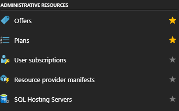

# Add hosting servers for the SQL resource provider

You can host a SQL instance on a virtual machine (VM) in [Azure Stack](azure-stack-poc.md), or on a VM outside your Azure Stack environment, as long as the SQL resource provider can connect to the instance.

> [!NOTE]
> SQL databases should be created on the SQL resource provider server. The SQL resource provider should be created in the default provider subscription while SQL hosting servers should be created in a billable, user subscription. The resource provider server should not be used to host user databases.

## Overview

Before you add a SQL hosting server, review the following mandatory and general requirements.

### Mandatory requirements

* Enable SQL authentication on the SQL Server instance. Because the SQL resource provider VM isn't domain joined, it can only connect to a hosting server using SQL authentication.
* Configure the IP addresses for the SQL instances as Public when installed on Azure Stack. The resource provider, and users, such as Web Apps, communicate over the user network, so connectivity to the SQL instance on this network is required.

### General requirements

* Dedicate the SQL instance for use by the resource provider and user workloads. You can't use a SQL instance that's being used by any other consumer. This restriction also applies to App Services.
* Configure an account with the appropriate privilege levels for the resource provider (described below).
* You are responsible for managing the SQL instances and their hosts.  For example, the resource provider doesn't apply updates, handle backups, or handle credential rotation.

### SQL Server virtual machine images

SQL IaaS virtual machine images are available through the Marketplace Management feature. These images are the same as the SQL VMs that are available in Azure.

Make sure you always download the latest version of the **SQL IaaS Extension** before you deploy a SQL VM using a Marketplace item. The IaaS extension and corresponding portal enhancements provide additional features such as automatic patching and backup. For more information about this extension, see [Automate management tasks on Azure Virtual Machines with the SQL Server Agent Extension](https://docs.microsoft.com/azure/virtual-machines/windows/sql/virtual-machines-windows-sql-server-agent-extension).

> [!NOTE]
> The SQL IaaS Extension is _required_ for all SQL on Windows images in the marketplace; the VM will fail to deploy if you did not download the extension. It is not used with Linux-based SQL virtual machine images.

There are other options for deploying SQL VMs, including templates in the [Azure Stack Quickstart Gallery](https://github.com/Azure/AzureStack-QuickStart-Templates).

> [!NOTE]
> Any hosting servers installed on a multi-node Azure Stack must be created from a user subscription and not the Default Provider Subscription. They must be created from the user portal or from a PowerShell session with an appropriate login. All hosting servers are billable VMs and must have appropriate SQL licenses. The service administrator _can_ be the owner of that subscription.

### Required Privileges

You can create an administrative user with lower privileges than a SQL sysadmin. The user only needs permissions for the following operations:

* Database: Create, Alter, With Containment (for Always On only), Drop, Backup
* Availability Group: Alter, Join, Add/Remove Database
* Login: Create, Select, Alter, Drop, Revoke
* Select Operations: \[master\].\[sys\].\[availability_group_listeners\] (AlwaysOn), sys.availability_replicas (AlwaysOn), sys.databases, \[master\].\[sys\].\[dm_os_sys_memory\], SERVERPROPERTY, \[master\].\[sys\].\[availability_groups\] (AlwaysOn), sys.master_files

### Additional Security Information

The following information provides additional security guidance:

* All Azure Stack storage is encrypted using BitLocker, so any SQL instance on Azure Stack will use encrypted blob storage.
* The SQL Resource Provider fully supports TLS 1.2. Ensure that any SQL Server that is managed through the SQL RP is configured for TLS 1.2 _only_ and the RP will default to that. All supported versions of SQL Server support TLS 1.2, see [TLS 1.2 support for Microsoft SQL Server](https://support.microsoft.com/en-us/help/3135244/tls-1-2-support-for-microsoft-sql-server).
* Use SQL Server Configuration Manager to set the **ForceEncryption** option to ensure all communications to the SQL server are always encrypted. See [To configure the server to force encrypted connections](https://docs.microsoft.com/sql/database-engine/configure-windows/enable-encrypted-connections-to-the-database-engine?view=sql-server-2017#ConfigureServerConnections).
* Ensure any client application is also communicating over an encrypted connection.
* The RP is configured to trust the certificates used by the SQL Server instances.

## Provide capacity by connecting to a standalone hosting SQL server

You can use standalone (non-HA) SQL servers using any edition of SQL Server 2014 or SQL Server 2016. Make sure you have the credentials for an account with sysadmin privileges.

To add a standalone hosting server that's already set up, follow these steps:

1. Sign in to the Azure Stack operator portal as a service administrator.

2. Select **All services** &gt; **ADMINISTRATIVE RESOURCES** &gt; **SQL Hosting Servers**.

   

   Under **SQL Hosting Servers**,  you can connect the SQL resource provider to instances of SQL Server that will serve as the resource provider’s backend.

   

3. Click **Add** and then provide the connection details for your SQL Server instance on the **Add a SQL Hosting Server** blade.

   

    Optionally, provide an instance name, and specify a port number if the instance isn't assigned to the default port of 1433.

   > [!NOTE]
   > As long as the SQL instance can be accessed by the user and admin Azure Resource Manager, it can be placed under control of the resource provider. The SQL instance __must__ be allocated exclusively to the resource provider.

4. As you add servers, you must assign them to an existing SKU or create a new SKU. Under **Add a Hosting Server**, select **SKUs**.

   * To use an existing SKU, choose an available SKU and then select **Create**.
   * To create a SKU, select **+ Create new SKU**. In **Create SKU**, enter the required information, and then select **OK**.

     

## Provide high availability using SQL Always On Availability Groups

Configuring SQL Always On instances requires additional steps and requires three VMs (or physical machines.) This article assumes that you already have a solid understanding of Always On availability groups. For more information, see the following articles:

* [Introducing SQL Server Always On availability groups on Azure virtual machines](https://docs.microsoft.com/azure/virtual-machines/windows/sql/virtual-machines-windows-portal-sql-availability-group-overview)
* [Always On Availability Groups (SQL Server)](https://docs.microsoft.com/sql/database-engine/availability-groups/windows/always-on-availability-groups-sql-server?view=sql-server-2017)

> [!NOTE]
> The SQL adapter resource provider _only_ supports SQL 2016 SP1 Enterprise or later instances for Always On Availability Groups. This adapter configuration requires new SQL features such as automatic seeding.

### Automatic seeding

You must enable [Automatic Seeding](https://docs.microsoft.com/sql/database-engine/availability-groups/windows/automatically-initialize-always-on-availability-group) on each availability group for each instance of SQL Server.

To enable automatic seeding on all instances, edit and then run the following SQL command on the primary replica for each secondary instance:

  ```sql
  ALTER AVAILABILITY GROUP [<availability_group_name>]
      MODIFY REPLICA ON '<secondary_node>'
      WITH (SEEDING_MODE = AUTOMATIC)
  GO
  ```

The availability group must be enclosed in square brackets.

On the secondary nodes, run the following SQL command:

  ```sql
  ALTER AVAILABILITY GROUP [<availability_group_name>] GRANT CREATE ANY DATABASE
  GO
  ```

### Configure contained database authentication

Before adding a contained database to an availability group, ensure that the contained database authentication server option is set to 1 on every server instance that hosts an availability replica for the availability group. For more information, see [contained database authentication Server Configuration Option](https://docs.microsoft.com/sql/database-engine/configure-windows/contained-database-authentication-server-configuration-option?view=sql-server-2017).

Use these commands to set the contained database authentication server option for each instance:

  ```sql
  EXEC sp_configure 'contained database authentication', 1
  GO
  RECONFIGURE
  GO
  ```

### To add SQL Always On hosting servers

1. Sign in to the Azure Stack Administration portal as a service admin.

2. Select **Browse** &gt; **ADMINISTRATIVE RESOURCES** &gt; **SQL Hosting Servers** &gt; **+Add**.

   Under **SQL Hosting Servers**, you can connect the SQL Server Resource Provider to actual instances of SQL Server that serve as the resource provider’s backend.

3. Fill out the form with the connection details for your SQL Server instance. Make sure that you use the FQDN address of the Always On Listener (and optional port number and instance name). Provide the information for the account you configured with sysadmin privileges.

4. Check the Always On Availability Group box to enable support for SQL Always On Availability Group instances.

   

5. Add the SQL Always On instance to a SKU.

   > [!IMPORTANT]
   > You can't mix standalone servers with Always On instances in the same SKU. Attempting to mix types after adding the first hosting server results in an error.

## SKU notes

You can use SKUs to differentiate service offerings. For example, you can have a SQL Enterprise instance that has the following characteristics:
  
* high capacity
* high-performance
* high availability

SKUs can't be assigned to specific users or groups in this release.

 SKUs can take up to an hour to be visible in the portal. Users can't create a database until the SKU is fully created.

>[!TIP]
>Use a SKU name that reflects describes the capabilities of the servers in the SKU, such as capacity and performance. The name serves as an aid to help users deploy their databases to the appropriate SKU.

As a best practice, all the hosting servers in a SKU should have the same resource and performance characteristics.

## Make the SQL databases available to users

Create plans and offers to make SQL databases available for users. Add the **Microsoft.SqlAdapter** service to the plan and create a new quota.

## Next steps

[Add databases](azure-stack-sql-resource-provider-databases.md)
