<properties
	pageTitle="Deploy the SQL Server resource provider on Azure Stack | Microsoft Azure"
	description="Detailed steps to deploy a SQL Server Resource Provider Adapter on Azure Stack."
	services="azure-stack"
	documentationCenter=""
	authors="Dumagar"
	manager="byronr"
	editor=""/>

<tags
	ms.service="multiple"
	ms.workload="na"
	ms.tgt_pltfrm="na"
	ms.devlang="na"
	ms.topic="article"
	ms.date="04/27/2016"
	ms.author="dumagar"/>

# Deploy the SQL Server Resource Provider Adapter on Azure Stack

Use this article to follow the detailed steps for setting up the SQL Server Resource Provider Adapter on the Azure Stack proof of concept (POC). See [use SQL databases on Azure Stack](azure-stack-sql-rp-deploy-short.md) to understand resource provider capabilities and architecture.

## Set up steps before you deploy

Before you deploy the resource provider, you need to:

- Have a default Windows Server image with .NET 3.5
- Turn off Internet Explorer (IE) Enhanced Security
- Install the latest version of Azure PowerShell

### Create an image of Windows Server including .NET 3.5

You can skip this step if you downloaded the Azure Stack bits after 2/23/2016 because the default base Windows Server 2012 R2 image includes .NET 3.5 framework in this download and later.

If you downloaded before 2/23/2016, you need to create a Windows Server 2012 R2 Datacenter VHD with .NET 3.5 image and set is as the default image in the Platform Image repository. For more information, see [Create an image of Windows Server 2012R2 including .NET 3.5](azure-stack-add-image-pir.md#create-an-image-of-windowsserver2012r2-including-&#046;net-3&#046;5).

### Turn off IE enhanced security and enable cookies

To deploy a resource provider, you run the PowerShell Integrated Scripting Environment (ISE) as an administrator, so you need to allow cookies and JavaScript in the Internet Explorer profile you use to sign in to Azure Active Directory for both administrator and user sign-ins.

**To turn off IE enhanced security:**

1. Sign in to the Azure Stack proof-of-concept (PoC) computer as an AzureStack/administrator, and then open Server Manager.

2. Turn off **IE Enhanced Security Configuration** for both Admins and Users.

3. Sign in to the **ClientVM.AzureStack.local** virtual machine as an administrator, and then open Server Manager.

4. Turn off **IE Enhanced Security Configuration** for both Admins and Users.

**To enable cookies:**

1. On the Windows Start screen, click **All apps**, click **Windows accessories**, right-click **Internet Explorer**, point to **More**, and then click **Run as administrator**.

2. If prompted, check **Use recommended security**, and then click **OK**.

3. In Internet Explorer, click the **Tools (gear) icon** &gt; **Internet options** &gt; **Privacy** tab.

4. Click **Advanced**, make sure that both **Accept** buttons are selected, click **OK**, and then click **OK** again.

5. Close Internet Explorer and restart PowerShell ISE as an administrator.

### Install an Azure Stack compatible release of Azure PowerShell

1. Uninstall any existing Azure PowerShell from your Client VM.

2. Sign in to the Azure Stack POC machine as an AzureStack/administrator.

3. Using Remote Desktop, sign in to the **ClientVM.AzureStack.local** virtual machine as an administrator.

4. Open the Control Panel, click **Uninstall a program** &gt; click **Azure PowerShell** &gt; click **Uninstall**.

5. [Download the latest Azure PowerShell that supports Azure Stack](http://aka.ms/azstackpsh) and install it.

    After you install PowerShell, you can run this verification PowerShell script to make sure that you can connect to your Azure Stack instance (a login web page should appear).

## Bootstrap the resource provider deployment PowerShell

1. Connect the Azure Stack POC remote desktop to clientVm.AzureStack.Local and sign in as azurestack\\azurestackuser.

2. [Download the SQLRP binaries](http://aka.ms/massqlrprfrsh) file. You may need to remove the Internet download security block by right-clicking on the file, selecting **Properties** and from the **General** tab, tick **Unblock**, **OK**. This should prevent 'Could not load file or assembly' exceptions related to DeploymentTelemetry.dll and the subsequent Trace-Deployment exceptions.

3. Extract the files to D:\\SQLRP.

4. Run the D:\\SQLRP\\Bootstrap.cmd file as an administrator (azurestack\\administrator).

	This opens the Bootstrap.ps1 file in the PowerShell ISE.

5. When the PowerShell ISE window completes loading, click the play button or press F5.

	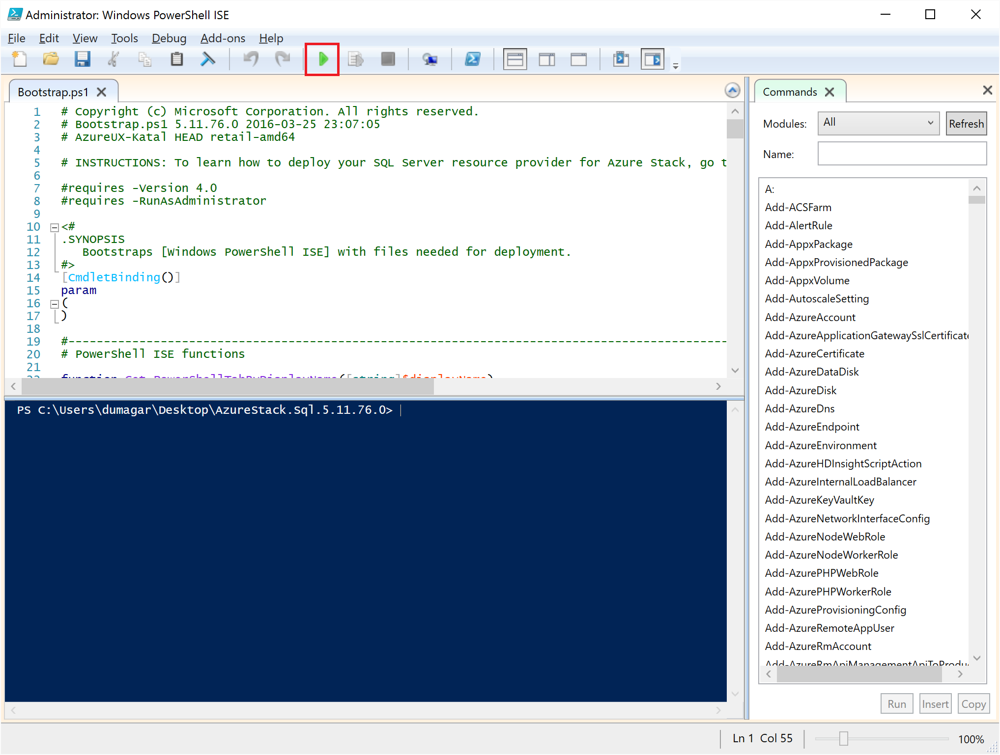

	Two major tabs will load, each containing all the scripts and files you need to deploy the resource provider.

## Prepare prerequisites

Click the **Prepare Prerequisites** tab to:

- Create required certificates
- Upload artifacts to a storage account on Azure Stack
- Publish gallery items

### Create the required certificates
This **New-SslCert.ps1** script adds the \_.AzureStack.local.pfx SSL certificate to the D:\\SQLRP\\Prerequisites\\BlobStorage\\Container folder. The certificate secures communication between the resource provider and the local instance of the Azure Resource Manager.

1. In the **Prepare Prerequisites** major tab, click the **New-SslCert.ps1** tab and run it.

2. In the prompt that appears, type a PFX password that protects the private key and **Make a note of this password**. You'll need it later.

### Upload all artifacts to a storage account on Azure Stack

1. Click the **Upload-Microsoft.Sql-RP.ps1** tab and run it.

2. In the Windows PowerShell credential request dialog box, type the Azure Stack service administrator credentials.

3. When prompted for the Azure Active Directory Tenant ID, type your Azure Active Directory tenant fully qualified domain name: for example, microsoftazurestack.onmicrosoft.com.

	A pop-up window asks for credentials.

	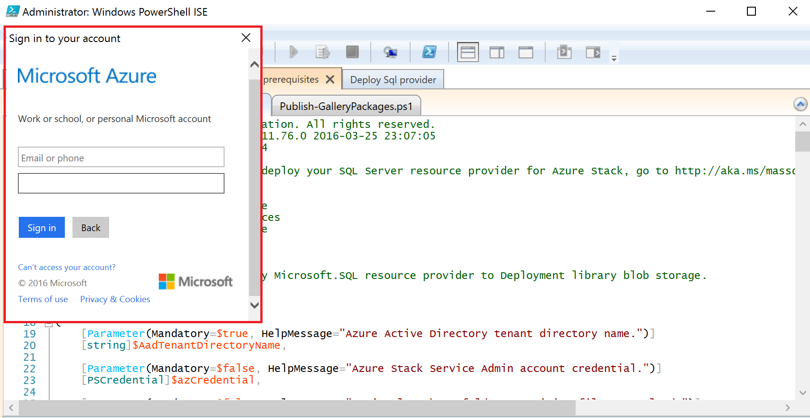

	> [AZURE.TIP] If the pop-up doesn't appear, you either haven’t turned off IE enhanced security to enable JavaScript on this machine and user, or you haven’t accepted cookies in IE. See [Set up steps before you deploy](#set-up-steps-before-you-deploy).

4. Type your Azure Stack Service Admin credentials and then click **Sign In**.

### Publish gallery items for later resource creation

Select the **Publish-GalleryPackages.ps1** tab and run it. This script adds two marketplace items to the Azure Stack POC portal’s marketplace that you can use to deploy database resources as marketplace items.

## Deploy the SQL Server Resource Provider VM

Now that you have prepared the Azure Stack PoC with the necessary certificates and marketplace items, you can deploy a SQL Server Resource Provider. Click the **Deploy SQL provider** tab to:

   - Provide values in a JSON file that the deployment process references
   - Deploy the resource provider
   - Update the local DNS
   - Register the SQL Server Resource Provider Adapter

### Provide values in the JSON file

Click **Microsoft.Sqlprovider.Parameters.JSON**. This file has parameters that the Azure Resource Manager template needs to properly deploy to Azure Stack.

1. Fill out the **empty** parameters in the JSON file:

	- Make sure you provide the **adminusername** and **adminpassword** for the SQL Resource Provider VM:

		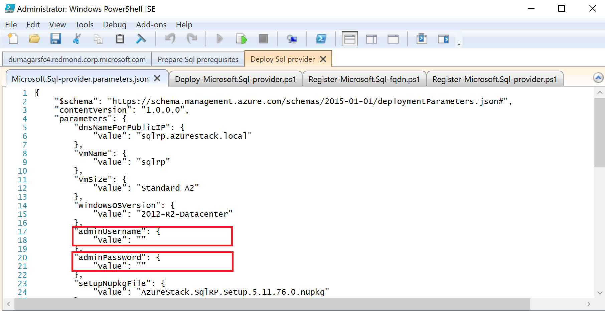

	- Make sure you provide the password for the **SetupPfxPassword** parameter that you made a note of in the [Prepare prequisites](#prepare-prerequisites) step:

    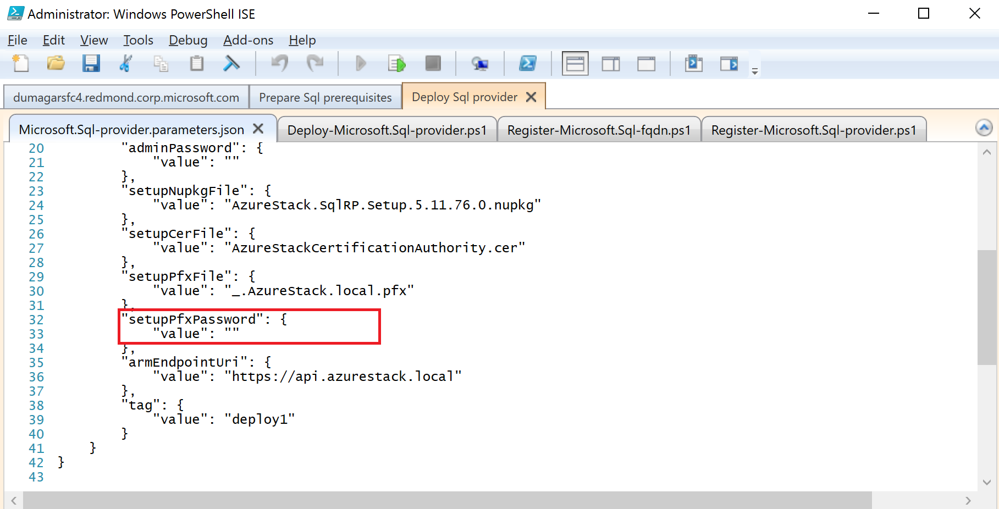

2. Click **Save** to save the parameter file.

### Deploy the resource provider

1. Click the **Deploy-Microsoft.sql-provider.PS1** tab and run the script.
2. Type your tenant name in Azure Active Directory when prompted.
3. In the pop-up window, submit your Azure Stack service admin credentials.

The full deployment may take between 25 and 55 minutes on some highly utilized Azure Stack POCs. The longest steps will be the Desired State Configuration (DSC) extension and the PowerShell execution, which is the final step. Each may take 10-25 minutes.

### Update the local DNS

1. Click the **Register-Microsoft.SQL-fqdn.ps1** tab and run the script.
2. When prompted for Azure Active Directory Tenant ID, input your Azure Active Directory tenant fully qualified domain name: for example, **microsoftazurestack.onmicrosoft.com**.

### Register the SQL RP Resource Provider##

1. Click the **Register-Microsoft.SQL-provider.ps1** tab and run the script.

2. When prompted for credentials, use the following values for user name and password:

   - **sqlRpUsername**
   - **sqlRpPassw0rd**

   > [AZURE.IMPORTANT] These are the *literal* values that you need to type when prompted for credentials. These are not placeholders. **Do *not* type** the username\password you saved in the parameter file before deploying the VM.

## Verify the deployment using the Azure Stack Portal

1. Sign out of the ClientVM and sign in again as **AzureStack\AzureStackUser**.

2. On the desktop, click **Azure Stack POC Portal** and sign in to the portal as the service admin.

3. Verify that the deployment succeeded. Click **Browse** &gt; **Resource Groups** &gt; click the resource group you used (default is **SQLRP**), and then make sure that the essentials part of the blade (upper half) reads **deployment succeeded**.

      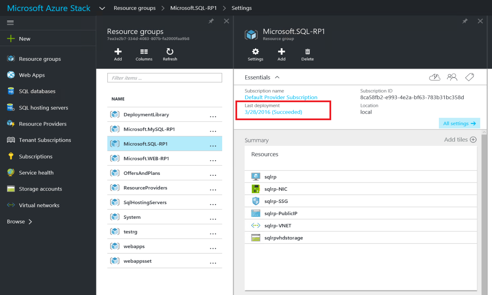

4. Verify that the registration succeeded. Click **Browse** &gt; **Resource providers**, and then look for **SQL Local**:

      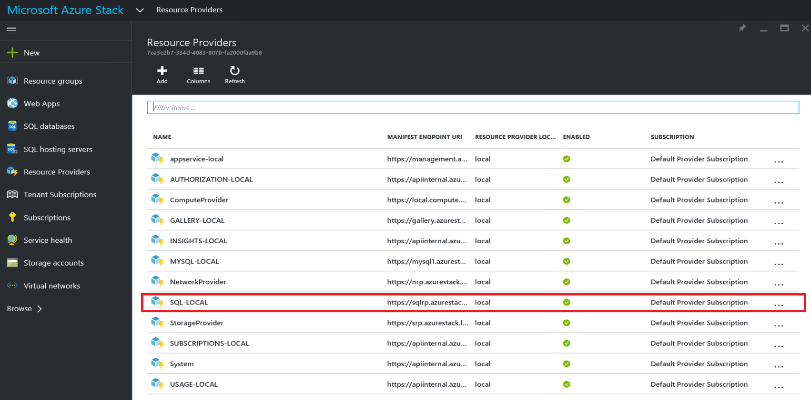

## Provide capacity to your SQL Resource Provider by connecting it to a hosting SQL server

1. Sign in to the Azure Stack POC portal as a service admin

2. Click **Resource Providers** &gt; **SQL Local** &gt; **Go To Resource Provider Management** &gt; **Servers** &gt; **Add**.

	The **SQL Hosting Servers** blade is where you can connect the SQL Server Resource Provider to actual instances of SQL Server that serve as the resource provider’s backend.

	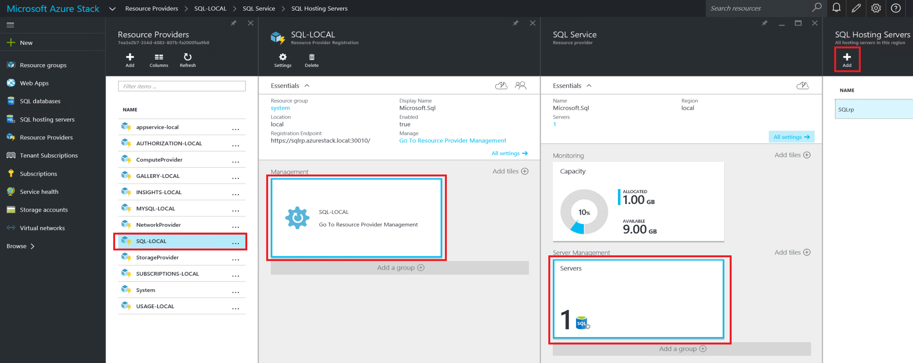

3. Fill the form with the connection details of your SQL Server instance. By default, a preconfigured SQL Server called “SQLRP” with the administrator username “sa” and the password you called out in the “adminpassword” parameter in the parameters JSON is running on the VM.

## Create your first SQL Database to test your deployment

1. Sign in to the Azure Stack POC portal as service admin.

2. Click **Browse** &gt;**SQL Databases** &gt; **Add**
  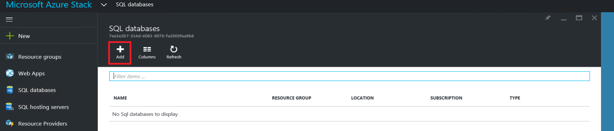

3. Fill in the form with database details, including a **Server Name**, **Server Admin Login**, and **Password** for a new *virtual server* in the **New Server** blade.

	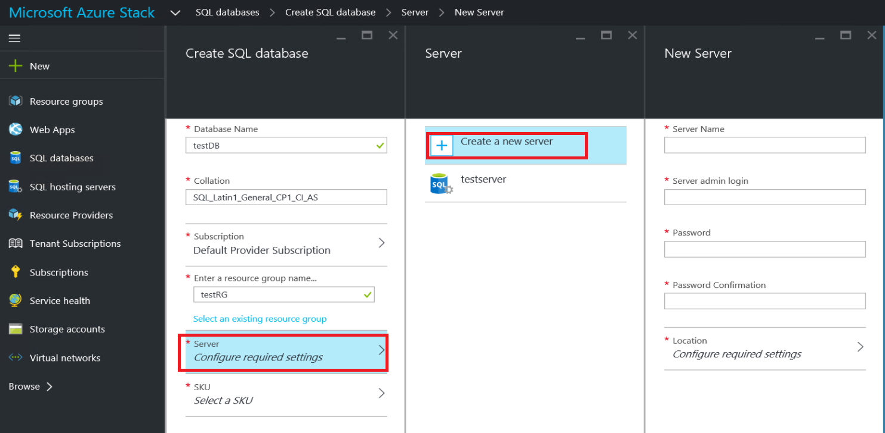

	The virtual server is an artificial construct. It doesn’t map to the SQL Server itself but instead manifests through the username inside the connection string, which the resource provider generates at the end of this process. **Note the password you input separately for the virtual server**. The portal will never show the password.

4. You're asked to pick a pricing tier for your database.

	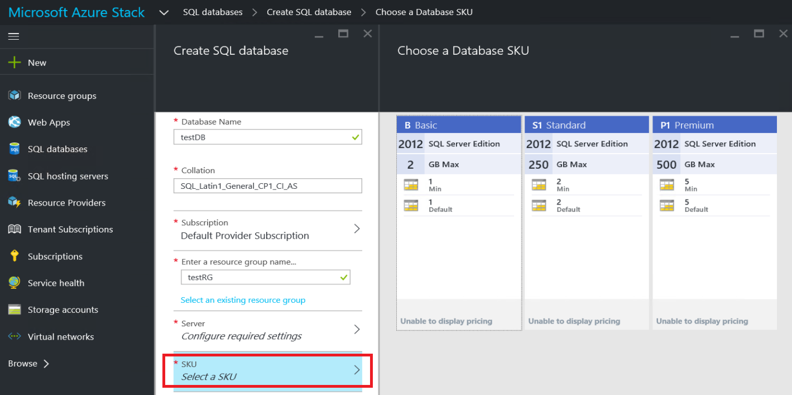

	Tiers are not implemented in this version, but their consumption is tracked by the Azure Resource Manager as a way to showcase the differentiation you can create in quota enforcement etc.

5. Submit the form and wait for the deployment to complete.

6. In the resulting blade, notice the “Connection string” field. You can use that string in any application that requires SQL Server access (for example, a web app) in your Azure Stack.

	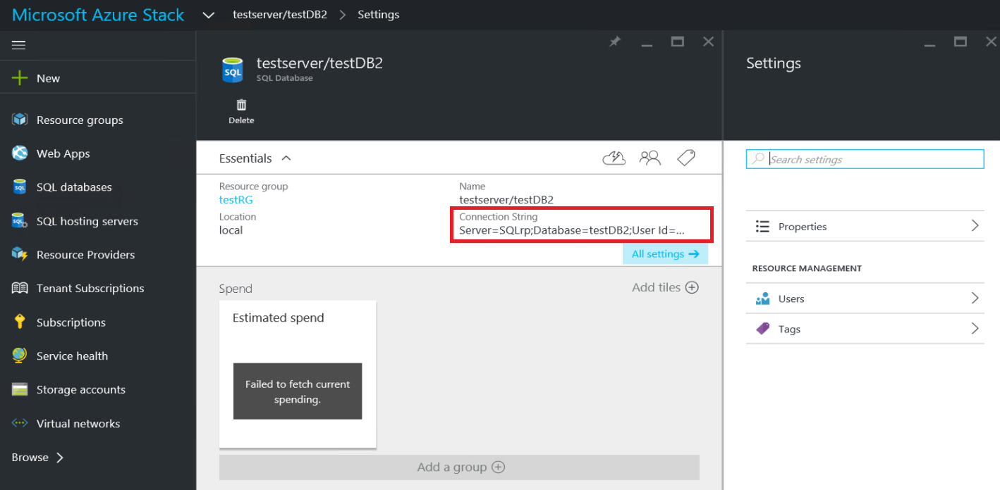

## Next steps

Try other [PaaS services](azure-stack-tools-paas-services.md) like the [MySQL Server resource provider](azure-stack-mysql-rp-deploy-short.md) and the [Web Apps resource provider](azure-stack-webapps-deploy.md).
