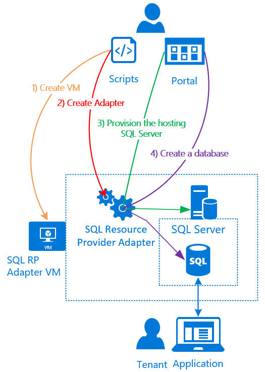

<properties
	pageTitle="Using SQL databases on Azure Stack | Microsoft Azure"
	description="Learn how you can deploy SQL databases as a service on Azure Stack and the quick steps to deploy the SQL Server Resource Provider Adapter."
	services="azure-stack"
	documentationCenter=""
	authors="Dumagar"
	manager="byronr"
	editor=""/>

<tags
	ms.service="multiple"
	ms.workload="na"
	ms.tgt_pltfrm="na"
	ms.devlang="na"
	ms.topic="article"
	ms.date="04/27/2016"
	ms.author="dumagar"/>

# Using SQL databases on Azure Stack

Use the SQL Server Resource Provider Adapter to expose SQL databases as an Azure Stack service. After you install the resource provider, you and your users can create databases for cloud-native apps, SQL-based websites, and SQL-based workloads without having to provision a virtual machine that hosts SQL Server each time.

Because the resource provider doesn't have all the capabilities of Azure SQL Database during the POC, this article begins with an overview of the resource provider architecture. Then you get a quick overview of the steps to set up the resource provider, with links to the more detailed steps in [Deploy the SQL Database Resource Provider Adapter on Azure Stack POC](azure-stack-sql-rp-deploy-long.md).

## SQL Server Resource Provider Adapter architecture
The resource provider doesn't offer all the database management capabilities of Azure SQL Database--for example, elastic database pools and the ability to dial database performance up and down on the fly aren't available. But the resource provider does support the same create, read, update, and delete (CRUD) operations available in Azure SQL Database.

The resource provider is made up of three components:

- **The SQL Resource Provider Adapter VM**, which encompasses the resource provider process and the hosting SQL Servers
- **The resource provider itself**, which processes provisioning requests and exposes databases resources
- **Hosting SQL Servers**, which provide capacity for databases

The conceptual diagram below shows these components and the steps you go through as you deploy the resource provider, set up a hosting SQL Server, and then create a database.

## Quick steps to deploy the resource provider
Use these steps if you're already familiar with Azure Stack. If you want more detail, follow the links in each section or go straight to [Deploy the SQL Database Resource Provider Adapter on Azure Stack POC](azure-stack-sql-rp-deploy-long.md).

1.  Make sure you fulfill all [set up steps before you deploy](azure-stack-sql-rp-deploy-long.md#set-up-steps-before-you-deploy):

  - .NET 3.5 framework already set up in the base Windows Server image (if you downloaded the Azure Stack bits after 2/23/2016, you can skip this step)
  - [Azure-Stack-Compatible PowerShell release](http://aka.ms/azStackPsh)
  - IE security settings configured properly on the ClientVM ([Turn off IE enhanced security and enable cookies](azure-stack-sql-rp-deploy-long.md#Turn-off-IE-enhanced-security-and-enable-cookies))

2. [Download the SQL Server RP binaries](http://aka.ms/massqlrprfrsh) and extract the zip file to the ClientVM in your Azure Stack POC.

3. [Run the bootstrap.cmd and script](azure-stack-sql-rp-deploy-long.md#Bootstrap-the-resource-provider-deployment-PowerShell-and-Prepare-for-deployment)

	A set of scripts grouped by two major tabs open in the PowerShell Integrated Scripting Environment (ISE). Run all the loaded scripts in sequence from left to right in each tab.

4. Run scripts in the "Prepare" tab from left to right to:

	- Create a wildcard certificate to secure communication between the resource provider and Azure Resource Manager.
	- Upload the certificates and all other artifacts to an Azure Stack storage account.
	- Publish gallery packages to allow deployment SQL and resources through gallery.

	> [AZURE.IMPORTANT] If any of the above scripts hangs for no apparent reason after submitting your AAD tenant, your security settings might be blocking one of the DLLs required for the deployment to run. To resolve this, look for the Microsoft.AzureStack.Deployment.Telemetry.Dll in your RP folder, right click it, click **Properties** and check **Unblock** in the "General" tab.

5. Run scripts in the  “Deploy” tab from left to right to:

	- [Deploy a VM](azure-stack-sql-rp-deploy-long.md#Deploy-the-SQL-Server-Resource-Provider-VM) that hosts both your resource provider and hosting SQL Server. This script references a JSON parameter file, which you need to update with some values before you run the script.
	- [Register a local DNS record](azure-stack-sql-rp-deploy-long.md#Update-the-local-DNS) that maps to your resource provider VM.
	- [Register your resource provider](azure-stack-sql-rp-deploy-long.md#Register-the-SQL-RP-Resource-Provider) with the local Azure Resource Manager.

	> [AZURE.IMPORTANT] All scripts assume the base operating system image fulfills the prerequisites (.NET 3.5, Javascript and cookies enabled on the clientVM, and a compatible version of Azure PowerShell). If you get errors running the scripts, double-check that you fulfilled the prerequisites.

6. [Connect the resource provider to a hosting SQL Server](#Provide-capacity-to-your-SQL-Resource-Provider-by-connecting-it-to-a-hosting-SQL-server) in the Azure Stack portal. Click **Browse** &gt; **Resource** **Providers** &gt; **SQLRP** &gt; **Go to Resource Provider** **Management** &gt; **Servers** &gt; **Add**

	Use “sa” for username and the password you used when you deployed the resource provider VM.

7. [Test your new SQL Server RP](/azure-stack-sql-rp-deploy-long.md#create-your-first-sql-database-to-test-your-deployment) by deploying a SQL database in the Azure Stack portal. Click **Create &gt; Custom &gt; SQL Server Database**.

This should get your SQL Server Resource Provider up and running in about 45 minutes (depending on your hardware).
