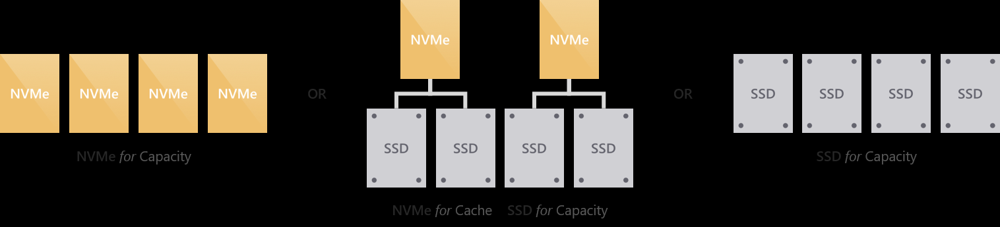
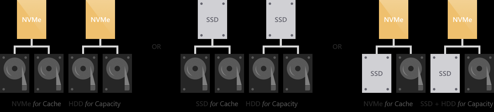
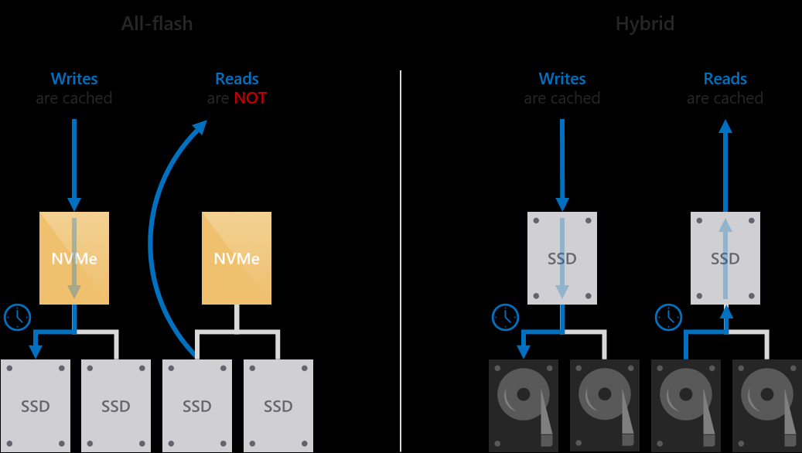
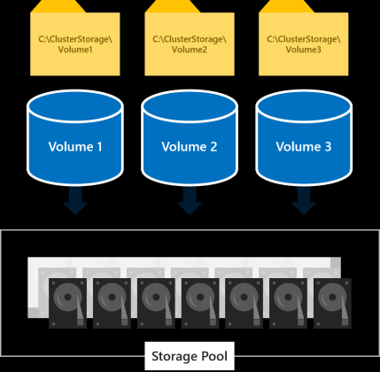
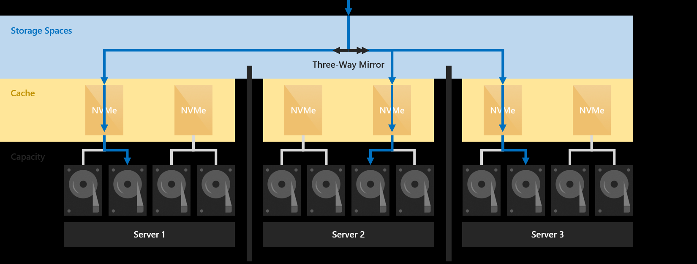

# Manage storage infrastructure for Azure Stack

*Applies to: Azure Stack integrated systems and Azure Stack Development Kit*

This article describes the health and operational status of Azure Stack storage infrastructure resources. These resources include storage drives and volumes. The information in this topic can be invaluable when trying to troubleshoot various issues such as a drive can't be added to a pool.

## Understand drives and volumes

### Drives

Powered by Windows Server software, Azure Stack defines storage capabilities with a combination of Storage Spaces Direct (S2D) and Windows Server Failover Clustering to provide a performant, scalable, and resilient storage service.

Azure Stack integrated system partners offer numerous solution variations, including a wide range of storage flexibility. You currently can select a combination of three drive types: NVMe (Non-Volatile Memory Express), SATA/SAS SSD (Solid-State Drive), HDD (Hard Disk Drive).

Storage Spaces Direct features a cache to maximize storage performance. In Azure Stack appliance with single or multiple types of drives, Storage Spaces Direct automatically use all drives of the "fastest" (NVMe &gt; SSD &gt; HDD) type for caching. The remaining drives are used for capacity. The drives could be grouped into either an "all-flash" or "hybrid" deployment:



All-flash deployments aim to maximize storage performance and do not include rotational hard disk drives (HDD).



Hybrid deployments aim to balance performance and capacity or to maximize capacity and do include rotational hard disk drives (HDD).

The behavior of the cache is determined automatically based on the type(s) of drives that are being cached for. When caching for solid-state drives (such as NVMe caching for SSDs), only writes are cached. This reduces wear on the capacity drives, reducing the cumulative traffic to the capacity drives and extending their lifetime. In the meantime, because reads do not significantly affect the lifespan of flash, and because solid-state drives universally offer low read latency, reads are not cached. When caching for hard disk drives (such as SSDs caching for HDDs), both reads and writes are cached, to provide flash-like latency (often /~10x better) for both.



For the available configuration of storage, you can check Azure Stack OEM partner (https://azure.microsoft.com/overview/azure-stack/partners/) for detailed specification.

> [!Note]  
> Azure Stack appliance can be delivered in a hybrid deployment, with both HDD and SSD (or NVMe) drives. But the drives of faster type would be used as cache drives, and all remaining drives would be used as capacity drives as a pool. The tenant data (blobs, tables, queues and disks) would be placed on capacity drives. So provisioning premium disks or selecting premium storage account type doesn't mean the objects are guaranteed to be allocated on SSD or NVMe drives and gain greater performance.

### Volumes

The *storage service* partitions the available storage into separate volumes that are allocated to hold system and tenant data. Volumes combine the drives in the storage pool to introduce the fault tolerance, scalability, and performance benefits of Storage Spaces Direct.



There are three types of volumes created on Azure Stack storage pool:

-   Infrastructure: host files used by Azure Stack infrastructure VMs and core services.

-   VM Temp: host the temporary disks attached to tenant VMs and that data is stored in these disks.

-   Object Store: host tenant data servicing blobs, tables, queues and VM disks.

In a multi-node deployment, you would see three infrastructure volumes, while the number of VM Temp volumes and Object Store volumes is equal to the number of the nodes in the Azure Stack deployment:

-   On a four-node deployment, there are four equal VM Temp volumes and four equal Object Store volumes.

-   If you add a new node to the cluster, there would be a new volume for both types be created.

-   The number of volumes remains the same even if a node malfunctioning or is removed.

-   If you use the Azure Stack Developer Kit, there is a single volume with multiple shares.

Volumes in Storage Spaces Direct provide resiliency to protect against hardware problems, such as drive or server failures, and to enable continuous availability throughout server maintenance, such as software updates. Azure Stack deployment is using three-way mirroring to ensure data resilience. Three copies of tenant data are written to different servers, where they land in cache:



Mirroring provides fault tolerance by keeping multiple copies of all data. How that data is striped and placed is non-trivial (see this blog to learn more), but it is absolutely true to say that any data stored using mirroring is written, in its entirety, multiple times. Each copy is written to different physical hardware (different drives in different servers) that are assumed to fail independently. Three-way mirroring can safely tolerate at least two hardware problems (drive or server) at a time. For example, if you're rebooting one server when suddenly another drive or server fails, all data remains safe and continuously accessible.

## Volume states

To find out what state volumes are in, use the following PowerShell commands:

```powershell
$scaleunit_name = (Get-AzsScaleUnit)[0].name

$subsystem_name = (Get-AzsStorageSubSystem -ScaleUnit $scaleunit_name)[0].name

Get-AzsVolume -ScaleUnit $scaleunit_name -StorageSubSystem $subsystem_name | Select-Object VolumeLabel, HealthStatus, OperationalStatus, RepairStatus, Description, Action, TotalCapacityGB, RemainingCapacityGB
```

Here's an example of output showing a detached volume and a degraded/incomplete volume:

| VolumeLabel | HealthStatus | OperationalStatus |
|-------------|--------------|------------------------|
| ObjStore_1 | Unknown | Detached |
| ObjStore_2 | Warning | {Degraded, Incomplete} |

The following sections list the health and operational states.

### Volume health state: Healthy

| Operational state | Description |
|-------------------|---------------------------------------------------------------------------------------------------------------------------------------------------------------------------------------------------------------------------------------------------------------------------------------------------------------------------|
| OK | The volume is healthy. |
| Suboptimal | Data isn't written evenly across drives.<br> <br>**Action:** Please contact Support to optimize drive usage in the storage pool. Before you do, start the log file collection process using the guidance from https://aka.ms/azurestacklogfiles. You may have to restore from backup after the failed connection is restored. |


### Volume health state: Warning

When the volume is in a Warning health state, it means that one or more copies of your data are unavailable, but Azure Stack can still read at least one copy of your data.

| Operational state | Description |
|-------------------|---------------------------------------------------------------------------------------------------------------------------------------------------------------------------------------------------------------------------------------------------------------------------------------|
| In service | Azure Stack is repairing the volume, such as after adding or removing a drive. When the repair is complete, the volume should return to the OK health state.<br> <br>**Action:** Wait for Azure Stack to finish repairing the volume, and check the status afterward. |
| Incomplete | The resilience of the volume is reduced because one or more drives failed or are missing. However, the missing drives contain up-to-date copies of your data.<br> <br>**Action:** Reconnect any missing drives, replace any failed drives, and bring online any servers that are offline. |
| Degraded | The resilience of the volume is reduced because one or more drives failed or are missing, and there are outdated copies of your data on these drives.<br> <br>**Action:** Reconnect any missing drives, replace any failed drives, and bring online any servers that are offline. |

 

### Volume health state: Unhealthy

When a volume is in an Unhealthy health state, some or all of the data on the volume is currently inaccessible.

| Operational state | Description |
|-------------------|------------------------------------------------------------------------------------------------------------------------------------------------------------------------------------------------------------------|
| No redundancy | The volume has lost data because too many drives failed.<br> <br>**Action:** Please contact Support. Before you do, start the log file collection process using the guidance from https://aka.ms/azurestacklogfiles. |


### Volume health state: Unknown

The volume can also be in the Unknown health state if the virtual disk has become detached.

| Operational state | Description |
|-------------------|-----------------------------------------------------------------------------------------------------------------------------------------------------------------------------------------------------------------------------------------------------------------------------------------------------------------------------------------------------------------------------------------------------------------------------------------------------------------------|
| Detached | A storage device failure occurred which may cause the volume to be inaccessible. Some data may be lost.<br> <br>**Action:** <br>1. Check the physical and network connectivity of all storage devices.<br>2. If all devices are connected correctly, please contact Support. Before you do, start the log file collection process using the guidance from https://aka.ms/azurestacklogfiles. You may have to restore from backup after the failed connection is restored. |

## Drive states

Use the following PowerShell commands to monitor the state of drives:

```powershell
$scaleunit_name = (Get-AzsScaleUnit)[0].name

$subsystem_name = (Get-AzsStorageSubSystem -ScaleUnit $scaleunit_name)[0].name

, SerialNumber

Get-AzsDrive -ScaleUnit $scaleunit_name -StorageSubSystem $subsystem_name | Select-Object StorageNode, PhysicalLocation, HealthStatus, OperationalStatus, Description, Action, Usage, CanPool, CannotPoolReason, SerialNumber, Model, MediaType, CapacityGB
```

The following sections describe the health states a drive can be in.

### Drive health state: Healthy

| Operational state | Description |
|-------------------|---------------------------------------------------------------------------------------------------------------------------------------------|
| OK | The volume is healthy. |
| In service | The drive is performing some internal housekeeping operations. When the action is complete, the drive should return to the OK health state. |

### Drive health state: Healthy

A drive in the Warning state can read and write data successfully but has an issue.

| Operational state | Description |
|---------------------------|-----------------------------------------------------------------------------------------------------------------------------------------------------------------------------------------------------------------------------------------------------------------------------------------------------------------------------------------------------------------------------------------------------------------------------------------------------------------------------------------------------------------------|
| Lost communication | Connectivity has been lost to the drive.<br> <br>**Action:** Bring all servers back online. If that doesn't fix it, reconnect the drive. If this keeps happening, replace the drive to ensure full resiliency. |
| Predictive failure | A failure of the drive is predicted to occur soon.<br> <br>**Action:** Replace the drive as soon as possible to ensure full resiliency. |
| IO error | There was a temporary error accessing the drive.<br> <br>**Action:** If this keeps happening, replace the drive to ensure full resiliency. |
| Transient error | There was a temporary error with the drive. This usually means the drive was unresponsive, but it could also mean that the Storage Spaces Direct protective partition was inappropriately removed from the drive. <br> <br>**Action:** If this keeps happening, replace the drive to ensure full resiliency. |
| Abnormal latency | The drive is sometimes unresponsive and is showing signs of failure.<br> <br>**Action:** If this keeps happening, replace the drive to ensure full resiliency. |
| Removing from pool | Azure Stack is in the process of removing the drive from its storage pool.<br> <br>**Action:** Wait for Azure Stack to finish removing the drive, and check the status afterward.<br>If the status remains, please contact Support. Before you do, start the log file collection process using the guidance from https://aka.ms/azurestacklogfiles. |
|  |  |
| Starting maintenance mode | Azure Stack is in the process of putting the drive in maintenance mode. This is a temporary state - the drive should soon be in the In maintenance mode state.<br> <br>**Action:** Wait for Azure Stack to finish the process, and check the status afterward. |
| In maintenance mode | The drive is in maintenance mode, halting reads and writes from the drive. This usually means Azure Stack administration tasks such as PNU or FRU is operating the drive. But administrator could also place the drive in maintenance mode.<br> <br>**Action:** Wait for Azure Stack to finish the administration task, and check the status afterward.<br>If the status remains, please contact Support. Before you do, start the log file collection process using the guidance from https://aka.ms/azurestacklogfiles. |
|  |  |
| Stopping maintenance mode | Azure Stack is in the process of bringing the drive back online. This is a temporary state - the drive should soon be in another state - ideally Healthy.<br> <br>**Action:** Wait for Azure Stack to finish the process, and check the status afterward. |

 

### Drive health state: Unhealthy

A drive in the Unhealthy state can't currently be written to or accessed.

| Operational state | Description |
|-------------------------|----------------------------------------------------------------------------------------------------------------------------------------------------------------------------------------------------------------------------------------------------------------------------------------------------------------------------------------|
| Split | The drive has become separated from the pool.<br> <br>**Action:** Replace the drive with a new disk. If you must use this disk, remove the disk from the system, make sure there is no useful data on the disk, erase the disk, and then reseat the disk. |
| Not usable | The physical disk is quarantined because it is not supported by your solution vendor. Only disks that are approved for the solution and have the correct disk firmware are supported.<br> <br>**Action:** Replace the drive with a disk that has an approved manufacturer and model number for the solution. |
| Stale metadata | The replacement disk was previously used and may contain data from an unknown storage system. The disk is quarantined.        <br> <br>**Action:** Replace the drive with a new disk. If you must use this disk, remove the disk from the system, make sure there is no useful data on the disk, erase the disk, and then reseat the disk. |
| Unrecognized metadata | Unrecognized metadata found on the drive, which usually means that the drive has metadata from a different pool on it.<br> <br>**Action:** Replace the drive with a new disk. If you must use this disk, remove the disk from the system, make sure there is no useful data on the disk, erase the disk, and then reseat the disk. |
| Failed media | The drive failed and won't be used by Storage Spaces anymore.<br> <br>**Action:** Replace the drive as soon as possible to ensure full resiliency. |
| Device hardware failure | There was a hardware failure on this drive. <br> <br>**Action:** Replace the drive as soon as possible to ensure full resiliency. |
| Updating firmware | Azure Stack is updating the firmware on the drive. This is a temporary state that usually lasts less than a minute and during which time other drives in the pool handle all reads and writes.<br> <br>**Action:** Wait for Azure Stack to finish the updating, and check the status afterward. |
| Starting | The drive is getting ready for operation. This should be a temporary state - once complete, the drive should transition to a different operational state.<br> <br>**Action:** Wait for Azure Stack to finish the operation, and check the status afterward. |
 

## Reasons a drive can't be pooled

Some drives just aren't ready to be in Azure Stack storage pool. You can find out why a drive isn't eligible for pooling by looking at the CannotPoolReason property of a drive. The following table gives a little more detail on each of the reasons.

| Reason | Description |
|--------------------------|---------------------------------------------------------------------------------------------------------------------------------------------------------------------------------------------------------------------------------------------------------------------|
| Hardware not compliant | The drive isn't in the list of approved storage models specified by using the Health Service.<br> <br>**Action:** Replace the drive with a new disk. |
| Firmware not compliant | The firmware on the physical drive isn't in the list of approved firmware revisions by using the Health Service.<br> <br>**Action:** Replace the drive with a new disk. |
| In use by cluster | The drive is currently used by a Failover Cluster.<br> <br>**Action:** Replace the drive with a new disk. |
| Removable media | The drive is classified as a removable drive. <br> <br>**Action:** Replace the drive with a new disk. |
| Not healthy | The drive isn't in a healthy state and might need to be replaced.<br> <br>**Action:** Replace the drive with a new disk. |
| Insufficient capacity | There are partitions taking up the free space on the drive.<br> <br>**Action:** Replace the drive with a new disk. If you must use this disk, remove the disk from the system, make sure there is no useful data on the disk, erase the disk, and then reseat the disk. |
| Verification in progress | The Health Service is checking to see if the drive or firmware on the drive is approved for use.<br> <br>**Action:** Wait for Azure Stack to finish the process, and check the status afterward. |
| Verification failed | The Health Service couldn't check to see if the drive or firmware on the drive is approved for use.<br> <br>**Action:** Please contact Support. Before you do, start the log file collection process using the guidance from https://aka.ms/azurestacklogfiles. |
| Offline | The drive is offline. <br> <br>**Action:** Please contact Support. Before you do, start the log file collection process using the guidance from https://aka.ms/azurestacklogfiles. |

## Next step

[Manage storage capacity](https://docs.microsoft.com/azure/azure-stack/azure-stack-manage-storage-shares) 