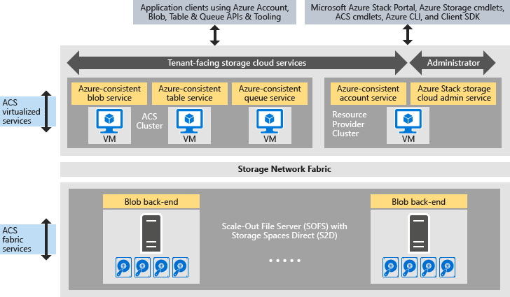

<properties
	pageTitle="Introduction to Azure-consistent storage  | Microsoft Azure"
	description="Learn about Azure-consistent storage"
	services="azure-stack"
	documentationCenter=""
	authors="AniAnirudh"
	manager="darmour"
	editor=""/>

<tags
	ms.service="azure-stack"
	ms.workload="na"
	ms.tgt_pltfrm="na"
	ms.devlang="na"
	ms.topic="get-started-article"
	ms.date="09/26/2016"
	ms.author="anirudha"/>

# Introduction to Azure-consistent storage
Azure-consistent storage is the set of storage cloud services in
Microsoft Azure Stack. Azure-consistent storage provides blob, table, queue, and account
management functionality with Azure-consistent semantics. It also provides functionality to
help a cloud administrator manage storage services. This article introduces
Azure-consistent storage and discusses how storage cloud services in Azure
Stack nicely complement the rich [software-defined storage
capabilities in Windows Server
2016](https://blogs.technet.microsoft.com/windowsserver/2016/04/14/ten-reasons-youll-love-windows-server-2016-5-software-defined-storage/).

Azure-consistent storage delivers the following broad categories of functionality:

- **Blobs**: page blobs, block blobs, and append blobs with
    [Azure-consistent
    blob](https://msdn.microsoft.com/library/azure/dd179355.aspx#Anchor_1)
    behavior

- **Tables**: entities, partitions, and other table properties with
    [Azure-consistent
    table](https://msdn.microsoft.com/library/azure/dd179355.aspx#Anchor_3)
    behavior

- **Queues**: reliable and persistent messages and queues with
    [Azure-consistent
    queue](https://msdn.microsoft.com/library/azure/dd179355.aspx#Anchor_2)
    behavior

- **Accounts**: storage account resource management with
    [Azure-consistent
    account](https://azure.microsoft.com/documentation/articles/storage-create-storage-account/)
    behavior for general-purpose storage accounts provisioned via the [Azure
    Resource Manager deployment
    model](https://azure.microsoft.com/documentation/articles/resource-manager-deployment-model/)

- **Administration**: management of tenant-facing and Azure-consistent storage internal
    storage services (discussed in other articles)

## Azure-consistent storage architecture

Figure 1. Azure-consistent
storage: solution view

## Azure-consistent storage virtualized services and clusters

In the Azure-consistent storage architecture, all tenant or administrator-accessible  storage
services are virtualized. That is, they run in service provider-managed,
highly available VMs based on
[Hyper-V](https://technet.microsoft.com/library/dn765471.aspx)
functionality in [Windows Server
2016](http://www.microsoft.com/server-cloud/products/windows-server-2016/).
Although the VMs are highly available based on [Windows Server Failover
Clustering](https://technet.microsoft.com/library/dn765474.aspx)
technology, the Azure-consistent storage virtualized services themselves are guest-clustered,
highly available services based on [Azure Service Fabric
technology](http://azure.microsoft.com/campaigns/service-fabric/).

Azure-consistent storage employs two Service Fabric clusters in an Azure Stack deployment.
The Storage Resource Provider service is deployed on a Service Fabric
cluster (“RP cluster”) that is also shared by other foundational
resource provider services. The rest of the storage virtualized data path
services--including the Blob, Table, and Queue services--are hosted on
a second Service Fabric cluster (“Azure-consistent storage cluster”).

## Blob service and software-defined storage

The Blob service back end, on the other hand, runs directly on the
[Scale-Out File Server](https://technet.microsoft.com/library/hh831349.aspx)
cluster nodes. In the Azure Stack solution architecture, Scale-Out File Server is
based on the [Storage Spaces Direct](https://technet.microsoft.com/library/mt126109.aspx)-based,
shared-nothing failover cluster. Figure 1 depicts the major Azure-consistent storage
component services and their distributed deployment model. As you see in
the diagram, Azure-consistent storage dovetails with existing software-defined storage features in Windows Server 2016. No special
hardware is required for Azure-consistent storage beyond these Windows Server platform
requirements.

## Storage Farm

Storage Farm is the collection of storage infrastructure, resources, and
back-end services that together provide tenant-facing and administrator-facing
Azure-consistent storage services in an Azure Stack deployment. Specifically, Storage Farm includes the following:

- Storage hardware (for example, Scale-Out File Server nodes, disks)

- Storage fabric resources (for example, SMB shares)

- Storage-related Service Fabric services (for example, Blob endpoint service
    off the Azure-consistent storage cluster)

- Storage-related services that run on Scale-Out File Server nodes (for example, the Blob service)

## IaaS and PaaS storage usage scenarios

Azure-consistent storage page blobs, as in Azure, provide the virtual disks in all
infrastructure as a service (IaaS) usage scenarios:

- Create a VM by using the custom OS disk in a page blob

- Create a VM by using the custom OS image in a page blob

- Create a VM by using an Azure Marketplace image in a new page blob

- Create a VM by using a blank disk in a new page blob

Similarly, for platform as a service (PaaS) scenarios, Azure-consistent storage block blobs,
append blobs, queues, and tables work as they do in Azure.

## User roles

Azure-consistent storage is valuable for two user roles:

- Application owners, including developers and enterprise IT. They no
    longer have to maintain or deploy two versions of an application
    and scripts that accomplish the same job across a public cloud and
    a hosted/private cloud in a datacenter. Azure-consistent storage provides storage services via REST API, SDK, cmdlet, and Azure Stack portal.

- Service providers, including enterprise IT, who deploy and manage
    Microsoft Azure Stack-based, multitenant storage cloud
    services.

## Next steps

-  [Azure-consistent storage:
    differences and considerations] (azure-stack-acs-differences-tp2.md)
