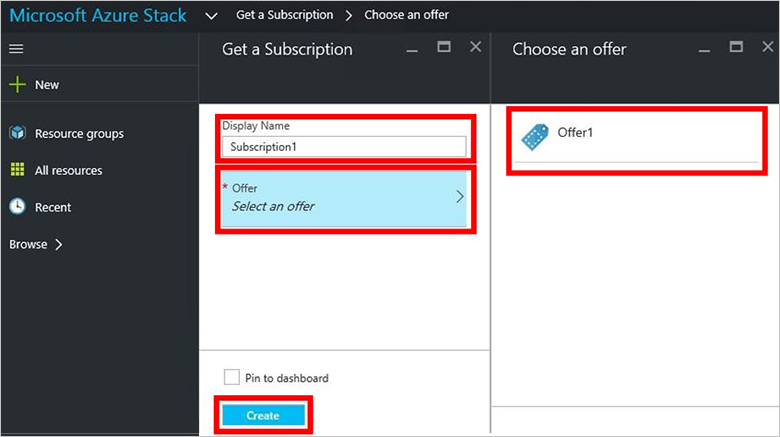
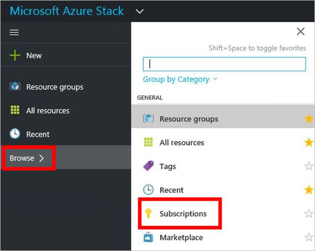

<properties
	pageTitle="Subscribe to an offer and then provision a VM in Azure Stack (tenant) | Microsoft Azure"
	description="As a tenant, learn how to subscribe to an offer and then provision a VM in Azure Stack."
	services="azure-stack"
	documentationCenter=""
	authors="ErikjeMS"
	manager="byronr"
	editor=""/>

<tags
	ms.service="azure-stack"
	ms.workload="na"
	ms.tgt_pltfrm="na"
	ms.devlang="na"
	ms.topic="get-started-article"
	ms.date="05/25/2016"
	ms.author="erikje"/>

# Subscribe to an offer

Now that you've [created an offer](azure-stack-create-offer.md), test that your tenants can  create a subscription.

1.  On the Azure Stack POC computer, log in to `https://portal.azurestack.local` as [a tenant](azure-stack-connect-azure-stack.md#log-in-as-a-tenant) and click **Get a Subscription**.

    

2.  In the **Display Name** field, type a name for your subscription, click **Offer**, click one of the offers in the **Choose an offer** blade, and then click **OK**.

	

4.  To view the subscription you just created, click **Browse**, click **Subscriptions**, then click your new subscription.  

	

	

	

After you subscribe to an offer, wait until the subscription state is InSync. Then refresh the portal to see which services are part of the new subscription.

## Next steps

[Storage accounts](azure-stack-provision-storage-account.md)
