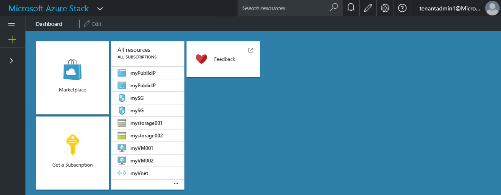
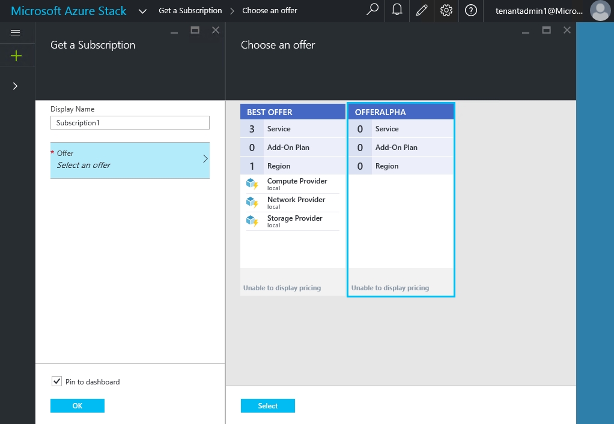

<properties 
	pageTitle="Subscribe to an offer and then provision a VM (tenant)" 
	description="Subscribe to an offer and then provision a VM (tenant)" 
	services="" 
	documentationCenter="" 
	authors="v-anpasi" 
	manager="v-kiwhit" 
	editor=""/>

<tags 
	ms.service="multiple" 
	ms.workload="na" 
	ms.tgt_pltfrm="na" 
	ms.devlang="na" 
	ms.topic="article" 
	ms.date="1/04/2016" 
	ms.author="v-anpasi"/>

# Subscribe to an offer and then provision a VM (tenant)

Now that the service administrator has created an offer, tenants can subscribe to it. The tenant can then use the subscription to provision a virtual machine.

1.  Subscribe to an offer.

2.  Provision a virtual machine.

For both of these steps, you must be signed in as a tenant. If you haven’t created a tenant account yet, follow the steps in Appendix A: Add new user in Azure Active Directory.

## Subscribe to an offer

1.  In a browser, navigate to <https://portal.azurestack.local> and sign in as a tenant and click **Get a Subscription**.

    

2.  Fill in **Display Name** or use the default (the name of the offer). 

	

3.  Click **Offer,** select an offer, click **Select**, and then click **OK**.  

	

4.  To view the subscription, click **Browse**, and then click **Subscriptions**.  

	

## Provision a virtual machine

1.  Click **New**, click **Compute**, and then click **WindowsServer-2012-R2-Datacenter**.  

	

2.  In the **Basics** blade, provide a **Name**, **User name**, **Password**, and **Resource Group,** and then click **OK**.  

	

3.  In the **Choose a size** blade, click **A1 Basic**, and then click **Select**.  

	

4.  In the **Settings** blade, accept all the defaults and click **OK**.  

	

5.  In the Summary blade, click **OK** to create the virtual machine.  

	

[AZURE.NOTE] When you subscribe to an offer, you have to wait till subscription state is InSync **then** refresh the portal or login/logout to see the services as part of that subscription.
