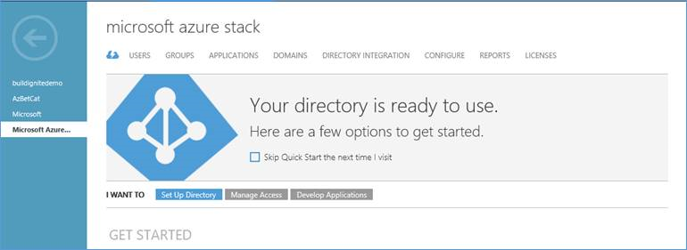
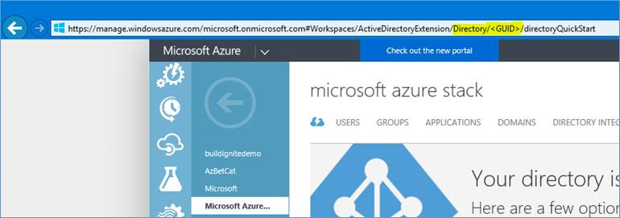
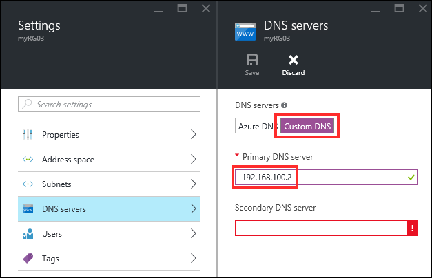
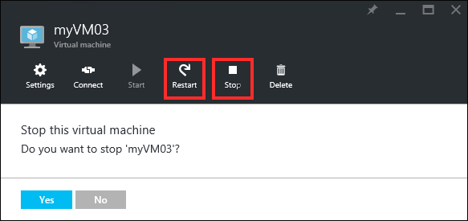

<properties
	pageTitle="Microsoft Azure Stack troubleshooting | Microsoft Azure"
	description="Azure Stack troubleshooting."
	services="azure-stack"
	documentationCenter=""
	authors="heathl17"
	manager="byronr"
	editor=""/>

<tags
	ms.service="azure-stack"
	ms.workload="na"
	ms.tgt_pltfrm="na"
	ms.devlang="na"
	ms.topic="article"
	ms.date="08/08/2016"
	ms.author="helaw"/>

# Microsoft Azure Stack troubleshooting

If you experience issues while deploying or using Microsoft Azure Stack, refer to the guidance below. But first, make sure that your deployment environment complies with all [requirements](azure-stack-deploy.md) and [preparations](azure-stack-run-powershell-script.md). In particular, make sure you comply with the storage configuration requirements and this note:

>[AZURE.IMPORTANT] Only one NIC is allowed during the deployment process. If you want to use a specific NIC, you must disable all the others.

The recommendations for troubleshooting issues that are described in this section are derived from several sources and may or may not resolve your particular issue. Code examples are provided as is and expected results cannot be guaranteed. This section is not comprehensive of all troubleshooting issues for Microsoft Azure Stack, and it is subject to frequent edits and updates as improvements to the product are implemented.

## Azure Active Directory

### JavaScript error when attempting to connect via AAD and Azure PowerShell

Two options are possible to work around this:

1. Disable Internet Explorer Enhanced Security Configuration on the Host / ClientVM (wherever PowerShell will be executed that pops up the AAD login).

2. Add three websites to the trusted list:
  - https://login.microsoftonline.com 
  - https://*.microsoftonline-p.com 
  - https://login.live.com

Also, depending on your current actions, please ensure you are running PowerShell as the regular Azure Stack user (default user when leveraging the ClientVM) and are not using “Run As Administrator” (different context). Logging in temporarily as the administrator, you could also set these options in this other user context.

### Cookies error when attempting to connect via AAD and AzureRM PowerShell

If you encounter this issue, the workaround is: 

1. In Internet Explorer, Open Internet Settings 
2. Privacy Tab 
3. Click on Advanced 
4. Click On Ok immediately 
5. Close Browser 
6. Try again

>[AZURE.NOTE] You may need to manually find iexplore.exe in the Program Files\Internet Explorer directory.

## Deployment

### At the end of the deployment, the PowerShell session is still open and doesn’t show any output

This is probably just the result of the default behavior of a PowerShell command window, when it has been selected. The POC deployment had actually succeeded but the script was paused when selecting the window. Please press the ESC key to unselect it, and the completion message should be shown after it.

### POC Deployment fails at “DomainJoin” step

POC deployment fails if your DNS server resolves AzureStack.local to another address external to the POC environment.

As a workaround if this is not a separate entry you have control over within your environment, you can add an entry in the hosts file on the POC host machine to point to the ADVM:

1.  Add the following entry in the hosts file under C:\Windows\System32\drivers\etc (you need local administrator privileges to do so)
'192.168.100.2       Azurestack.local'

3.  Re-run the POC deployment script. You do not need to reinstall the host machine

###  My deployment fails with an error about a time and/or date difference between the client and server

Please check your BIOS settings, in case there is an option to synchronize time. We have seen this issue with HP servers (DL380 G9), using the “Coordinated Universal Time” feature. This is what step #8 in the deployment guide means: “Configure the BIOS to use Local Time instead of UTC.” 

### Installing .NET Framework 3.5 on a Windows Server 2012 R2 machine, from the command line

Here are two methods:

Method 1:

1. Download Windows Server 2012 R2 ISO, and copy the “sources\sxs” folder to local machine (e.g. “c:\sources\ws2012r2\sxs”)
2. Mount Image:
`Dism /Mount-Image /ImageFile:C:\ClusterStorage\Volume1\Share\CRP\PlatformImages\WindowsServer2012R2DatacenterEval\WindowsServer2012R2DatacenterEval.vhd /index:1 /MountDir:C:\OfflineImg`
3. Check if .Net Framework 3.5 is installed (NetFx3)
`DISM /Image:c:\OfflineImg /Get-Features /Format:Table`
4. Install .Net Framework 3.5 specifying the “sxs” sources
`DISM /Image:c:\OfflineImg /Enable-Feature /FeatureName:NetFx3 /All /LimitAccess /Source:C:\Sources\WS2012R2\sxs`
5. Check .Net Framework 3.5 was installed (NetFx3)
`DISM /Image:c:\OfflineImg /Get-Features /Format:Table`
A status of “Enable Pending” indicates that the image must be brought online to complete the installation.
6. Unmount image and commit changes
`Dism /Unmount-Image /MountDir:c:\OfflineImg /commit`

Method 2:

Mount the Windows Server 2012R2 ISO and run:
`Install-WindowsFeature -Vhd C:\ClusterStorage\Volume1\Share\CRP\PlatformImages\WindowsServer2012R2DatacenterEval\WindowsServer2012R2DatacenterEval.vhd -Name NET-Framework-Core -Source X:\sources\sxs\`

### The POC deployment fails with AAD error “User realm discovery failed”

This error indicates that deployment script is unable to connect to the Internet for Azure Active Directory (AAD) authentication via the NATVM. Please verify the PortalVM has Internet connectivity by browsing to https://login.windows.net
- If you are using a static IP / gateway, you need to specify the NATVM static IP / gateway as parameters (NATVMStaticIP and  NATVMStaticGateway) when running the deployment script.
- If you require a proxy to connect to the Internet, you need to specify the ProxyServer parameter when running the deployment script. 

Note: TP1 doesn’t support scenarios where the proxy requires authentication.

Repair actions: If you hit this error, ensure NATVM and PortalVM can connect to the Internet and re-run the deployment script, for example, assign proper IP / Gateway on the NATVM, and configure HTTP Proxy on PortalVM and ClientVM. If this does not succeed, you may try to redeploy POC on a clean machine with the correct parameters.

Information about the NATVMStaticIP,  NATVMStaticGateway, and ProxyServer parameters can be found in the [deployment documentation](azure-stack-run-powershell-script.md).

## Operational

### License expiration on Windows Server 2016 Technical Preview 4
If you deployed Azure Stack using Windows Server 2016 TP 4 ISO you may receive notice of license expiration.

1. Install the following updates on the Azure Stack POC host:
	- [KB3163018](https://support.microsoft.com/en-us/kb/3163018) 
	- [KB3149135](https://support.microsoft.com/en-us/kb/3149135) 
2. Reboot Azure Stack POC Host to complete update installation
3. If you experience a license expiration notice after following the steps 1-2, run the following commands from an elevated command prompt:

    `slmgr /rilc`

    `slmgr /ato` 

## PaaS resource providers

### Failures when deploying the Web Apps RP template via the portal

Line 410 of the template still has a comment that should have been removed. This line should be deleted before deploying the template from the portal. This should be corrected in the next update for the installation files for the Web Apps RP

### Failures when deploying the Web Apps RP template via PowerShell

If you receive a message about secure strings being expected for passwords, when deploying the template with PowerShell, you can use this syntax to pass a secure string:

`-adminPassword (“MyPassword” | ConvertTo-SecureString –AsPlainText –Force)`

There are other ways to do this via PowerShell, like using the Get-Credential cmdlet.

### Configuring the .NET 3.5-enabled image to use when deploying the PaaS RPs

The SQL Server Resource Provider and the Web Apps Resource Providers both require a Windows Server image with .NET 3.5 installed.
By leveraging the steps mentioned just before in this document, you create such an image, and the documentation tells you to replace the default Windows Server 2012 R2 image with this new .NET 3.5-enabled image. Those steps are accurate and, if you follow them, things should be working.

However, you may want to keep one image without .NET 3.5 and one with .NET 3.5. For this, you can just add your new .NET 3.5-enabled image to the Platform Image Repository (PIR), and change the “SKU”, “Publisher”, “Offer” fields from the SQL Server RP and Web Apps RP templates, to match your new values.

### Can't delete resource groups hosting a SQL Server "virtual server"

The SQL Server resource provider includes the notion of a “virtual server”, that you can create/reuse when you create a database. This creates a Contained Database authentication user, and provides tenant-scoped virtual servers that can be used to connect to specific databases on the underlying SQL Server hosting servers.

When creating a database, you can specify credentials (username/password), and those credentials will be used for all the databases on the logical server you create, but you can’t specify existing wellknown logins on the backing hosting server (due to the access scoping that happens with the chosen account).  

In particular, if you use a well-known login on the underlying hosting server (like “sa”), there is a known issue where the hosting resource group cannot be deleted afterwards. 

### SQL Server or MySQL Server gallery package fails to publish

If publishing fails for a SQL Server or MySQL Server gallery package with multiple subscriptions fails, change the script to explicitly select the **Default Provider Subscription**.

### "Signature verification failed on downloaded file" error during Web Apps resource provider deployment

Workaround: Clear any previous cache (C:/Users/<your alias>/AppData/Local/Temp/Websites/WebsitesSetup/) you may have and try the download again.

## Platform Image Repository

### A new image added to the Platform Image Repository (PIR) may not show up in the portal

First, it is important to note that it can take some time (5 to 10 minutes) for the image to show up in TP1, after running “CopyImageToPlatformImageRepository.ps1”.

Also, if the value for -Offer and/or -SKU contains a space, the manifest will be invalid and a gallery item will not be created. This is a known issue, and the current workaround is to ensure you don’t use space, for example changing the SKU from “Windows Server 2012 R2 Standard" to either "Windows-Server-2012-R2-Standard" or “WindowsServer2012R2Standard"

Finally, we’ve seen reports where increasing the number of virtual processors (to 4 or 8) and memory (to 8 GB) for the xRPVM would solve this situation. If you do see this, please make sure to post a message on Yammer.

### The marketplace UI may error after you remove a previously added image from the PIR

This is mentioned in the documentation but can be easily missed:

To fix this, click Settings in the portal. Then, click Discard modifications under Portal customization.

### Terminal provisioning state 'failed' error

If you copy VHDX files in the file share, the Platform Image Repository (PIR) will also show them in the portal, even though VHDX images are not supported by Azure Stack.

Workaround: If you get this error when deploying a custom image, double check that the disk you are using is not in the VHDX format, as this could be an easy mistake when preparing the sysprepped image.

## Portal

### Error when creating a storage account

When creating a storage account in the portal, you must select a subscription first (before entering a name).

## PowerShell

### I can’t find the AzureRM.AzureStackStorage PowerShell module

This module is called out in some of the Azure Consistent Storage (ACS) scenarios, and is preinstalled on the ClientVM machine.
If you want to install it on another machine, it is provided as part of the Azure Stack installation files.

After mounting the MicrosoftAzureStackPOC.vhdx file on the host machine, you can find this module in the Azure PowerShell module from this \This PC\DataImage\Dependencies folder.

### When signing in to Azure Stack as a tenant using PowerShell, I am getting an error “We received a bad request”

Please make sure the tenant GUID used in the URL to sign in is the right one.

Here is a process to get the right GUID:

1.  Sign in to https://manage.windowsazure.com.

2.  Scroll down to and click on Azure Active Directory.

3.  Choose a directory.

4.  Make sure the following screen is visible (not further in - not users, applications, etc.):
  
  

5.  Inspect the URL while looking at this screen, and find the following section of the URL:

  
  
6. Copy the Directory GUID for later use when referencing this directory:

https://manage.windowsazure.com/microsoft.onmicrosoft.com#Workspaces/ActiveDirectoryExtension/Directory/<GUID>/directoryQuickStart 

### When creating a storage account in PowerShell, I get an error about the “specific argument was out of the range of valid values”

Please ensure you use all minimal caps for the storage account. This behavior is consistent with Microsoft Azure (public cloud).

## Templates

### Templates deployment may be failing with Visual Studio and Azure SDK 2.8.2

When this happens, you may get a deserialization error in Visual Studio’s PowerShell output.

To work around this issue, uninstall Azure PowerShell from Control Panel and then add it back using Web Platform Installer.

It is important to uninstall the previous Azure PowerShell version before installing the latest February 2016 version. If you do an upgrade, the way Windows Installer handles versioning may leave you with older cmdlets for some of the modules.

### Templates leveraging DSC extensions are failing, not completing or providing inconsistent results

Make sure the templates you are using are referencing DSC extension version 2.13 (included with TP1 in the  \\sofs\Share\CRP\GuestArtifactRepository directory) , or leverage the autoUpgradeMinorVersion option.

If you need to explicitly leverage version 2.13, this may not possible when nested templates stored on GitHub are being used. In this situation, you can copy the nested template from GitHub, edit it to use version 2.13, and store them in a local blob storage in your Azure Stack environment.

### The SQL Server VM templates are failing to deploy SQL Server

SQL Server requires .NET Framework 3.5, and the image used in the template must contain that component. The default image provided with TP1 does not include the .NET Framework 3.5.

To create a new image with this component, see [Add an image to the Platform Image Repository (PIR) in Azure Stack](azure-stack-add-image-pir.md).

### Template deployment fails using Visual Studio

A deployment in Visual Studio may time out after one hour with an access token expiration (UTC is earlier than current UTC time). This is a known issue with Visual Studio.

Workaround:  publish the template using PowerShell.

### Azure template won't deploy to Azure Stack

Make sure that:

- The template must be using a Microsoft Azure service that is already available or in preview in Azure Stack.
- The APIs used for a specific resource are supported by the local Azure Stack instance, and that you are targeting a valid location (“local” in Azure Stack Technical Preview (TP) 1, vs the “East US” or “South India” in Azure).
- You review [this article](https://github.com/Azure/AzureStack-QuickStart-Templates/blob/master/README.md) about the Test-AzureRmResourceGroupDeployment cmdlets, which catch small differences in azure Resource Manager syntax.

You can also use the Azure Stack templates already provided in the [GitHub repository](http://aka.ms/AzureStackGitHub/) to help you get started.

## Tenant

### Tenant can't change plan's status to "public"

If the service admin sets an offer/plan to private, the tenant admin cannot change it to public.

Workaround: Change the plan and offer to public at the service admin level.  The tenant admin can then flip it to public or private.

## Virtual machines

### Frequent crashes in the ComputeController (CRP.SelfHost) service

The issue may occur when the steps to create and configure the VM NIC for a particular VM fail partway, leaving a partially configured NIC and missing persisted state representing the NIC. Normally, CRP is supposed to handle these partial failures and try to recover from them to complete the configuration, but this specific case is a known issue in the ComputeController service that assumes the persisted state is always there for any NIC discovered via Hyper-V. Until this is fixed, one way to unblock your environment is by manually deleting that Hyper-V NIC:

`Remove-VMNetworkAdapter -VMNetworkAdapter $nic`

### “Gateway Timeout” error message when working with virtual machines

In PowerShell, the error message may be:

Gateway Timeout: The gateway did not receive a response from 'Microsoft.Compute' within the specified time period.

Restarting the Compute Resource Provider (CRP) services on the xRPVM, or restarting this VM, should solve the issue. 

### Network resolution issues from tenant virtual machines

With this release, Virtual Machines should be able to connect to the internet, for example for some of the virtual machine extensions.

If you are having internet connectivity issues from within the virtual machines, it is likely due to the fact that we do not have the iDNS feature yet in this Technical Preview 1 release, meaning that a shared DNS feature from Azure is not configured by default.
You can confirm this by looking at the “DNS servers” settings for the associated virtual network.

In the portal, this can be changed to 192.168.100.2 and another public DNS value for the second one that is required. This can also be controlled when deploying via a template, by using this setting in the “dhcpOptions” for the virtual network:
`"dnsServers": ["192.168.100.2"]`

This setting can also be used when deploying a virtual machine via a template that also includes a virtual network.
If you need to change this for an existing virtual network, virtual machines that are already deployed will need to be stopped and restarted. When logging into the restarted VM, you should confirm it has picked up the new settings from the Network Controller, via DHCP. Doing changes directly in the VM may work, but would be a change “out of band” for the Network Controller, so is not desired. Disabling/enabling the virtual NIC within the VM would also be a possibility at this stage (since you have access to both tenant and service admin sides in the POC).

### After starting my Microsoft Azure Stack POC host, all my tenants VMs are gone from Hyper-V Manager, and come back automatically after waiting a bit?

As the system comes back up the Azure Consistent Storage subsystem and RPs need to determine consistency. The time needed depends on the hardware and specs being used, but it may sometimes take ~45 minutes after a reboot of the host for tenant VMs to come back and be recognized.

Please note this would not happen in a multi system deployment because you would not have a single box running the Azure Consistent Storage layer unless you restarted all nodes at the same time, similar to a full restart of an all up integrated system.

### I have deleted some virtual machines, but still see the VHD files on disk. Is this expected?

Yes, this is expected. It was designed this way because:

- When you delete a VM, VHDs are not deleted. Disks are separate resources in the resource group.
- When a storage account gets deleted, the deletion is visible immediately through Azure Resource Manager (portal, PowerShell) but the disks it may contain are still kept in storage until garbage collection runs. Garbage collection runs every 2 days in the TP1 release.

So:

- If you delete a VM and nothing more, VHDs will stay there, and may still be there for weeks or months.
- If you delete the storage account containing those VHDs, they should be deleted the next time garbage collection runs (in a maximum of 2 days, depending when it ran last).

If you see "orphan" VHDs (that have not been touched for more than 2 days), it is important to know if they are part of the folder for a storage account that was deleted. If the storage account was not deleted, it's normal they are still there. If the storage account was deleted less than 2 days ago, it's also normal, because garbage collection may not have run yet. If the storage account was deleted more than 2 days ago, those VHDs should not be there, and this should be investigated.

Example flow:

- Day 1 : Create a storage account and VM with VHDs in this storage account.
- Day 2 : Delete VM – VHDs remain, per design.
- Day 3 : Delete storage account (directly or via resource group) – which should be allowed since there is no VM still “attached” to the disks in the storage account.
- Day 3 + 2 (maximum, depending on last garbage collector run) : VHDs should be deleted.

The garbage collector lets the Storage service administrator "undelete" a storage account and get all the data back (see the Azure Consistent Storage/Storage Resource Provider document).

### Virtual machine doesn't have internet connectivity

If you create a virtual machine from the default gallery, the virtual machine won’t have internet connectivity.
 
To get around this issue, try either of these options:

- Option 1: Deploy a [virtual machine template](https://github.com/Azure/AzureStack-QuickStart-Templates) with the correct DNS settings (192.168.0.2).
- Option 2: Deploy the virtual machine from the default gallery and then follow these steps:
    1. Update the DNS for Vnet and set the DNS to Custom DNS, with Primary DNS server 192.168.100.2 (ignore the **Invalid argument** error for secondary DNS server).
     
    2. From the portal, **Stop** the virtual machine and then **Start** it.
     
    
### Performance issues while deploying or deleting tenant virtual machines

If you see performance issues while deploying or deleting tenant virtual machines, try this workaround:

1. Restart the WinRM service on the Hyper-V Host 2.

2. If that doesn’t work, restart the CRP service on the xRPVM.

3. If that doesn’t work, restart the xRPVM.
 
### "Loading..." message never stops when trying to deploy a new virtual machine

Workaround: Reset IIS in the PortalVM.

## Next steps

[Frequently asked questions](azure-stack-FAQ.md)
