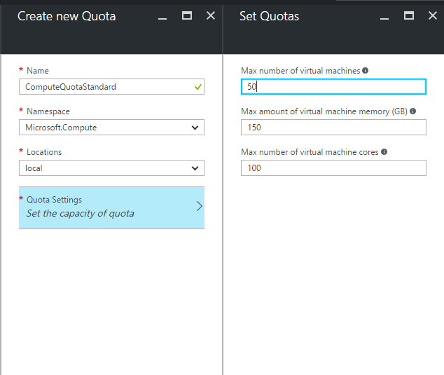

# Make virtual machines available to your Azure Stack users
As an Azure Stack administrator, you can create offers that your users (sometimes referred to as tenants) can subscribe to. Using their subscription, users can then consume Azure Stack services.

This article shows you how to create an offer, and then test it. 
For the test, you will log in to the portal as a user, subscribe to the offer, and then create a virtual machine using the subscription.

What you will learn:

> [!div class="checklist"]
> * Create an offer
> * Add an image
> * Test the offer


In Azure Stack, services are delivered to users using subscriptions, offers, and plans. Users can subscribe to multiple offers. Offers can have one or more plans, and plans can have one or more services.


To learn more, see [Key features and concepts in Azure Stack](azure-stack-key-features.md).

## Create an offer

Now you can get things ready for your users. Create an offer that they can then subscribe to.

1. **Set quotas**

   Quotas define the limits of resources that a user subscription can provision or consume. For example, a quota might allow a user to create up to five VMs. To add a service to a plan, the administrator must configure the quota settings for that service.

   a. Sign in to the Azure Stack portal at https://adminportal.local.azurestack.external using the administrator credentials you provided during deployment.

   b. Select **New**, then **Tenant Offers + Plans**, and select **Quota**.

   c. Select the first service for which you want to create a quota. For an IaaS quota, follow these steps for the Compute, Network, and Storage services.
   In this example, we first create a quota for the Compute service. In the **Namespace** list, select the **Microsoft.Compute** namespace.
   
   > 
   > 
   > 

   d. Choose the location where the quota is defined (for example, 'local').

   e. On the **Quota Settings** item, it says **Set the
   Capacity of Quota**. Click this item to configure the quota settings.

   f. On the **Set Quotas** blade, you see all the Compute resources for which
   you can configure limits. Each type has a default
   value that's associated with it. You can change these values or you can select the **Ok** button at the bottom of the blade to accept
   the defaults.
   
   > 
   > 
   > 

   g. After you have configured the values and clicked **OK**, the **Quota Settings** item appears as **Configured**. Click **Create** to create the **Quota** resource.
   
   You should see a notification indicating that the quota resource is
   being created.

   h. After the quota set has been successfully created, you receive a second notification. The Compute service quota is now ready to be associated with a plan. Repeat these steps with the Network and Storage services, and you are ready to create an IaaS plan!
   
   > 
   > 
   > 

2. **Create a plan**

    Plans are groupings of one or more services. As a provider, you can create plans to offer to your users. In turn, your users subscribe to your offers to use the plans and services they include.

   a. In an internet browser, navigate to https://adminportal.local.azurestack.external.

   b. Sign in to the Azure Stack Portal as a service administrator.

   Service administrators can create offers and plans, and manage users.

   c. To create a plan and offer that users can subscribe to, click **New** > **Tenant Offers + Plans** > **Plan**.

   

   d. In the **New Plan** blade, fill in **Display Name** and **Resource Name**. The Display Name is the plan's friendly name that users see. Only the admin can see the Resource Name. It's the name that admins use to work with the plan as an Azure Resource Manager resource.

   

   e. Create a new **Resource Group**, or select an existing one, as a container for the plan.

   

   f. Click **Services**, select **Microsoft.Compute**, **Microsoft.Network**, and **Microsoft.Storage**, and then click **Select**.

   

   g. Click **Quotas**, click **Microsoft.Storage (local)**, and then select the quota you created previously.

   h. Click **Microsoft.Network (local)**, and then select the quota you created previously.

   i. Click **Microsoft.Compute (local)**, and then select the quota you created previously.

   j. In the **Quotas** blade, click **OK**, and then in the **New Plan** blade, click **Create** to create the plan.

   

   k. To see your new plan, click **All resources**, then search for the plan and click its name.

   

3. **Create an offer**

   Offers are groups of one or more plans that providers present to users to purchase or subscribe to.

   a. [Sign in](azure-stack-connect-azure-stack.md) to the portal as a service administrator and then click **New** > **Tenant Offers + Plans** > **Offer**.
   

   b. In the **New Offer** blade, fill in **Display Name** and **Resource Name**, and then select a new or existing **Resource Group**. The Display Name is the offer's friendly name. Only the admin can see the Resource Name. It's the name that admins use to work with the offer as an Azure Resource Manager resource.

   

   c. Click **Base plans** and, in the **Plan** blade, select the plans you want to include in the offer, and then click **Select**. Click **Create** to create the offer.

   

   d. Click **Offers** and then click the offer you just created.

    

   e. Click **Change State**, and then click **Public**.

   


## Add an image

Before you can provision virtual machines, you must add an image to the Azure Stack marketplace. This example shows you how to add a Windows Server 2016 image, but you can add the image of your choice, including Linux images.

If you are operating in a connected scenario and if you have registered your Azure Stack instance with Azure, then you can download the Windows Server 2016 VM image from the Azure Marketplace by using the steps described in the [Download marketplace items from Azure to Azure Stack](azure-stack-download-azure-marketplace-item.md) topic.

For information about adding different items to the marketplace , see [The Azure Stack Marketplace](azure-stack-marketplace.md).

This step can take almost an hour to complete!


1. After deploying Azure Stack, connect to the Azure Stack host desktop.

2. If you haven't downloaded the Windows Server 2016 image already, go to https://www.microsoft.com/en-us/evalcenter/evaluate-windows-server-2016 and download the Windows Server 2016 evaluation. When prompted, select the **ISO** version of the download. Record the path to the download location, which is used later in these steps.

3. Open PowerShell ISE as an administrator.

4. [Install PowerShell for Azure Stack](azure-stack-powershell-install.md).

5. [Download the Azure Stack tools from GitHub](azure-stack-powershell-download.md). Make sure that you download and extract the Azure Stack tool repository to a folder that is NOT under the C:\Windows\System32 directory.

6. Import the Azure Stack Connect and ComputeAdmin modules by using the following commands:
   ```powershell
   Import-Module .\Connect\AzureStack.Connect.psm1
   Import-Module .\ComputeAdmin\AzureStack.ComputeAdmin.psm1
   ```
7. Create the Azure Stack administrator's AzureRM environment by using the following cmdlet:
   ```powershell
   Add-AzureStackAzureRmEnvironment `
     -Name "AzureStackAdmin" `
     -ArmEndpoint "https://adminmanagement.local.azurestack.external" 
   ```

8. Get the GUID value of the Active Directory(AD) user that is used to deploy the Azure Stack. If your Azure Stack environment is deployed by using:  

    a. **Azure Active Directory**, use the following cmdlet:
    
    ```PowerShell
    $TenantID = Get-DirectoryTenantID `
      -AADTenantName "<myaadtenant>.onmicrosoft.com" `
      -EnvironmentName AzureStackAdmin
    ```
    b. **Active Directory Federation Services**, use the following cmdlet:
    
    ```PowerShell
    $TenantID = Get-DirectoryTenantID `
      -ADFS 
      -EnvironmentName AzureStackAdmin 
    ```
   
9. Add the Windows Server 2016 image to the Azure Stack marketplace by running the `New-Server2016VMImage` cmdlet. Replace *Path_to_ISO* with the path to the WS2016 ISO you downloaded. See the [Parameters](#parameters) section for information about the allowed parameters.

   ```powershell
   $ISOPath = "<Fully_Qualified_Path_to_ISO>"
  
   # Store the service administrator account credentials in a variable 
   $UserName='<Username of the service administrator account>'
   $Password='<Admin password provided when deploying Azure Stack>'| `
     ConvertTo-SecureString -Force -AsPlainText
   $Credential=New-Object PSCredential($UserName,$Password)

   # Add a Windows Server 2016 Evaluation VM Image.
   New-Server2016VMImage `
     -ISOPath $ISOPath `
     -TenantId $TenantID `
     -EnvironmentName "AzureStackAdmin" `
     -Net35 $True `
     -AzureStackCredentials $Credential
   ```
   To ensure that the Windows Server 2016 VM image has the latest cumulative update, include the `IncludeLatestCU` parameter when running the previous cmdlet. 

   When you run the `New-Server2016VMImage` cmdlet, the output displays a warning message that says, “Unable to acquire token for tenant ‘Common’”, which you can ignore and the download continues. The output also displays the “Downloading” message for a while and if the download is successful, it ends with the “StatusCode: Created” message.

## Test the offer

Now that you’ve created an offer, you can test it. Log in as a user and subscribe to the offer and then add a virtual machine.

1. **Subscribe to an offer**

   Now you can log in to the portal as a user to subscribe to an offer.

   a. On the Azure Stack Deployment Kit computer, log in to `https://portal.local.azurestack.external` as a user and click **Get a Subscription**.

   

   b. In the **Display Name** field, type a name for your subscription, click **Offer**, click one of the offers in the **Choose an offer** blade, and then click **Create**.

   

   c. To view the subscription you created, click **More services**, click **Subscriptions**, then click your new subscription.  

   After you subscribe to an offer, refresh the portal to see which services are part of the new subscription.

2. **Provision a virtual machine**

   Now you can log in to the portal as a user to provision a virtual machine using the subscription. 

   a. On the Azure Stack Deployment Kit computer, log in to `https://portal.local.azurestack.external` as a user, and then click **New** > **Compute** > **Windows Server 2016 Datacenter Eval**.  

   b. In the **Basics** blade, type a **Name**, **User name**, and **Password**. For **VM disk type**, choose **HDD**. Choose a **Subscription**. Create a **Resource group**, or select an existing one, and then click **OK**.  

   c. In the **Choose a size** blade, click **A1 Basic**, and then click **Select**.  

   d. In the **Settings** blade, click **Virtual network**. In the **Choose virtual network** blade, click **Create new**. In the **Create virtual network** blade, accept all the defaults, and click **OK**. In the **Settings** blade, click **OK**.

   

   e. In the **Summary** blade, click **OK** to create the virtual machine.  

   f. To see your new virtual machine, click **All resources**, then search for the virtual machine and click its name.

    

What you learned in this tutorial:

> [!div class="checklist"]
> * Create an offer
> * Add an image
> * Test the offer

> [!div class="nextstepaction"]
> [Make web, mobile, and API apps available to your Azure Stack users](azure-stack-tutorial-app-service.md)