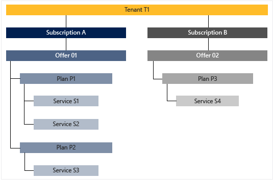
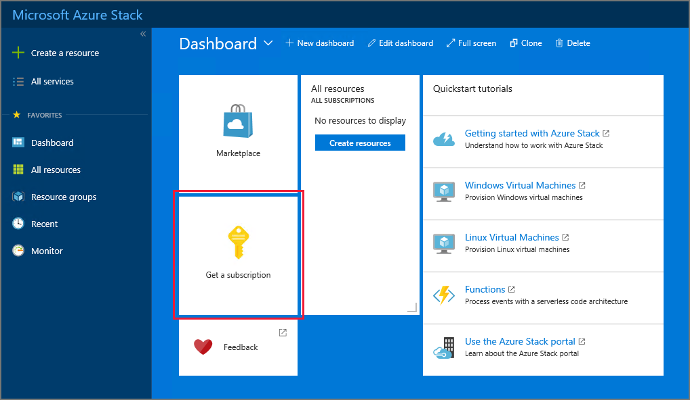
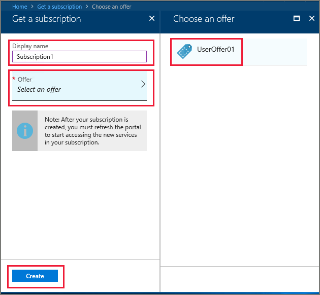

---
title: Make virtual machines available to your Azure Stack users| Microsoft Docs
description: Learn how to make virtual machines available on Azure Stack
services: azure-stack
documentationcenter: ''
author: jeffgilb
manager: femila
editor: ''

ms.assetid:
ms.service: azure-stack
ms.workload: na
ms.tgt_pltfrm: na
ms.devlang: na
ms.topic: tutorial
ms.date: 09/11/2018
ms.author: jeffgilb
ms.reviewer: 
ms.custom: mvc

---

# Tutorial: make virtual machines available to your Azure Stack users

As an Azure Stack cloud administrator, you can create offers that your users (sometimes referred to as tenants) can subscribe to. By subscribing to an offer, users can consume the Azure Stack services that an offer provides.

This tutorial shows how to create an offer for a virtual machine, and then sign in as a user to test the offer.

What you will learn:

> [!div class="checklist"]
> * Create an offer
> * Add an image
> * Test the offer

In Azure Stack, services are delivered to users using subscriptions, offers, and plans. Users can subscribe to multiple offers. An offer can have one or more plans, and a plan can have one or more services.

To learn more, see [Key features and concepts in Azure Stack](azure-stack-key-features.md).

## Create an offer

Offers are groups of one or more plans that providers present to users to purchase or subscribe to. The process of creating an offer has several steps. First, you're prompted to create the offer, then a plan, and finally, quotas.

1. [Sign in](azure-stack-connect-azure-stack.md) to the portal as a cloud administrator and then select **+ Create a resource** > **Offers + Plans** > **Offer**.

   

1. In **New offer**, enter a **Display name** and **Resource name**, and then select a new or existing **Resource group**. The Display name is the offer's friendly name. Only the cloud operator can see the Resource name which is the name that admins use to work with the offer as an Azure Resource Manager resource.

   

1. Select **Base plans**, and in the **Plan** section, select **Add** to add a new plan to the offer.

   

1. In the **New plan** section, fill in **Display name** and **Resource name**. The Display name is the plan's friendly name that users see. Only the cloud operator can see the Resource name which is the name that cloud operators use to work with the plan as an Azure Resource Manager resource.

   

1. Select **Services**. From the list of Services, pick  **Microsoft.Compute**, **Microsoft.Network**, and **Microsoft.Storage**. Choose **Select** to add these services to the plan.

   

1. Select **Quotas**, and then select the first service that you want to create a quota for. For an IaaS quota, use the following example as a guide for configuring quotas for the Compute, Network, and Storage services.

   - First, create a quota for the Compute service. In the namespace list, select **Microsoft.Compute** and then select **Create new quota**.

     

   - In **Create quota**, enter a name for the quota. You can change or accept any of the quota values that are shown for the quota you're creating. In this example, we accept the default settings and select **OK**.

     

   - Pick **Microsoft.Compute** in the namespace list, and then select the quota that you created. This links the quota to the Compute service.

     

      Repeat these steps for the Network and Storage services. When you're finished, select **OK** in **Quotas** to save all the quotas.

1. In **New plan**, select **OK**.

1. Under **Plan**, select the new plan and then **Select**.

1. In **New offer**, select **Create**. You'll see a notification when the offer is created.

1. On the dashboard menu, select **Offers** and then pick the offer you created.

1. Select **Change State**, and then chose **Public**.

    

## Add an image

Before you can provision virtual machines, you must add an image to the Azure Stack marketplace. You can add the image of your choice, including Linux images, from the Azure Marketplace.

If you are operating in a connected scenario and if you have registered your Azure Stack instance with Azure, then you can download the Windows Server 2016 VM image from the Azure Marketplace by using the steps described in the [Download marketplace items from Azure to Azure Stack](azure-stack-download-azure-marketplace-item.md) topic.

For information about adding different items to the marketplace, see [The Azure Stack Marketplace](azure-stack-marketplace.md).

## Test the offer

Now that you’ve created an offer, you can test it. You'll sign in as a user, subscribe to the offer, and then add a virtual machine.

1. **Subscribe to an offer**

   a. Sign in to the user portal with a user account and select the **Get a Subscription** tile.
   - For an integrated system, the URL varies based on your operator’s region and external domain name, and will be in the format https://portal.&lt;*region*&gt;.&lt;*FQDN*&gt;.
   - If you’re using the Azure Stack Development Kit, the portal address is https://portal.local.azurestack.external.

   

   b. In **Get a Subscription**, enter a name for your subscription in the **Display Name** field. Select **Offer**, and then choose one of the offers in the **Choose an offer** list. Select **Create**.

   

   c. To view the subscription, select **All services**, and then under the **GENERAL** category select **Subscriptions**. Select your new subscription to see which services are part of the subscription.

   >[!NOTE]
   >After you subscribe to an offer, you might have to refresh the portal to see which services are part of the new subscription.

1. **Provision a virtual machine**

   From the user portal you can provision a virtual machine using the new subscription.

   a. Sign in to the user portal with a user account.
      - For an integrated system, the URL varies based on your operator’s region and external domain name, and will be in the format https://portal.&lt;*region*&gt;.&lt;*FQDN*&gt;.
   - If you’re using the Azure Stack Development Kit, the portal address is https://portal.local.azurestack.external.

   b.  On the dashboard, select **+Create a resource** > **Compute** > **Windows Server 2016 Datacenter Eval**, and then select **Create**.

   c. In **Basics**, provide the following information:
      - Enter a **Name**
      - Enter a **User name**
      - Enter a **Password**
      - Choose a **Subscription**
      - Create a **Resource group** (or select an existing one.) 
      - Select **OK** to save this information.

   d. In **Choose a size**, select **A1 Standard**, and then **Select**.  

   e. In **Settings**, select **Virtual network**.

   f. In **Choose virtual network**, select **Create new**.

   g. In **Create virtual network**, accept all the defaults, and select **OK**.

   h. Select **OK** in **Settings** to save the network configuration.

      i. In **Summary**, select **OK** to create the virtual machine.  

   j. To see the new virtual machine, select **All resources**. Search for the virtual machine and select its name from the search results.

   
## Next steps

In this tutorial you learned how to:

> [!div class="checklist"]
> * Create an offer
> * Add an image
> * Test the offer

Advance to the next tutorial to learn how to:
> [!div class="nextstepaction"]
> [Make SQL databases available to your Azure Stack users](azure-stack-tutorial-sql-server.md)