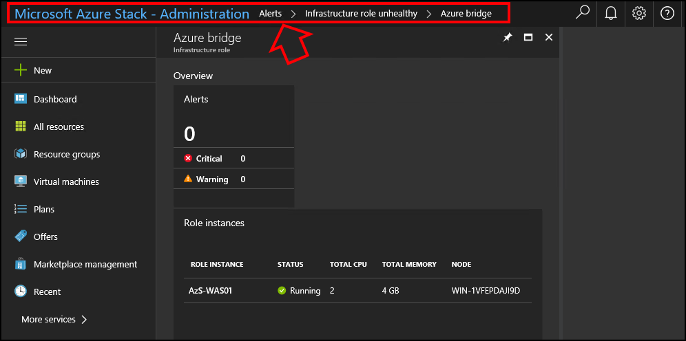

# Azure Stack 1807 update

*Applies to: Azure Stack integrated systems*

This article describes the contents of the 1807 update package. This update includes improvements, fixes, and known issues for this version of Azure Stack, and where to download the update. Known issues are divided into issues directly related to the update process and issues with the build (post-installation).

> [!IMPORTANT]  
> This update package is only for Azure Stack integrated systems. Do not apply this update package to the Azure Stack Development Kit.

## Build reference

The Azure Stack 1807 update build number is **1.1807.0.76**.  

### New features

This update includes the following improvements for Azure Stack.

<!-- 1658937 | ASDK, IS --> 
- **Start backups on a pre-defined schedule** - As an appliance, Azure Stack can now automatically trigger infrastructure backups periodically to eliminate human intervention. Azure Stack will also automatically clean up the external share for backups that are older than the defined retention period. For more information, see [Enable Backup for Azure Stack with PowerShell](azure-stack-backup-enable-backup-powershell.md).

<!-- 2496385 | ASDK, IS -->  
- **Added data transfer time into the total backup time.** For more information, see [Enable Backup for Azure Stack with PowerShell](azure-stack-backup-enable-backup-powershell.md).

<!-- 1702130 | ASDK, IS -->  
- **Backup external capacity now shows the correct capacity of the external share.** (Previously this was hard-code to 10 GB.) For more information, see [Enable Backup for Azure Stack with PowerShell](azure-stack-backup-enable-backup-powershell.md).

<!-- 2508488 |  IS   -->
- **Expand capacity** by [adding additional scale unit nodes](azure-stack-add-scale-node.md).

<!-- 2753130 |  IS, ASDK   -->  
- **Azure Resource Manager templates now support the condition element** - You can now deploy a resource in an Azure Resource Manger template using a condition. You can design your template to deploy a resource based on a condition, such as evaluating if a parameter value is present. For information about using a template as a condition, see [Conditionally deploy a resource](https://docs.microsoft.com/azure/architecture/building-blocks/extending-templates/conditional-deploy) and [Variables section of Azure Resource Manager templates](https://docs.microsoft.com/azure/azure-resource-manager/resource-manager-templates-variables) in the Azure documentation. 

   You can also use templates to [deploy resources to more than one subscription or resource group](https://docs.microsoft.com/azure/azure-resource-manager/resource-manager-cross-resource-group-deployment).  

<!--2753073 | IS, ASDK -->  
- **The Microsoft.Network API resource version support has been updated** to include support for API version 2017-10-01 from 2015-06-15 for Azure Stack network resources.  Support for resource versions between 2017-10-01 and 2015-06-15 is not included in this release.  Please refer to [Considerations for Azure Stack networking](user/azure-stack-network-differences.md) for functionality differences.

<!-- 2272116 | IS, ASDK   -->  
- **Azure Stack has added support for reverse DNS lookups for externally facing Azure Stack infrastructure endpoints** (that is for portal, adminportal, management, and adminmanagement). This allows Azure Stack external endpoint names to be resolved from an IP address.

<!-- 2780899 |  IS, ASDK   --> 
- **Azure Stack now supports adding additional network interfaces to an existing VM.**  This functionality is available by using the portal, PowerShell, and CLI. For more information, see [Add or remove network interfaces](https://docs.microsoft.com/azure/virtual-network/virtual-network-network-interface-vm) in the Azure documentation. 

<!-- 2222444 | IS, ASDK   -->  
- **Improvements in accuracy and resiliency have been made to networking usage meters**.  Network usage meters are now more accurate and take into account suspended subscriptions, outage periods and race conditions.

<!-- 2753080 | IS -->  
- **Update available notification.** Connected Azure Stack deployments will now periodically check a secured endpoint and determine if an update is available for your cloud. This notification appears in the Update tile, as it would after manually checking for and importing a new update. Read more about [managing updates for Azure Stack](azure-stack-updates.md).

<!-- 2297790 | IS, ASDK -->  
- **Improvements to the Azure Stack syslog client (preview feature)**. This client allows the forwarding of audit and logs related to the Azure Stack infrastructure to a syslog server or security information and event management (SIEM) software external to Azure Stack. The syslog client now supports the TCP protocol with plain text or TLS 1.2 encryption, the latter being the default configuration. You can configure the TLS connection with either server-only or mutual authentication.

  To configure how the syslog client communicates (such as protocol, encryption, and authentication) with the syslog server, use the *Set-SyslogServer* cmdlet. This cmdlet is available from the privileged endpoint (PEP).

  To add the client-side certificate for the syslog client TLS 1.2 mutual authentication, use the Set-SyslogClient cmdlet in the PEP.

  With this preview, you can see a much larger number of audits and alerts. 

  Because this feature is still in preview, don't rely on it in production environments.

  For more information, see [Azure Stack syslog forwarding](azure-stack-integrate-security.md).

<!-- ####### | IS, ASDK | --> 
- **Azure Resource Manager includes the region name.** With this release, objects retrieved from the Azure Resource Manager will now include the region name attribute. If an existing PowerShell script directly passes the object to another cmdlet, the script may produce an error and fail. This is Azure Resource Manager compliant behavior, and requires the calling client to subtract the region attribute. For more information about the Azure Resource Manager see [Azure Resource Manager Documentation](https://docs.microsoft.com/azure/azure-resource-manager/). verify 8-10 mdb -->

<!-- TBD | IS, ASDK -->  
- **Changes to Delegated Providers functionality.** Starting with 1807 the Delegated Providers model is simplified in order to better align with the Azure reseller model and Delegated Providers will not be able to create other Delegated Providers, essentially flattening the model and making the Delegated Provider feature available on a single level. To enable the transition to the new model and the management of the subscriptions, the user-subscriptions can now be moved between new or existing Delegated Provider subscriptions that belong to the same Directory tenant. User-subscriptions belonging to the Default Provider Subscription can also be moved to the Delegated Provider Subscriptions in the same Directory-tenant.  For more information see [Delegate offers in Azure Stack](azure-stack-delegated-provider.md).

<!-- 2536808 IS ASDK --> 
- **Improved VM creation time** for VMs that are created with images you download from the Azure marketplace.

<!-- TBD | IS, ASDK -->  
- **Azure Stack Capacity Planner usability improvements**. The Azure Stack [Capacity Planner](http://aka.ms/azstackcapacityplanner) now offers a simplified experience for inputting S2D cache and S2D capacity when defining solution SKUs. The 1000 VM limit has been removed.


### Fixed issues

<!-- TBD | ASDK, IS --> 
- Various improvements were made to the update process to make it more reliable. In addition, fixes have been made to underlying infrastructure, which minimize potential downtime for workloads during the update.

<!--2292271 | ASDK, IS --> 
- We fixed an issue where a modified Quota limit did not apply to existing subscriptions. Now, when you raise a Quota limit for a network resource that is part of an Offer and Plan associated with a user subscription, the new limit applies to the pre-existing subscriptions, as well as new subscriptions.

<!-- 448955 | IS ASDK --> 
- You can now successfully query activity logs for systems that are deployed in a UTC+N time zone.    

<!-- 2319627 |  ASDK, IS --> 
- Pre-check for backup configuration parameters (Path/Username/Password/Encryption Key) no longer sets incorrect settings to the backup configuration. (Previously, incorrect settings were set into the backup and backup would then fail when triggered.)

<!-- 2215948 |  ASDK, IS -->
- The backup list now refreshes when you manually delete the backup from the external share.

<!-- 2332636 | IS -->  
- Update to this version no longer resets the default owner of the default provider subscription to the built-in **CloudAdmin** user when deployed with AD FS.

<!-- 2360715 |  ASDK, IS -->  
- When you set up datacenter integration, you no longer access the AD FS metadata file from an Azure file share. For more information, see [Setting up AD FS integration by providing federation metadata file](azure-stack-integrate-identity.md#setting-up-ad-fs-integration-by-providing-federation-metadata-file). 

<!-- 2388980 | ASDK, IS --> 
- We fixed an issue that prevented users from assigned an existing Public IP Address that had been previously assigned to a Network Interface or Load Balancer to a new Network Interface or Load Balancer.  

<!-- 2551834 - IS, ASDK --> 
- When you select *Overview* for a storage account in either the admin or user portals, the *Essentials* pane now displays all the expected information correctly. 

<!-- 2551834 - IS, ASDK --> 
- When you select *Tags* for a storage account in either the admin or user portals, the information now displays correctly.

<!-- TBD - IS ASDK --> 
- This version of Azure Stack fixes the issue that prevented the application of driver updates from OEM Extension packages.

<!-- 2055809- IS ASDK --> 
- We fixed an issue that prevented you from deleting VMs from the compute blade when the VM failed to be created.  

<!--  2643962 IS ASDK -->  
- The alert for *Low memory capacity* no longer appears incorrectly.

- **Various fixes** for performance, stability, security, and the operating system that is used by Azure Stack.


<!-- ### Additional releases timed with this update    -->

### Common Vulnerabilities and Exposures
Azure Stack uses Server Core installations of Windows Server 2016 to host key infrastructure. This release installs the following Windows Server 2016 updates on the infrastructure servers for Azure Stack: 
- [CVE-2018-8206](https://portal.msrc.microsoft.com/en-us/security-guidance/advisory/CVE-2018-8206)
- [CVE-2018-8222](https://portal.msrc.microsoft.com/en-us/security-guidance/advisory/CVE-2018-8222)
- [CVE-2018-8282](https://portal.msrc.microsoft.com/en-us/security-guidance/advisory/CVE-2018-8282)
- [CVE-2018-8304](https://portal.msrc.microsoft.com/en-us/security-guidance/advisory/CVE-2018-8304)
- [CVE-2018-8307](https://portal.msrc.microsoft.com/en-us/security-guidance/advisory/CVE-2018-8307)
- [CVE-2018-8308](https://portal.msrc.microsoft.com/en-us/security-guidance/advisory/CVE-2018-8308) 
- [CVE-2018-8309](https://portal.msrc.microsoft.com/en-us/security-guidance/advisory/CVE-2018-8309)
- [CVE-2018-8313](https://portal.msrc.microsoft.com/en-us/security-guidance/advisory/CVE-2018-8313)  

For more information about these vulnerabilities, click on the preceding links, or see Microsoft Knowledge Base articles [4338814](https://support.microsoft.com/help/4338814)  and [4345418](https://support.microsoft.com/help/4345418).


## Before you begin

### Prerequisites

- Install the Azure Stack [1805 Update](azure-stack-update-1805.md) before you apply the Azure Stack 1807 update.  There was no update 1806.  

- Install the latest available [update or hotfix for version 1805](azure-stack-update-1805.md#post-update-steps).  
  > [!TIP]  
  > Subscribe to the following *RRS* or *Atom* feeds to keep up with Azure Stack Hotfixes:
  > - RRS: https://support.microsoft.com/app/content/api/content/feeds/sap/en-us/32d322a8-acae-202d-e9a9-7371dccf381b/rss … 
  > - Atom: https://support.microsoft.com/app/content/api/content/feeds/sap/en-us/32d322a8-acae-202d-e9a9-7371dccf381b/atom …


- Before you start installation of this update, run [Test-AzureStack](azure-stack-diagnostic-test.md) with the following parameters to validate the status of your Azure Stack and resolve any operational issues found, including all warnings and failures. Also review active alerts, and resolve any that require action.  

  ```PowerShell
  Test-AzureStack -Include AzsControlPlane, AzsDefenderSummary, AzsHostingInfraSummary, AzsHostingInfraUtilization, AzsInfraCapacity, AzsInfraRoleSummary, AzsPortalAPISummary, AzsSFRoleSummary, AzsStampBMCSummary
  ``` 

### Known issues with the update process

<!-- 2468613 - IS --> 
- During installation of this update, you might see alerts with the title *Error – Template for FaultType UserAccounts.New is missing.*  You can safely ignore these alerts. These alerts will close automatically after installation of this update completes.

<!-- 2489559 - IS --> 
- Do not attempt to create virtual machines during the installation of this update. For more information about managing updates, see [Manage updates in Azure Stack overview](azure-stack-updates.md#plan-for-updates).

<!-- 2830461 - IS --> 
- In certain circumstances when an update requires attention, the corresponding alert may not be generated. The accurate status will still be reflected in the portal and is not impacted.

### Post-update steps
After the installation of this update, install any applicable Hotfixes. For more information view the following knowledge base articles, as well as our [Servicing Policy](azure-stack-servicing-policy.md). 
- [KB 4467061 – Azure Stack Hotfix Azure Stack Hotfix 1.1807.3.82](https://support.microsoft.com/help/4467061/)

<!-- 2933866 – IS --> 
After installation of this update, you can see **improved status for failed update installations.** This might include information about previous update installation failures that are revised to reflect the two new STATE categories. The new STATE categories are *PreparationFailed*, and *InstallationFailed*.  

## Known issues (post-installation)

The following are post-installation known issues for this build version.

### Portal

- The Azure Stack technical documentation focuses on the latest release. Due to portal changes between releases, what you see when using the Azure Stack portals might vary from what you see in the documentation. 

- The ability to [open a new support request from the dropdown](azure-stack-manage-portals.md#quick-access-to-help-and-support) within the administrator portal is not available. Instead, for Azure Stack integrated systems, use the following link: [https://aka.ms/newsupportrequest](https://aka.ms/newsupportrequest).

<!-- 2931230 – IS  ASDK --> 
- Plans that are added to a user subscription as an add-on plan cannot be deleted, even when you remove the plan from the user subscription. The plan will remain until the subscriptions that reference the add-on plan are also deleted. 

<!--2760466 – IS  ASDK --> 
- When you install a new Azure Stack environment that runs this version, the alert that indicates *Activation Required* might not display. [Activation](azure-stack-registration.md) is required before you can use marketplace syndication.  

<!-- TBD - IS ASDK --> 
- The two administrative subscription types that were introduced with version 1804 should not be used. The subscription types are **Metering subscription**, and **Consumption subscription**. These subscription types are visible in new Azure Stack environments beginning with version 1804 but are not yet ready for use. You should continue to use the **Default Provider** subscription type.

<!-- 2403291 - IS ASDK --> 
- You might not have use of the horizontal scroll bar along the bottom of the admin and user portals. If you can’t access the horizontal scroll bar, use the breadcrumbs to navigate to a previous blade in the portal by selecting the name of the blade you want to view from the breadcrumb list found at the top left of the portal.

  

<!-- TBD - IS --> 
- It might not be possible to view compute or storage resources in the administrator portal. The cause of this issue is an error during the installation of the update that causes the update to be incorrectly reported as successful. If this issue occurs, contact Microsoft Customer Support Services for assistance.

<!-- TBD - IS --> 
- You might see a blank dashboard in the portal. To recover the dashboard, select the gear icon in the upper right corner of the portal, and then select **Restore default settings**.

<!-- TBD - IS ASDK --> 
- Deleting user subscriptions results in orphaned resources. As a workaround, first delete user resources or the entire resource group, and then delete user subscriptions.

<!-- TBD - IS ASDK --> 
- You cannot view permissions to your subscription using the Azure Stack portals. As a workaround, use PowerShell to verify permissions.


### Health and monitoring

<!-- TBD - IS -->
- You might see the following alerts repeatedly appear and then disappear on your Azure Stack system:
   - *Infrastructure role instance unavailable*
   - *Scale unit node is offline*
   
  Please run the [Test-AzureStack](azure-stack-diagnostic-test.md) cmdlet to verify the health of the infrastructure role instances and scale unit nodes. If no issues are detected by [Test-AzureStack](azure-stack-diagnostic-test.md), you can ignore these alerts. If an issue is detected, you can attempt to start the infrastructure role instance or node using the admin portal or PowerShell.

<!-- 1264761 - IS ASDK -->  
- You might see alerts for the **Health controller** component that have the following details:  

   Alert #1:
   - NAME:  Infrastructure role unhealthy
   - SEVERITY: Warning
   - COMPONENT: Health controller
   - DESCRIPTION: The health controller Heartbeat Scanner is unavailable. This may affect health reports and metrics.  

  Alert #2:
   - NAME:  Infrastructure role unhealthy
   - SEVERITY: Warning
   - COMPONENT: Health controller
   - DESCRIPTION: The health controller Fault Scanner is unavailable. This may affect health reports and metrics.

  Both alerts can be safely ignored and they'll close automatically over time.  


<!-- 2812138 | IS --> 
- You might see an alert for **Storage** component that have the following details:

   - NAME: Storage service internal communication error  
   - SEVERITY: Critical  
   - COMPONENT: Storage  
   - DESCRIPTION: Storage service internal communication error occurred when sending requests to the following nodes.  

    The alert can be safely ignored, but you need to close the alert manually.

<!-- 2368581 - IS. ASDK --> 
- An Azure Stack operator, if you receive a low memory alert and tenant virtual machines fail to deploy with a **Fabric VM creation error**, it is possible that the Azure Stack stamp is out of available memory. Use the [Azure Stack Capacity Planner](https://gallery.technet.microsoft.com/Azure-Stack-Capacity-24ccd822) to best understand the capacity available for your workloads.


### Compute

<!-- 2724873 - IS --> 
- When using the PowerShell cmdlets **Start-AzsScaleUnitNode** or  **Stop-AzsScaleunitNode** to manage scale units, the first attempt to start or stop the scale unit might fail. If the cmdlet fails on the first run, run the cmdlet a second time. The second run should succeed to complete the operation. 

<!-- 2494144 - IS, ASDK --> 
- When selecting a virtual machine size for a virtual machine deployment, some F-Series VM sizes are not visible as part of the size selector when you create a VM. The following VM sizes do not appear in the selector: *F8s_v2*, *F16s_v2*, *F32s_v2*, and *F64s_v2*.  
  As a workaround, use one of the following methods to deploy a VM. In each method, you need to specify the VM size you want to use.

  - **Azure Resource Manager template:** When you use a template, set the *vmSize* in the template to equal the VM size you want to use. For example, the following entry is used to deploy a VM that uses the *F32s_v2* size:  

    ```
        "properties": {
        "hardwareProfile": {
                "vmSize": "Standard_F32s_v2"
        },
    ```  
  - **Azure CLI:** You can use the [az vm create](https://docs.microsoft.com/cli/azure/vm?view=azure-cli-latest#az-vm-create) command and specify the VM size as a parameter, similar to `--size "Standard_F32s_v2"`.

  - **PowerShell:** With PowerShell you can use [New-AzureRMVMConfig](https://docs.microsoft.com/powershell/module/azurerm.compute/new-azurermvmconfig?view=azurermps-6.0.0) with the parameter that specifies the VM size, similar to `-VMSize "Standard_F32s_v2"`.


<!-- TBD - IS ASDK --> 
- Scaling settings for virtual machine scale sets are not available in the portal. As a workaround, you can use [Azure PowerShell](https://docs.microsoft.com/azure/virtual-machine-scale-sets/virtual-machine-scale-sets-manage-powershell#change-the-capacity-of-a-scale-set). Because of PowerShell version differences, you must use the `-Name` parameter instead of `-VMScaleSetName`.

<!-- TBD - IS --> 
- When you create an availability set in the portal by going to **New** > **Compute** > **Availability set**, you can only create an availability set with a fault domain and update domain of 1. As a workaround, when creating a new virtual machine, create the availability set by using PowerShell, CLI, or from within the portal.

<!-- TBD - IS ASDK --> 
- When you create virtual machines on the Azure Stack user portal, the portal displays an incorrect number of data disks that can attach to a DS series VM. DS series VMs can accommodate as many data disks as the Azure configuration.

<!-- TBD - IS ASDK --> 
- If provisioning an extension on a VM deployment takes too long, users should let the provisioning time-out instead of trying to stop the process to deallocate or delete the VM.  

<!-- 1662991 IS ASDK --> 
- Linux VM diagnostics is not supported in Azure Stack. When you deploy a Linux VM with VM diagnostics enabled, the deployment fails. The deployment also fails if you enable the Linux VM basic metrics through diagnostic settings.  

<!-- 2724961- IS ASDK --> 
- When you register the **Microsoft.Insight** resource provider in Subscription settings, and create a Windows VM with Guest OS Diagnostic enabled, the VM overview page doesn't show metrics data. 

   To find metrics data, like the CPU Percentage chart for the VM, go to the **Metrics** blade and show all the supported Windows VM guest metrics.

### Networking  

<!-- 1766332 - IS ASDK --> 
- Under **Networking**, if you click **Create VPN Gateway** to set up a VPN connection, **Policy Based** is listed as a VPN type. Do not select this option. Only the **Route Based** option is supported in Azure Stack.

<!-- 1902460 - IS ASDK --> 
- Azure Stack supports a single *local network gateway* per IP address. This is true across all tenant subscriptions. After the creation of the first local network gateway connection, subsequent attempts to create a local network gateway resource with the same IP address are blocked.

<!-- 16309153 - IS ASDK --> 
- On a Virtual Network that was created with a DNS Server setting of *Automatic*, changing to a custom DNS Server fails. The updated settings are not pushed to VMs in that Vnet.

<!-- 2702741 -  IS ASDK --> 
- Public IPs that are deployed by using the Dynamic allocation method are not guaranteed to be preserved after a Stop-Deallocate is issued.

<!-- 2529607 - IS ASDK --> 
- During Azure Stack *Secret Rotation*, there is a period in which Public IP Addresses are unreachable for two to five minutes.

<!-- 2664148 - IS ASDK --> 
- In scenarios where the tenant is accessing their virtual machines by using a S2S VPN tunnel, they might encounter a scenario where connection attempts fail if the on-premise subnet was added to the Local Network Gateway after gateway was already created. 


### SQL and MySQL


<!-- No Number - IS, ASDK -->  
- Special characters, including spaces and periods, are not supported in the **Family** name when you create a SKU for the SQL and MySQL resource providers. 

<!-- TBD - IS --> 
- Only the resource provider is supported to create items on servers that host SQL or MySQL. Items created on a host server that are not created by the resource provider might result in a mismatched state.  

<!-- TBD - IS -->
> [!NOTE]   
> After you update to this version of Azure Stack, you can continue to use the SQL and MySQL resource providers that you previously deployed.  We recommend you update SQL and MySQL when a new release becomes available. Like Azure Stack, apply updates to SQL and MySQL resource providers sequentially. For example, if you use version 1804, first apply version 1805, and then update to 1807.  
>  
> The install of this update does not affect the current use of SQL or MySQL resource providers by your users. 
> Regardless of the version of the resource providers you use, your users data in their databases is not touched, and remains accessible.  

### App Service

<!-- 2352906 - IS ASDK --> 
- Users must register the storage resource provider before they create their first Azure Function in the subscription.

<!-- 2489178 - IS ASDK --> 
- In order to scale out infrastructure (workers, management, front-end roles), you must use PowerShell as described in the release notes for Compute.

<!-- TBD - IS ASDK --> 
- App Service can only be deployed into the *Default Provider subscription* at this time. 


### Usage  
<!-- TBD - IS ASDK --> 
- Usage Public IP address usage meter data shows the same *EventDateTime* value for each record instead of the *TimeDate* stamp that shows when the record was created. Currently, you can’t use this data to perform accurate accounting of public IP address usage.


<!-- #### Identity -->
<!-- #### Marketplace -->


## Download the update
You can download the Azure Stack 1807 update package from [here](https://aka.ms/azurestackupdatedownload).


## Next steps
- To review the servicing policy for Azure Stack integrated systems, and what you must do to keep your system in a supported state, see [Azure Stack servicing policy](azure-stack-servicing-policy.md).  
- To use the Privileged End Point (PEP) to monitor and resume updates, see [Monitor updates in Azure Stack using the privileged endpoint](azure-stack-monitor-update.md).  
- For an overview of the update management in Azure Stack, see [Manage updates in Azure Stack overview](azure-stack-updates.md).  
- For more information about how to apply updates with Azure Stack, see [Apply updates in Azure Stack](azure-stack-apply-updates.md).  
