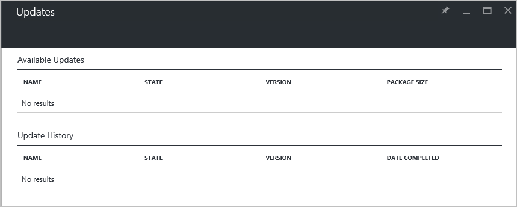

# Manage updates in Azure Stack overview

*Applies to: Azure Stack integrated systems*

Microsoft update packages for Azure Stack integrated systems typically release around the fourth Tuesday of each month. Ask your OEM about their specific notification process to ensure update notifications reach your organization. You can also check in this documentation library under **Overview** > **Release notes** for information about releases that are in active support. 

Each release of Microsoft software updates is bundled as a single update package. As an Azure Stack operator, you can import, install, and monitor the installation progress of these update packages from the administrator portal. 

Your original equipment manufacturer (OEM) hardware vendor will also release updates, such as driver and firmware updates. While these updates are delivered as separate packages by your OEM hardware vendor, they are imported, installed, and managed the same way update packages from Microsoft update packages are imported, installed, and managed.

To keep your system under support, you must keep Azure Stack updated to a specific version level. Make sure that you review the [Azure Stack servicing policy](azure-stack-servicing-policy.md).

> [!NOTE]
> You can't apply Azure Stack update packages to Azure Stack Development Kit. The update packages are designed for integrated systems. For information, see [Redeploy the ASDK](https://docs.microsoft.com/azure/azure-stack/asdk).

## The Update resource provider

Azure Stack includes an Update resource provider that orchestrates the application of Microsoft software updates. This resource provider ensures that updates are applied across all physical hosts, Service Fabric applications and runtimes, and all infrastructure virtual machines and their associated services.

As updates install, you can view high-level status as the update process targets the various subsystems in Azure Stack (for example, physical hosts, and infrastructure virtual machines).

## Plan for updates

We strongly recommend that you notify users of any maintenance operations, and that you schedule normal maintenance windows during non-business hours if possible. Maintenance operations can affect both tenant workloads and portal operations.


- Before you start installation of this update, run [Test-AzureStack](azure-stack-diagnostic-test.md) with the following parameters to validate the status of your Azure Stack and resolve any operational issues found, including all warnings and failures. Also review active alerts, and resolve any that require action.  

  ```PowerShell
  Test-AzureStack -Include AzsControlPlane, AzsDefenderSummary, AzsHostingInfraSummary, AzsHostingInfraUtilization, AzsInfraCapacity, AzsInfraRoleSummary, AzsPortalAPISummary, AzsSFRoleSummary, AzsStampBMCSummary
  ``` 

## Using the Update tile to manage updates
You manage updates from the administrator portal. As an Azure Stack operator you can use the Update tile in the dashboard to:

- view important information such as the current version.
- install updates, and monitor progress.
- review update history for previously installed updates.
 
## Determine the current version

The Update tile shows the current version of Azure Stack. You can get to the Update tile by using either of the following methods in the administrator portal:

- On the dashboard, view the current version in the **Update** tile.
 
   
 
- On the **Region management** tile, click the region name. View the current version in the **Update** tile.

## Next steps

- [Azure Stack servicing policy](azure-stack-servicing-policy.md) 
- [Region management in Azure Stack](azure-stack-region-management.md)     


