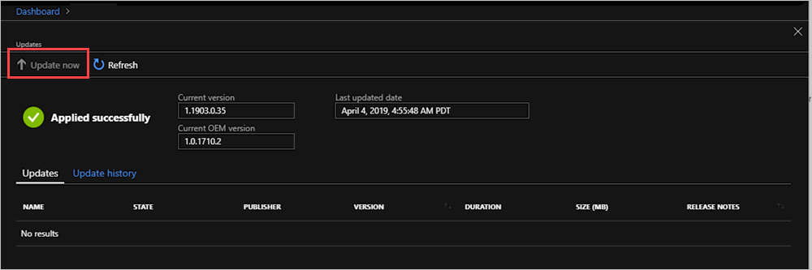
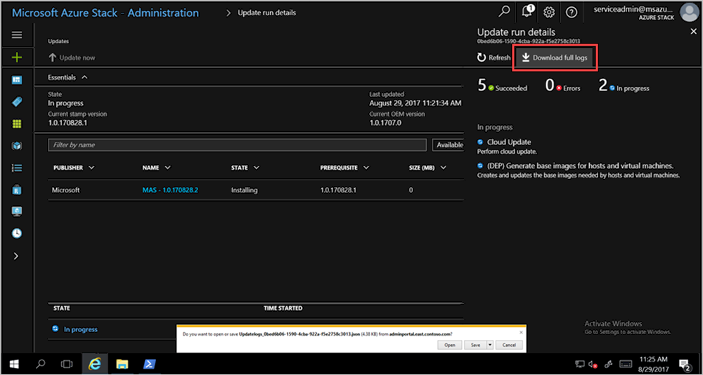

# Manage updates in Azure Stack overview

*Applies to: Azure Stack integrated systems*

Microsoft update packages for Azure Stack integrated systems typically release around the fourth Tuesday of each month. Ask your original equipment manufacturer (OEM) about their specific notification process to ensure update notifications reach your organization. You can also check in this documentation library under **Overview** > **Release notes** for information about releases that are in active support. 

Each release of Microsoft software updates is bundled as a single update package. As an Azure Stack operator, you can import, install, and monitor the installation progress of these update packages from the administrator portal. 

Your OEM vendor will also release updates, such as driver and firmware updates. While these updates are delivered as separate packages by vendor, they're imported, installed, and managed the same way as update packages from Microsoft.

To keep your system under support, you must keep Azure Stack updated to a specific version level. Make sure that you review the [Azure Stack servicing policy](azure-stack-servicing-policy.md).

> [!NOTE]
> You can't apply Azure Stack update packages to Azure Stack Development Kit. The update packages are designed for integrated systems. For information, see [Redeploy the ASDK](https://docs.microsoft.com/azure/azure-stack/asdk).

## The Update resource provider

Azure Stack includes an Update resource provider that handles the application of Microsoft software updates. This provider checks that updates are applied across all physical hosts, Service Fabric applications and runtimes, and all infrastructure virtual machines and their associated services.

As updates install, you can view high-level status as the update process targets the various subsystems in Azure Stack (for example, physical hosts, and infrastructure virtual machines).

## Plan for updates

We strongly recommend that you notify users of any maintenance operations, and that you schedule normal maintenance windows during non-business hours if possible. Maintenance operations can affect both tenant workloads and portal operations.

- Before you start installation of this update, run [Test-AzureStack](azure-stack-diagnostic-test.md) with the following parameters to validate the status of your Azure Stack and resolve any operational issues found, including all warnings and failures. Also review active alerts, and resolve any that require action.  

  ```powershell
  Test-AzureStack -Group UpdateReadiness
  ``` 

## Using the Update tile to manage updates

You manage updates from the administrator portal. As an Azure Stack operator you can use the Update tile in the dashboard to:

- View important information such as the current version.
- Install updates and monitor progress.
- Review update history for previously installed updates.
- View the cloud’s current OEM package version
 
## Determine the current version

You can view the current version of Azure Stack in the Update tile. To open the tile:

1. Open the Azure Stack Administration portal.
2. Select **Dashboard**. In the **Update** tile, the current version is listed. 

    

    For example, in the screen the version is 1.1903.0.35.

## Install updates and monitor progress


1. Open the Azure Stack Administration portal.
2. Select **Dashboard**. Select the Update tile.
3. Select **Update now**.

    

4.  You can view high-level status as the update process iterates through various subsystems in Azure Stack. Example subsystems include physical hosts, Service Fabric, infrastructure virtual machines, and services that provide both the administrator and user portals. Throughout the update process, the Update resource provider reports additional details about the update, such as the number of steps that have succeeded, as well as the number in progress.

5. Select the **Download full logs** from the Update run details blade to download full logs.

    

6. Once completed, the Update resource provider provides a **Succeeded** confirmation to let you know that the update process has been completed and how long it took. From there, you can view information about all updates, available updates, or installed updates using the filter.

    

   If the update fails, the Update tile reports **Needs attention**. Use the **Download full logs** to get a high-level status of where the update could have failed. The Azure Stack log collection helps facilitate diagnostics and troubleshooting.

## Next steps

- [Azure Stack servicing policy](azure-stack-servicing-policy.md) 
- [Region management in Azure Stack](azure-stack-region-management.md)
