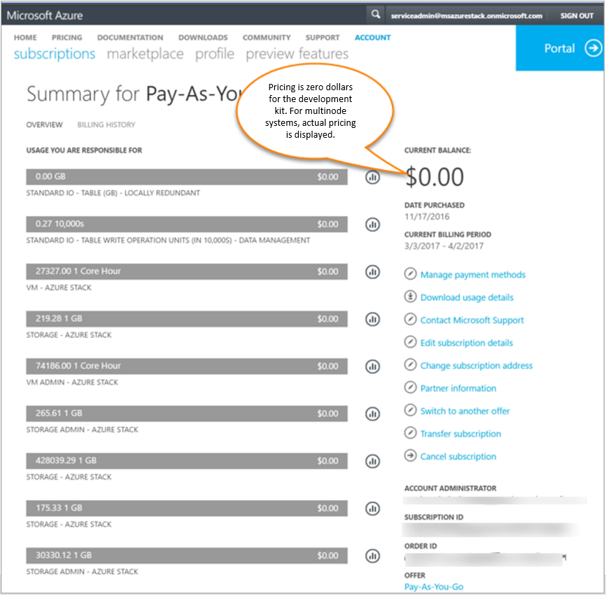

# Report Azure Stack usage data to Azure 

Usage data, also called as consumption data represents the amount of resources used. In Azure Stack, usage data must be reported to Azure for billing purpose. Azure Stack administrators should configure their Azure Stack instance to report usage data to Azure.

> [!NOTE]
> At Technical Preview 3(TP3), usage data reporting is not required, and users are not charged for consuming resources. However, Azure Stack
> administrators can test this feature and provide feedback about it. When Azure Stack becomes generally available, all multi-node environments must
> report the usage data to Azure. 

Usage data is sent from Azure Stack to Azure through the Azure Bridge. In Azure, the commerce system processes the usage data and generates the bill. After the bill is generated, the Azure subscription owner can view and download it from the [Azure Account Center](https://account.windowsazure.com/Subscriptions). To learn about how Azure Stack is licensed, refer to the [Azure Stack packaging and pricing document](https://go.microsoft.com/fwlink/?LinkId=842847&clcid=0x409).

## Set up usage data reporting

To set up usage data reporting in Azure Stack, you must [register your Azure Stack instance with Azure](azure-stack-register.md). As a part of the registration process, Azure Stack is configured with the Azure Bridge, which connects Azure Stack to Azure and sends the usage data. The following usage data is sent from Azure Stack to Azure:

* **Meter ID** – Unique ID for the resource that was consumed.
* **Quantity** – Amount of resource usage data that occurred in a certain time frame.
* **Location** – Location where the current Azure Stack resource is deployed.
* **Resource URI** – fully qualified URI of the resource for which usage is being reported. 
* **Subscription ID** – Subscription ID of the Azure Stack user.
* **Time** – Start and end time of the usage data. There is some delay between the time when these resources are consumed in Azure Stack and when the usage data is reported to commerce. Azure Stack aggregates usage data for every 24 hours and reporting usage data to commerce pipeline in Azure takes another few hours. So, usage that occurs shortly before midnight may show up in Azure the following day.

## Test usage data reporting 

1. To test usage data reporting, create a few resources in Azure Stack. For example, you can create a [storage account](azure-stack-provision-storage-account.md), [Windows Server VM](azure-stack-provision-vm.md) and a Linux VM with Basic and Standard SKUs to see how core usage is reported. The usage data for different types of resources are reported under different meters.  

2. Leave your resources running for few hours. Usage information is collected approximately once every hour. After collecting, this data is transmitted to Azure and processed into the Azure commerce system. This process can take up to a few hours.  

3. Sign in to the [Azure Account Center](https://account.windowsazure.com/Subscriptions) as the Azure account administrator and select the Azure subscription that you used to register the Azure Stack. You can view the Azure Stack usage data, the amount charged for each of the used resources as shown in the following image:  
   

At TP3, because Azure Stack resources are not charged, the price is shown as $0.00. When Azure Stack becomes generally available, you can see the actual cost for each of these resources. 

## Which Azure Stack instances are charged?
At TP3, resource usage is free for Azure Stack POC and multi-node instances. 

At general availability, Azure Stack multi-node systems are charged whereas the single-node POC environment remains available at no cost. For multi-node systems, workload VMs, Storage services, and App Services are charged. 

## Are users charged for the infrastructure VMs?
No, the usage data for Azure Stack infrastructure VMs, which are created during deployment is reported to Azure, but there are no charges for these VMs. The infrastructure VMs include the VMs that are created by the Azure Stack deployment script, and the VMs that run Microsoft first-party resource providers such as Compute, Storage, SQL.

## What Azure meters are used when reporting usage data?
The following are the two sets of meters that are used in usage data reporting:  

* **Full price meters** – used for resources associated with user workloads.  
* **Admin meters** – used for infrastructure resources. These meters have a price of zero dollars.

## Which subscription is charged for the resources consumed?
The subscription that is provided when [registering Azure Stack with Azure](azure-stack-register.md) is charged.

## What types of subscriptions are supported for usage data reporting?
At TP3, Enterprise Agreement (EA), Pay-as-you-go, and MSDN subscriptions are supported for usage data reporting. 

## Does usage data reporting work in sovereign clouds?
No, at TP3, usage data reporting requires subscriptions that are created in the global Azure system. Subscriptions created in one of the sovereign clouds (the Azure Government, Azure Germany, and Azure China clouds) cannot be registered with Azure, so they don’t support usage data reporting. 

## Can an administrator test usage data reporting before GA?
Yes, Azure Stack administrators can test the usage data reporting by [registering](azure-stack-register.md) the Azure Stack POC instance with Azure. After registering, usage data starts flowing from your Azure Stack instance to your Azure subscription. 

## How can users identify Azure Stack usage data in the Azure billing portal?
Users can see the Azure Stack usage data in the usage details file. To know about how to get the usage details file, refer to the [download usage file from the Azure Account Center](../billing/billing-download-azure-invoice-daily-usage-date.md#download-usage-from-the-account-center-csv) article. The usage details file contains the Azure Stack meters that identify Azure Stack storage and VMs. All resources used in Azure Stack are reported under the region named “Azure Stack.”

## Why doesn’t the usage reported in Azure Stack match the report generated from Azure Account Center?
There is a delay between when the usage data is generated in Azure Stack versus when it is submitted to Azure commerce. The delay is the time required to upload usage data from Azure Stack to Azure commerce. Due to this delay, usage that occurs shortly before midnight may show up in Azure the following day. If you use the [Azure Stack Usage APIs](azure-stack-provider-resource-api.md), and compare the results to the usage reported in the Azure billing portal, you can see a difference.

## Next steps

* [Provider usage API](azure-stack-provider-resource-api.md)  
* [Tenant usage API](azure-stack-tenant-resource-usage-api.md)
* [Usage FAQ](azure-stack-usage-related-faq.md)