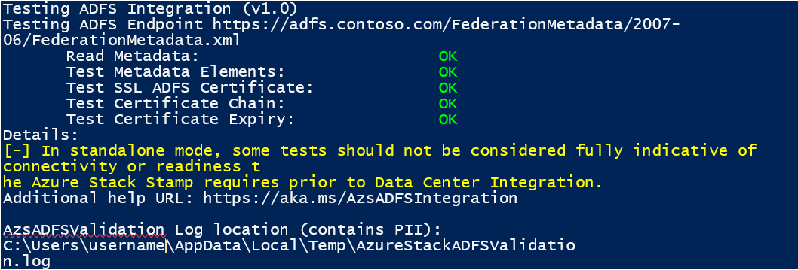

# Validate ADFS integration for Azure Stack

Use the Azure Stack Readiness Checker tool (AzsReadinessChecker) to validate that your environment is ready for ADFS integration with Azure Stack. You should validate ADFS integration before you begin data center integration or before an Azure Stack deployment.

The readiness checker validates:

* The *federation metadata* contains the valid XML elements for federation.
* The *ADFS SSL certificate* can be retrieved and chain of trust can be built. On stamp ADFS must trust the SSL certificates chain. The certificate must be signed by the same *certificate authority* as the Azure Stack deployment certificates by a trusted root authority partner. For the full list of trusted root authority partners, see: https://gallery.technet.microsoft.com/Trusted-Root-Certificate-123665ca
* *ADFS signing certificate* is trusted and not nearing expiry.

For more information about Azure Stack data center integration, see [Azure Stack datacenter integration - Identity](azure-stack-integrate-identity.md)

## Get the readiness checker tool

Download the latest version of the Azure Stack Readiness Checker tool (AzsReadinessChecker) from the [PSGallery](https://aka.ms/AzsReadinessChecker).  

## Prerequisites

The following prerequisites must be in place.

**The computer where the tool runs:**

* Windows 10 or Windows Server 2016, with domain connectivity.
* PowerShell 5.1 or later. To check your version, run the following PowerShell cmd and then review the *Major* version and *Minor* versions:  
   > `$PSVersionTable.PSVersion`
* Configure [PowerShell for Azure Stack](azure-stack-powershell-install.md). 
* The latest version of the [Microsoft Azure Stack Readiness Checker](https://aka.ms/AzsReadinessChecker) tool.

**Active Directory Federation Services environment:**

You need one of the following:

* The URL for ADFS federation metadata. For example, `https://adfs.contoso.com/FederationMetadata/2007-06/FederationMetadata.xml`
* The federation metadata XML file. For example, FederationMetadata.xml

## Validate ADFS integration

1. On a computer that meets the prerequisites, open an administrative PowerShell prompt and then run the following command to install the AzsReadinessChecker.

     `Install-Module Microsoft.AzureStack.ReadinessChecker -Force`

1. From the PowerShell prompt, run the following to start validation for !!!!graph!!!!. Specify the value for **-CustomADFSFederationMetadataEndpointUri** as the URI for the federation metadata:

     !!!! Is this correct? !!! Shouldn't it be ADFS? `Invoke-AzsGraphValidation -CustomADFSFederationMetadataEndpointUri https://adfs.contoso.com/FederationMetadata/2007-06/FederationMetadata.xml`

1. After the tool runs, review the output. Confirm the status is OK for ADFS integration requirements. A successful validation appears similar to the following.

    

    In production environments, testing certificate chains of trust from an operators workstation cannot be considered fully indicative of the PKI trust posture in the Azure Stack infrastructure. The Azure Stack stamp’s Public VIP network needs the connectivity to the CRL for the PKI infrastructure.

## Report and log file

Each time validation runs, it logs results to **AzsReadinessChecker.log** and **AzsReadinessCheckerReport.json**. The location of these files displays with the validation results in PowerShell.

The validation files can help you share status before you deploy Azure Stack or investigate validation problems. Both files persist the results of each subsequent validation check. The report provides your deployment team confirmation of the identity configuration. The log file can help your deployment or support team investigate validation issues.

By default, both files are written to
`C:\Users\<username>\AppData\Local\Temp\AzsReadinessChecker\AzsReadinessCheckerReport.json`.

Use:

* **-OutputPath** *path* parameter at the end of the run command line to specify a different report location.
* **-CleanReport** parameter at the end of the run command to clear *AzsReadinessCheckerReport.json* of previous report information. For more information, see [Azure Stack validation report](azure-stack-validation-report.md).

## Validation failures

If a validation check fails, details about the failure display in the PowerShell window. The tool also logs information to the *AzsGraphIntegration.log*.  !!!! Should this be ADFS? !!!!

The following examples provide guidance on common validation failures.

PLACEHOLDER XXXXX – failure name

*image*

Cause - xxxxxxxxxxxxxxxxxxxxxx.

Resolution – xxxxxxxxxxxxxxxxxxxxxx.

## Next Steps

[Validate Azure registration](azure-stack-validate-registration.md)  
[View the readiness report](azure-stack-validation-report.md)  
[General Azure Stack integration considerations](azure-stack-datacenter-integration.md)  