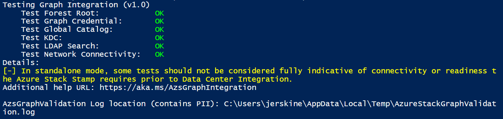

# Validate graph integration for Azure Stack

Use the Azure Stack Readiness Checker tool (AzsReadinessChecker) to validate that your environment is ready for graph integration with Azure Stack. You should validate graph integration before you begin data center integration or before an Azure Stack deployment.

The readiness checker validates:

* The credentials to the service account created for graph integration have appropriate rights to query Active Directory.
* The *global catalog* can be resolved and is contactable.
* The KDC can be resolved and is contactable.
* Necessary network connectivity is in place.

For more information about Azure Stack data center integration, see [Azure Stack datacenter integration - Identity](azure-stack-integrate-identity.md)

## Get the readiness checker tool

Download the latest version of the Azure Stack Readiness Checker tool (AzsReadinessChecker) from the [PSGallery](https://aka.ms/AzsReadinessChecker).  

## Prerequisites

The following prerequisites must be in place.

**The computer where the tool runs:**

* Windows 10 or Windows Server 2016, with domain connectivity.
* PowerShell 5.1 or later. To check your version, run the following PowerShell cmd and then review the *Major* version and *Minor* versions:  
   > `$PSVersionTable.PSVersion`
* Active Directory PowerShell module
* The latest version of the [Microsoft Azure Stack Readiness Checker](https://aka.ms/AzsReadinessChecker) tool

**Active Directory environment:**

* Identify the username and password for an account for the graph service in the existing Active Directory
* Identify the Active Directory forest root FQDN

## Validate graph

1. On a computer that meets the prerequisites, open an administrative PowerShell prompt and then run the following command to install the AzsReadinessChecker.

     `Install-Module Microsoft.AzureStack.ReadinessChecker -Force`

1. From the PowerShell prompt, run the following to to set *$graphCredential* variable to the graph account. Replace `contoso\graphservice` with your account using the `domain\username` format.

    `$graphCredential = Get-Credential contoso\graphservice -Message "Enter Credentials for the Graph Service Account"`

1. From the PowerShell prompt, run the following to start validation for graph. Specify the value for **-ForestFQDN** as the FQDN for the forest root:

     `Invoke-AzsGraphValidation -ForestFQDN contoso.com -Credential $graphCredential`

1. After the tool runs, review the output. Confirm the status is OK for graph integration requirements. A successful validation appears similar to the following.

    

    In production environments, testing network connectivity from an operators workstation cannot be considered fully indicative of the connectivity available to Azure Stack. The Azure Stack stamp’s public VIP network will need the connectivity for LDAP traffic to perform identity integration.

## Report and log file

Each time validation runs, it logs results to **AzsReadinessChecker.log** and **AzsReadinessCheckerReport.json**. The location of these files displays with the validation results in PowerShell.

The validation files can help you share status before you deploy Azure Stack or investigate validation problems. Both files persist the results of each subsequent validation check. The report provides your deployment team confirmation of the identity configuration. The log file can help your deployment or support team investigate validation issues.

By default, both files are written to
`C:\Users\<username>\AppData\Local\Temp\AzsReadinessChecker\AzsReadinessCheckerReport.json`.

Use:

* **-OutputPath** *path* parameter at the end of the run command line to specify a different report location.
* **-CleanReport** parameter at the end of the run command to clear *AzsReadinessCheckerReport.json* of previous report information. For more information, see [Azure Stack validation report](azure-stack-validation-report.md).

## Validation failures

If a validation check fails, details about the failure display in the PowerShell window. The tool also logs information to the *AzsGraphIntegration.log*.

The following examples provide guidance on common validation failures.

PLACEHOLDER XXXXX – failure name

*image*

Cause - xxxxxxxxxxxxxxxxxxxxxx.

Resolution – xxxxxxxxxxxxxxxxxxxxxx.

## Next Steps

[Validate Azure registration](azure-stack-validate-registration.md)  
[View the readiness report](azure-stack-validation-report.md)  
[General Azure Stack integration considerations](azure-stack-datacenter-integration.md)  