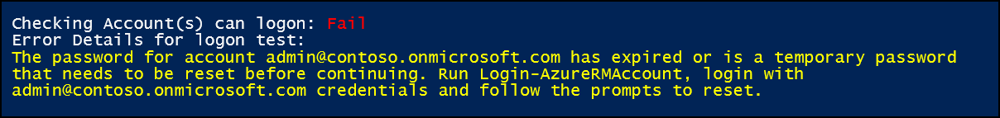
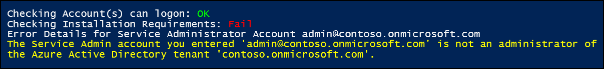

# Validate Azure identity 
Use the Azure Stack Readiness Checker tool (AzsReadinessChecker) to validate that your Azure Active Directory (Azure AD) is ready to use with Azure Stack. Validate your Azure identity solution before you begin an Azure Stack deployment.  

The readiness checker validates:
 - Azure Active Directory (Azure AD) as an identity provider for Azure Stack.
 - The Azure AD account that you plan to use can log on as a global administrator of your Azure Active Directory. 

Validation ensures your environment is ready for Azure Stack to store information about users, applications, groups, and service principals from Azure Stack in your Azure AD.

## Get the readiness checker tool
Download the latest version of the Azure Stack Readiness Checker tool (AzsReadinessChecker) from the [PSGallery](https://aka.ms/AzsReadinessChecker).  

## Prerequisites
The following prerequisites must be in place.

**The computer where the tool runs:**
 - Windows 10 or Windows Server 2016, with internet connectivity.
 - PowerShell 5.1 or later. To check your version, run the following PowerShell cmd and then review the *Major* version and *Minor* versions:  

   > `$PSVersionTable.PSVersion`
 - Configure [PowerShell for Azure Stack](azure-stack-powershell-install.md). 
 - The latest version of [Microsoft Azure Stack Readiness Checker](https://aka.ms/AzsReadinessChecker) tool.

**Azure Active Directory environment:**
 - Identify the Azure AD account you will use for Azure Stack and ensure it is an Azure Active Directory Global administrator.
 - Identify your Azure AD Tenant Name. The tenant name must be the *primary* domain name for your Azure Active Directory. For example, *contoso.onmicrosoft.com*. 
 - Identify the AzureEnvironement you will use: *AzureCloud*, *AzureGermanCloud*, or *AzureChinaCloud*.

## Validate Azure identity 
1. On a computer that meets the prerequisites, open an administrative PowerShell prompt and then run the following command to install the AzsReadinessChecker:  

   > `Install-Module Microsoft.AzureStack.ReadinessChecker -Force`

2. From the PowerShell prompt, run the following to set *$serviceAdminCredential* as the Service Administrator for your Azure AD Tenant.  Replace *serviceadmin@contoso.onmicrosoft.com* with your account and tenant. 
   > `$serviceAdminCredential = Get-Credential serviceadmin@contoso.onmicrosoft.com -Message "Enter Credentials for Service Administrator of Azure Active Directory Tenant"` 

3. From the PowerShell prompt, run the following to start validation of your Azure AD. 
   - Specify the value for AzureEnvironment as *AzureCloud*, *AzureGermanCloud*, or *AzureChinaCloud*.  
   - Specify your Azure Active Directory Tenant Name to replace *contoso.onmicrosoft.com*. 

   > `Start-AzsReadinessChecker -AADServiceAdministrator $serviceAdminCredential -AzureEnvironment AzureCloud -AADDirectoryTenantName contoso.onmicrosoft.com`
4. After the tool runs, review the output. Confirm the status is **OK** for both logon and the installation requirements. A successful validation appears like the following image: 
 

## Report and log file
Each time validation runs, it logs results to **AzsReadinessChecker.log** and **AzsReadinessCheckerReport.json**. The location of these files displays with the validation results in PowerShell.

These files can help you share validation status before you deploy Azure Stack or investigate validation problems.  Both files persist the results of each subsequent validation check. The report provides your deployment team confirmation of the identity configuration. The log file can help your deployment or support team investigate validation issues. 

By default, both files are written to *C:\Users\<username>\AppData\Local\Temp\AzsReadinessChecker\AzsReadinessCheckerReport.json*.  
 - Use the **-OutputPath** ***&lt;path&gt;*** parameter at the end of the run command line to specify a different report location.   
 - Use the **-CleanReport** parameter at the end of the run command to clear information from *AzsReadinessCheckerReport.json*.  about previous runs of the tool. 

For more information, [Azure Stack validation report](azure-stack-validation-report.md).

## Validation failures
If a validation check fails, details about the failure display in the PowerShell window. The tool also logs information to the AzsReadinessChecker.log.

The following examples provide guidance on common validation failures.

### Expired or temporary password 
 

**Cause** - The account can’t log on because the password is either expired or is temporary.     

**Resolution** - In PowerShell run the following, and then follow the prompts to reset the password.  
> `Login-AzureRMAccount`

Alternatively, login into https://portal.azure.com as the account and the user will be forced to change the password.
### Unknown user type 
 

**Cause** - The account can’t log on to the specified Azure Active Directory (AADDirectoryTenantName). In this example, *AzureChinaCloud* is specified as the *AzureEnvironment*.

**Resolution** - Confirm that the account is valid for the specified Azure Environment. In PowerShell, run the following to verify the account is valid for a specific environment:   Login-AzureRmAccount –
EnvironmentName AzureChinaCloud 
### Account is not an administrator 
 

**Cause** -  Although the account can successfully log on, the account is not an admin of the Azure Active Directory (AADDirectoryTenantName).  

**Resolution** - Login into https://portal.azure.com as the account, go to **Azure Active Directory** > **Users** > *Select the User* > **Directory Role**, and then ensure the user is a **Global administrator**.  If the account is a User, go to **Azure Active Directory** > **Custom domain** names, and confirm that the name you supplied for *AADDirectoryTenantName* is marked as the primary domain name for this directory.  In this example, that is *contoso.onmicrosoft.com*. 

Azure Stack requires that the domain name is the primary domain name.

## Next Steps
[Validate Azure registration](azure-stack-validate-registration.md)  
[View the readiness report](azure-stack-validation-report.md)  
[General Azure Stack integration considerations](azure-stack-datacenter-integration.md)  

