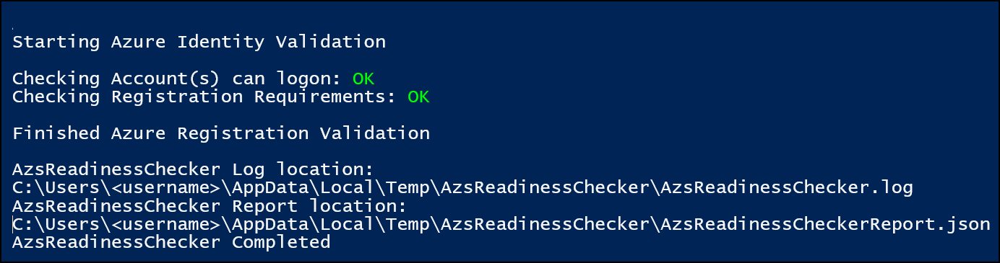
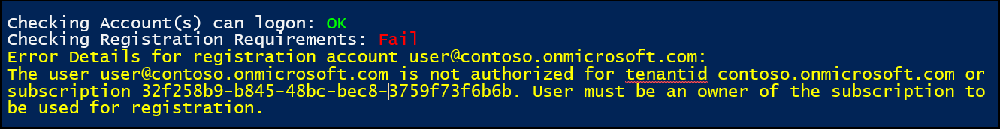
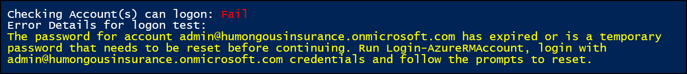
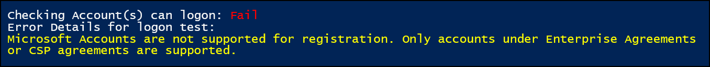
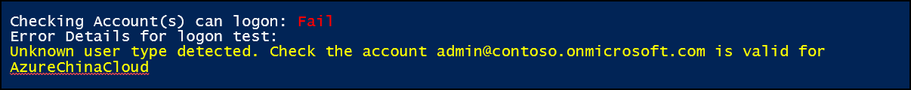

# Validate Azure registration 
Use the Azure Stack Readiness Checker tool (AzsReadinessChecker) to validate that your Azure subscription is ready to use with Azure Stack. Validate registration before you begin an Azure Stack deployment. 
The readiness checker validates:
- The Azure subscription you use is a supported type. Subscriptions must be a Cloud Service Provider (CSP) or Enterprise Agreement (EA). 
- The account you use to register your subscription with Azure can sign in to Azure and is a subscription owner. 

For more information about Azure Stack registration, see [Register Azure Stack with Azure](azure-stack-registration.md). 

## Get the readiness checker tool
Download the latest version of the Azure Stack Readiness Checker tool (AzsReadinessChecker) is available on [PSGallery](https://aka.ms/AzsReadinessChecker).  

## Prerequisites
The following prerequisites must be in place.

**The computer where the tool runs:**
 - Windows 10 or Windows Server 2016, with internet connectivity.
 - PowerShell 5.1 or later. To check your version, run the following PowerShell cmd and then review the *Major* version and *Minor* versions:  

    >`$PSVersionTable.PSVersion` 
 - Configure [PowerShell for Azure Stack](azure-stack-powershell-install.md). 
 - Download the latest version of [Microsoft Azure Stack Readiness Checker](https://aka.ms/AzsReadinessChecker) tool.  

**Azure Active Directory environment:**
 - Identify the username and password for an account that is an owner for the Azure subscription you will use with Azure Stack.  
 - Identify the subscription ID for the Azure subscription you will use. 
 - Identify the AzureEnvironment you will use: *AzureCloud*, *AzureGermanCloud*, or *AzureChinaCloud*.

## Validate Azure registration
1. On a computer that meets the prerequisites, open an administrative PowerShell prompt and then run the following command to install the AzsReadinessChecker.
    > `Install-Module Microsoft.AzureStack.ReadinessChecker -Force`

2. From the PowerShell prompt, run the following to set *$registrationCredential* as the account that is the subscription owner.   Replace *subscriptionowner@contoso.onmicrosoft.com* with your account and tenant. 
    > `$registrationCredential = Get-Credential subscriptionowner@contoso.onmicrosoft.com -Message "Enter Credentials for Subscription Owner"`

3. From the PowerShell prompt, run the following to set *$subscriptionID* as the Azure subscription you will use. Replace *xxxxxxxx-xxxx-xxxx-xxxx-xxxxxxxxxxxx* with your own subscription ID.  
     > `$subscriptionID = "xxxxxxxx-xxxx-xxxx-xxxx-xxxxxxxxxxxx"` 

4. From the PowerShell prompt, run the following to start validation of your subscription 
   - Specify the value for AzureEnvironment as *AzureCloud*, *AzureGermanCloud*, or *AzureChinaCloud*.  
   - Provide your Azure Active Directory administrator and your Azure Active Directory Tenant name. 

   > `Start-AzsReadinessChecker -RegistrationAccount $registrationCredential -AzureEnvironment AzureCloud -RegistrationSubscriptionID $subscriptionID`

5. After the tool runs, review the output. Confirm the status is OK for both logon and the registration requirements. A successful validation appears like the following image:  

## Report and log file
Each time validation runs, it logs results to **AzsReadinessChecker.log** and **AzsReadinessCheckerReport.json**. The location of these files displays with the validation results in PowerShell. 

These files can help you share validation status before you deploy Azure Stack or investigate validation problems. Both files persist the results of each subsequent validation check. The report provides your deployment team confirmation of the identity configuration. The log file can help your deployment or support team investigate validation issues. 

By default, both files are written to *C:\Users\<username>\AppData\Local\Temp\AzsReadinessChecker\AzsReadinessCheckerReport.json*.  
 - Use the **-OutputPath** ***&lt;path&gt;*** parameter at the end of the run command line to specify a different report location.   
 - Use the **-CleanReport** parameter at the end of the run command to clear information from *AzsReadinessCheckerReport.json*.  about previous runs of the tool. 
For more information, [Azure Stack validation report](azure-stack-validation-report.md).

## Validation failures
If a validation check fails, details about the failure display in the PowerShell window. The tool also logs information to the AzsReadinessChecker.log.

The following examples provide guidance on common validation failures.

### User must be an owner of the subscription	

**Cause** - The account is not an administrator of the Azure subscription.   

**Resolution** - Use an account that is an administrator of the Azure subscription that will be billed for usage from the Azure Stack deployment.

### Expired or temporary password 

**Cause** - The account can’t log on because the password is either expired or is temporary.     

**Resolution** - In PowerShell run and follow the prompts to reset the password. 
  > `Login-AzureRMAccount` 

Alternatively, login into https://portal.azure.com as the account and the user will be forced to change the password.

### Microsoft accounts are not supported for registration  

**Cause** - A Microsoft account (like Outlook.com or Hotmail.com) was specified.  These accounts are not supported.

**Resolution** - Use an account and subscription from a Cloud Service Provider (CSP) or Enterprise Agreement (EA). 

### Unknown user type  

**Cause** - The account can’t log on to the specified Azure Active Directory environment. In this example, *AzureChinaCloud* is specified as the *AzureEnvironment*.  

**Resolution** - Confirm that the account is valid for the specified Azure Environment. In PowerShell, run the following to verify the account is valid for a specific environment.     
  > `Login-AzureRmAccount -EnvironmentName AzureChinaCloud`

## Next Steps
[Validate Azure identity](azure-stack-validate-identity.md)
[View the readiness report](azure-stack-validation-report.md)
[General Azure Stack integration considerations](azure-stack-datacenter-integration.md)

