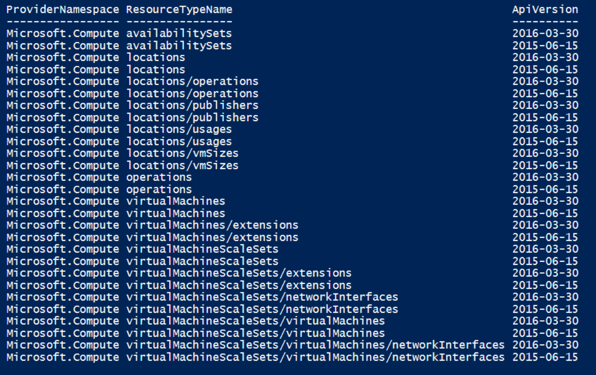
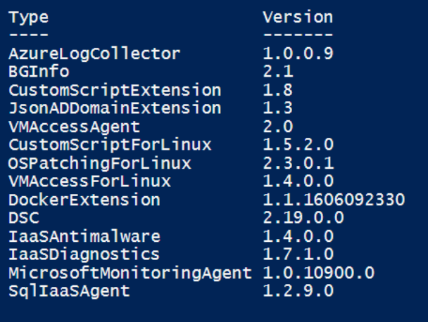

# Considerations for Virtual Machines in Azure Stack
‎
Virtual machines are an on-demand, scalable computing resource offered by Azure Stack. This article gives you information about unique considerations for the following virtual machine features in Azure Stack:  

## API versions 

Azure Stack supports specific Azure services and specific API versions for these services. When you develop applications in Azure Stack, you must specify  the supported versions to ensure that your application deploys successfully. Use the following PowerShell script to get the list of virtual machine features and corresponding API versions that are available in your Azure Stack environment:

```powershell 
Get-AzureRmResourceProvider | Select ProviderNamespace -Expand ResourceTypes | Select * -Expand ApiVersions | ` 
Select ProviderNamespace, ResourceTypeName, @{Name="ApiVersion"; Expression={$_}} | where-Object {$_.ProviderNamespace -like “Microsoft.compute”}
```

In the latest Azure Stack version, Virtual Machines and its features support the following API versions:


 
The list of resource types and API versions supported in Azure Stack may vary if the Azure Stack administrator updates your Azure Stack environment to a newer version. It’s the administrator who decides how often your Azure Stack environment should be updated to contain new features. Latest resource types and API versions may be available based on these updates.

## Virtual machine images

Virtual machines are created by using virtual machine images that are available in the marketplace. The Azure Stack Marketplace supports a subset of the list of virtual machine images that are available in the Azure Marketplace. 

By default, there aren’t any virtual machine images available in the Azure Stack Marketplace. The Azure Stack **administrator must publish virtual machine images to the Azure Stack marketplace** before users can use them. Users should notify their Azure Stack administrator if they want to use a virtual machine image, which is currently unavailable in the Azure Stack Marketplace.    

## Virtual Machine sizes 

Virtual Machine size determines the hardware and performance configuration of a virtual machine. A user should choose a virtual machine size based on the workload they want to run. Azure Stack supports a subset of the virtual machine sizes that are available in Azure. The latest Azure Stack version supports the following list of virtual machine sizes for Windows and Linux: 

| Type | Size | Range of supported sizes |
| --- | --- | --- |
|General purpose|Basic A|A0-A4|
|General purpose |Basic A|A0-A4|
|General purpose |Standard A|A0-A7|
|General purpose |Standard D|D1-D4|
|General purpose |Standard Dv2|D1v2-D5v2|
|Memory optimized|D-series|D11-D14|
|Memory optimized |Dv2-series|D11v2-D14v2|

Virtual machine sizes in Azure Stack and Azure are consistent in terms of the memory, CPU cores, network bandwidth, disk performance, and other factors that define the size. For example, the Standard D size virtual machine in Azure and  Azure Stack is consistent. 

## Virtual machine quota limits

Unlike Azure, in Azure Stack, the administrator should assign quotas for virtual machines. Quotas define limits on the number of resources that a user can create in a subscription. For virtual machines in Azure Stack, the administrator assigns a quota for the maximum number of virtual machines that a user can create or the maximum amount of memory that a virtual machine can consume.    

## Virtual machine extensions 

Azure Stack supports a subset of virtual machine extensions that are available in Azure. The Azure Stack administrator can choose which extensions will be available to their tenants. Use the following PowerShell script to get the list of virtual machine extensions that are available in your Azure Stack environment:

```powershell 
Get-AzureRmVmImagePublisher -Location local | `
Get-AzureRmVMExtensionImageType | `
Get-AzureRmVMExtensionImage | Select Type, Version | Format-Table -Property * -AutoSize 
```

Currently, Azure Stack supports the following virtual machine extension versions:


 

## Availability sets 

In Azure Stack, the fault domain and the update domain  are scoped to an Azure Stack environment. The latest Azure Stack version supports **one fault domain and one update domain** for virtual machine availability sets. 
In case of a hardware failure, the virtual machines in Azure Stack are automatically moved to a new physical server and restarted. This is true for both virtual machines in an availability set and standalone virtual machines.

## Virtual machine network  

Azure Stack virtual machines use network resources like network interfaces, IP addresses, virtual networks (VNet), and DNS names to set up network connectivity. Azure Stack has the following unique considerations for the network resources that are associated with a virtual machine:

* **Public IP addresses**
Public IP addresses are used to communicate with the public Internet and other resources that are not connected to the virtual machine’s VNet. In Azure Stack, the public IP addresses assigned to a virtual machine are not accessible from the public Internet and they are **available only within the internal organization network**. So, a user must have access to the organization network to connect to a virtual machine that is created in the Azure Stack POC. It’s the responsibility of the Azure Stack administrator to configure which users can access the organization network.  

* **DNS names**
Unlike Azure, in Azure Stack, the administrator configures the DNS name for an Azure Stack instance. So, all the virtual machines created in Azure Stack have a DNS name based on the value that is configured by the Azure Stack administrator.

## Virtual machine storage

Azure Stack virtual machines use storage accounts to store the operating system disks, data disks or virtual hard disk (VHD) images associated with the virtual machine. Azure Stack has the following unique considerations for the storage that is associated with virtual machines:

* **Premium and Standard Storage**
Like in Azure, Azure Stack has two performance tiers for storage that you can choose from when creating disks Standard Storage and Premium Storage. **Azure Stack, doesn’t differentiate between Premium and Standard storage**. Both performance tiers are backed by Storage Spaces Direct with a combination of storage types such as SSDs, non-volatile memory express (NVMe) or hard disk drive (HDDs). 
Currently, there is no limitation on the input/output operations per second (IOPS) value for the storage account and you can use either premium or standard storage account types when deploying a virtual machine with Resource Manager templates or PowerShell. 

* **Supports  unmanaged disks only**
Azure Stack currently supports **unmanaged or traditional disk types only**. Managed disks are not yet supported in Azure Stack. You should manually create and manage the storage accounts associated with the virtual machine disks. The storage accounts store the VHD images that are required by the virtual machine.  The storage account properties and the disk URI should be specified when you create a virtual machine by using PowerShell or an Azure Resource Manager template. See [Create a virtual machine with PowerShell in Azure Stack(azure-stack-quick-create-vm-powershell.md) for an example.


## Next Steps
* [Create a Windows virtual machine with PowerShell in Azure Stack](azure-stack-quick-create-vm-powershell.md)
