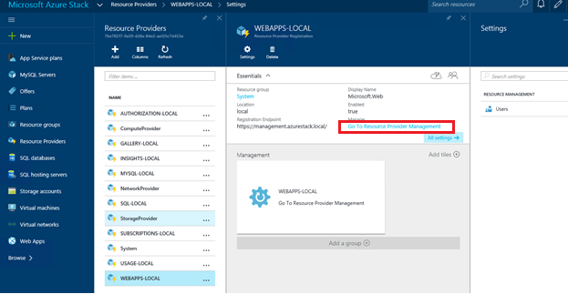
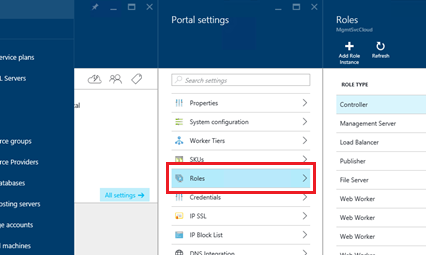
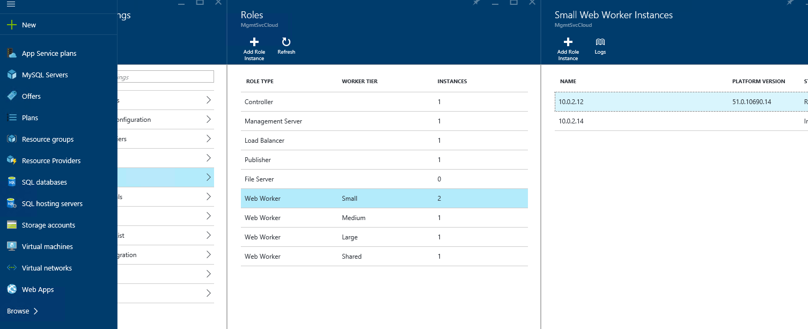
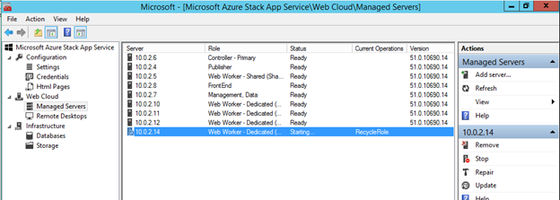
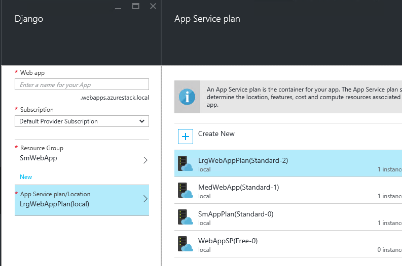
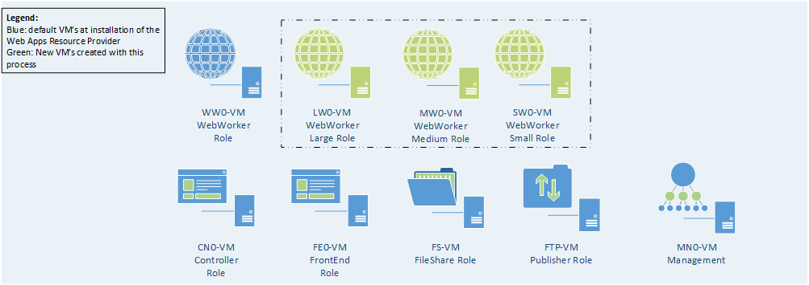

<properties
	pageTitle="Azure Stack Adding More Web Worker Roles | Microsoft Azure"
	description="Detailed guidance for scaling Azure Stack Web App"
	services="azure-stack"
	documentationCenter=""
	authors="kathm"
	manager="slinehan"
	editor=""/>

<tags
	ms.service="azure-stack"
	ms.workload="app-service"
	ms.tgt_pltfrm="na"
	ms.devlang="na"
	ms.topic="article"
	ms.date="08/09/2016"
	ms.author="kathm"/>

#   Web Apps:

##  Adding more web worker roles

This document provides instructions about how to scale Web Apps web worker roles. It contains steps for creating additional web worker roles to support web apps offerings of any size.

Azure Stack supports free and shared web app deployments. To add other types, you'll need to add more web worker roles.

If you are not sure what was deployed with the default Web Apps installation, you can review additional information [here](https://azure.microsoft.com/documentation/articles/azure-stack-webapps-overview/).

The following steps are required to scale web worker roles:

1.  [Create a new virtual machine](#step-1-create-a-new-vm-to-support-the-new-instance-size)

2.  [Configure the virtual machine](#step-2-configure-the-virtual-machine)

3.  [Configure the web worker role in the Azure Stack portal](#step-3-configure-the-web-worker-role-in-the-azure-stack-portal)

4.  [Configure app service plans](#step-4-configure-app-service-plans)

Step 1: Create a new VM to support the new instance size
========================================================

Create a virtual machine as described in [this article](https://azure.microsoft.com/documentation/articles/azure-stack-provision-vm/),
ensuring that the following selections are made:

-   User name and password: Provide the same user name and password you provided when you installed Web Apps.

-   Subscription: Use the default provider subscription.

-   Resource group: Choose **AppService-Local**.

**Note:** Store the virtual machines for worker roles in the same resource group as the Web Apps application is deployed to. (This is
recommended for this release.)

Step 2: Configure the Virtual Machine
=====================================

Once the deployment has completed, the following configuration is required to support the web worker role:

1.  Open Server Manager on the host machine, and click **Tools** &gt; **HyperV Manager**.

2.  Connect by using Remote Desktop Protocol (RDP) to the new virtual machine you created in Step 1. The name of the server is located in the summary pane when each VM is selected.

3.  Open PowerShell by clicking on the **Start** button and typing PowerShell. Right-click **PowerShell.exe**, and select **Run
    as administrator** to open PowerShell in administrator mode.

4.  Copy and paste each of the following commands (one at a time) into the PowerShell window, and press enter:

 netsh advfirewall firewall set rule group="File and Printer Sharing" new enable=Yes

 netsh advfirewall firewall set rule group="Windows Management Instrumentation (WMI)" new enable=yes

 reg add HKLM\\SOFTWARE\\Microsoft\\Windows\\CurrentVersion\\Policies\\system /v LocalAccountTokenFilterPolicy /t REG\_DWORD /d 1 /f

5.  Reboot the virtual machine.

 Note: These are minimum requirements for Web Apps. They are the default settings of the Windows 2012 R2 image included with Azure Stack. The instructions have been provided for future reference, and for those using a different image.

Step 3: Configure the web worker role in the Azure Stack portal
===============================================================
 

1.  Open the portal as the service administrator on **ClientVM**.

2.  Navigate to **Resource Providers** &gt; **WEBAPPS-LOCAL**.

 

3.  Click **Go to Resource Provider Management**.

4.  Click **Roles**.

 

5.  Click **Add Role Instance**.

6.  Click the **Tier** you would like to deploy the new instance to (small, medium, large, or shared).

 

7.  Configure the following:

-   ServerName: Provide the IP address of the server you created earlier (in section 1).

-   Role Type: Web Worker.

-   Worker Tier: Matches tier size selected.

8.  Click **OK.**

9.  Log in to CN0-VM, and open the **Web Cloud Management MMC**.

10.  Navigate to **Web Cloud** &gt; **Managed Servers**.

11.  Click the server name that you just deployed. Review the status column, and wait to move to the next step until the status
    is "Ready".

 

Step 4: Configure app service plans
===================================

**Note:** In the current release of Web Apps, app service plans must be stored in separate resource groups. Build a resource group for each size of web app, and place the application plans in their appropriate resource groups.

1.  Sign in to the portal on the ClientVM.

2.  Navigate to **New** &gt; **Web and Mobile**.

3.  Select the web app you would like to deploy.

4.  Provide the information for the web app, and then select **AppService Plan / Location**.

-   Click **Create New**.

-   Create your new plan, selecting the corresponding pricing tier for the plan.

**Note:** You can create multiple plans while on this blade. Before you deploy, however, ensure you have selected the appropriate plan.

The following shows an example of the multiple plans available:

 

Final Web App service VM configuration
======================================

The image below provides a view of the environment once you have scaled the web worker roles. The green items represent the new role additions.

 
