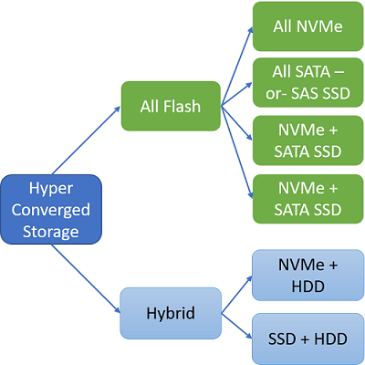

# Azure Stack storage capacity planning
The following sections provide Azure Stack storage capacity planning information to assist in planning for the solutions's storage needs.

## Uses and Organization of Storage Capacity
The hyper-converged configuration of Azure Stack allows for the sharing of physical storage devices. The three main divisions of the available storage are between the infrastructure, temporary storage of the tenant virtual machines, and the storage backing the blobs, tables, and queues of the Azure Consistent Storage (ACS) services.

## Spaces Direct Cache and Capacity Tiers
There is storage capacity used for the operating system, local logging, dumps, and other temporary infrastructure storage needs. This local storage capacity is separate (devices and capacity) from the storage devices brought under management of the Storage Spaces Direct configuration. The remainder of the storage devices is placed in a single pool of storage capacity regardless of the number of servers in the Scale Unit. These devices are of two types: Cache and Capacity.  The Cache devices are just that – Cache. Spaces Direct will consume these devices for write-back and read caching. The capacities of these Cache devices, while used, are not committed to formatted, “visible” capacity of the formatted virtual-disks. The Capacity devices are used for this purpose and provide the “home location” of the data managed by Storage Spaces.

All storage capacity is allocated and managed directly by the Azure Stack infrastructure. The operator does need to make choices about configuration, allocation, or deal with choices when it comes to capacity expansion. These design decisions have been made to align with the solution requirements and are automated during either initial installation/deployment or during capacity expansion. Details about resiliency, reserved capacity for rebuilds, and other details have been considered as part of the design. 

Operators can choose between either an all flash or a hybrid storage configuration:



In the all flash configuration, the cache is NVMe with a choice of either SATA SSD or NVMe for capacity. In the hybrid configuration, the cache is a choice between NVMe and SATA SSD while the capacity is HDD.

A brief summary of the Storage Spaces Direct and Azure Stack storage configuration is as follows:
- One Storage Spaces Pool per Scale Unit (all storage devices are configured within a single pool)
- Virtual-disks are created as a three copy mirror for best performance and resiliency
- Each virtual-disk is formatted as an ReFS file system
- Virtual-disk capacity is calculated and allocated in a way as to leave one Capacity device’s amount of data capacity unallocated in the pool. This is the equivalent of one Capacity drive per server.
- Each ReFS file system will have BitLocker enabled for data-at-rest encryption. 

The virtual-disks created automatically and their capacities are as follows:


|Name|Capacity calculation|Description|
|-----|-----|-----|
|Local/boot device|Minimum of 340 GB<sup>1</sup>|Individual server storage for operating system images and "local" Infrastructure VMs|
|Infrastructure|3.5 TB|All Azure Stack infrastructure usage|
|VmTemp|See below<sup>2</sup>|Tenant virtual machines have a temporary disk attached and that data is stored in these virtual disks|
|ACS|See below <sup>3</sup>|Azure Consistent Storage capacity for servicing blobs, tables, and queues|

<sup>1</sup> Minimum storage capacity required of the Azure Stack solution partner.

<sup>2</sup> The virtual-disk size used for Tenant Virtual Machine temporary disks is calculated as a ratio of the physical memory of the server. As noted in the tables below for the Azure IaaS VM sizes, the temporary disk is a ratio of the physical memory assigned to the virtual machine. The allocation done for “temp disk” storage in Azure Stack will be done in a way as to capture most use cases but may not be able to satisfy all temp disk storage needs. The ratio chosen is a trade-off between making temporary storage available while not consuming a majority of the storage capacity of the solution for temp disk capacity only. One temporary storage disk is created per server in the Scale Unit. The capacity of the temporary storage will not grow beyond 10% of the overall available storage capacity in the storage pool of the Scale Unit. The calculation is something like the following example:

```
  DesiredTempStoragePerServer = PhysicalMemory * 0.65 * 8
  TempStoragePerSolution = DesiredTempStoragePerServer * NumberOfServers
  PercentOfTotalCapacity = TempStoragePerSolution / TotalAvailableCapacity
  If (PercentOfTotalCapacity <= 0.1)
      TempVirtualDiskSize = DesiredTempStoragePerServer
  Else
      TempVirtualDiskSize = (TotalAvailableCapacity * 0.1) / NumberOfServers
```

<sup>3</sup> The virtual-disks created for use by ACS are a simple division of the remaining capacity. As noted, all virtual-disks are a three-way mirror and one Capacity drive’s worth of capacity for each server is unallocated. The various virtual-disks enumerated above are allocated first and the remaining capacity is then used for the ACS virtual-disks.

## Next steps
[Learn about the Azure Stack capacity planning spreadsheet](capacity-planning-spreadsheet.md)
