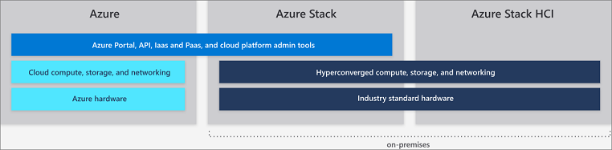

# Differences between global Azure, Azure Stack, and Azure Stack HCI

Microsoft provides Azure and the Azure Stack family of services in one Azure ecosystem. Use the same application model, self-service portals, and APIs with Azure Resource Manager to deliver cloud-based capabilities whether your business uses global Azure or on-premises resources.

This article describes global Azure, Azure Stack, and Azure Stack HCI capabilities and provides common scenario recommendations to help you make the best choice for delivering Microsoft cloud-based services for your organization.

## Global Azure

Microsoft Azure is an ever-expanding set of cloud services to help your organization meet your business challenges. It’s the freedom to build, manage, and deploy applications on a massive, global network using your favorite tools and frameworks.

Global Azure offers more than 100 services available in 54 regions around the globe. For the most current list of global Azure services, see the [*Products available by region*](https://azure.microsoft.com/regions/services). The services available in Azure are listed by category, as well as whether they are Generally Available or available through preview.

For more information about global Azure services, see [Get started with Azure](https://docs.microsoft.com/azure/#pivot=get-started&panel=get-started1).

## Azure Stack

Azure Stack is an extension of Azure that brings the agility and innovation of cloud computing to your on-premises environment. Deployed on-premises, Azure Stack can be used to provide Azure consistent services either connected to the internet (and Azure) or in disconnected environments with no internet connectivity. Azure Stack uses the same underlying technologies as global Azure, which includes the core components of Infrastructure-as-a-Service (IaaS), Software-as-a-Service (SaaS), and optional Platform-as-a-Service (PaaS) capabilities including:

- Azure VMs for Windows and Linux
- Azure Web Apps and Functions
- Azure Key Vault
- Azure Resource Manager
- Azure Marketplace
- Containers
- Azure IoT Hub and Event Hubs
- Admin tools (Plans, offers, RBAC, etc.)

The PaaS capabilities of Azure Stack are optional because Azure Stack is not operated by Microsoft—it is operated by our customers. This means you can offer whatever PaaS service you want to end users if you are prepared to abstract the underlying infrastructure and processes away from the end user. However, Azure Stack does include several optional PaaS service providers including App Service, SQL databases, and MySQL databases. These are delivered as resource providers, so they are multi-tenant ready, updated over time with standard Azure Stack updates, visible in the Azure Stack portal, and well-integrated with Azure Stack.

In addition to the resource providers described above, there are additional PaaS services available and tested as [Azure Resource Manager template-based solutions](https://github.com/Azure/AzureStack-QuickStart-Templates) that run in IaaS, but you as an Azure Stack operator can offer them as PaaS services to your users including:

- Service Fabric
- Kubernetes Container Service
- IoT Hub and Event Hubs
- Ethereum Blockchain
- Cloud Foundry

### Example use cases for Azure Stack:

- Financial modeling
- Clinical and claims data
- IoT device analytics
- Retail assortment optimization
- Supply-chain optimization
- Industrial IoT
- Predictive maintenance
- Smart city
- Citizen engagement

Learn more about Azure Stack at [What is Azure Stack](azure-stack-overview.md).

## Azure Stack HCI 

Azure Stack HCI solutions allow you to run virtual machines on-premises and easily connect to Azure with a hyperconverged infrastructure (HCI) solution. Build and run cloud applications using consistent Azure services on-premises to meet regulatory or technical requirements. In addition to running virtualized applications on-premises, Azure Stack HCI enables you to replace and consolidate aging server infrastructure and connect to Azure for cloud services using the Windows Admin Center.

Azure Stack HCI provides validated HCI solutions powered by Hyper-V and Storage Spaces Direct with Windows Server 2019 Software-Defined Datacenter (SDDC). The Windows Admin Center is used for management and integrated access to Azure services such as:

- Azure Backup
- Azure Site Recovery
- Azure Monitor and Update

For an updated list of Azure services that you can connect Azure Stack HCI to, see [Connecting Windows Server to Azure hybrid services](https://docs.microsoft.com/windows-server/azure-hybrid-services/index).

### Example use cases for Azure Stack HCI
- Remote or branch office systems
- Datacenter consolidation
- Virtual desktop Infrastructure
- Business-critical infrastructure
- Lower-cost storage
- High availability and disaster recovery in the cloud
- Enterprise apps like SQL Server

Visit the [Azure Stack HCI website](https://azure.microsoft.com/overview/azure-stack/hci/) to view 70+ Azure Stack HCI solutions currently available from Microsoft partners.

## Next steps

[Azure Stack administration basics](azure-stack-manage-basics.md)

[Quickstart: use the Azure Stack administration portal](azure-stack-manage-portals.md)
