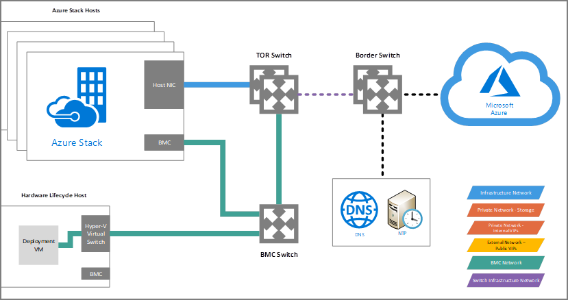

# About deployment network traffic
Understanding how network traffic flows during Azure Stack deployment is vital to ensuring a successful deployment. This article walks you through expected network traffic during the deployment process to provide an understanding of what to expect.

This illustration shows all the components and connections involved in the deployment process:

> [!NOTE]
> This article describes the requirements for a connected deployment, to learn about other deployment methods, see [Azure Stack deployment connection models](azure-stack-connection-models.md).

### The Deployment VM
The Azure Stack solution includes a group of servers that are used to host Azure Stack components and an extra server called the Hardware Lifecycle Host (HLH). This server is used to deploy and manage the lifecycle of your solution and hosts the Deployment VM (DVM) during deployment.

## Deployment requirements
Before deployment starts, there are some minimum requirements that can be validated by your OEM to ensure deployment completes successfully. Understanding these requirements will help you prepare the environment and make sure validation succeeds, these are:

-   [Certificates](azure-stack-pki-certs.md)
-   [Azure Subscription](https://azure.microsoft.com/free/?b=17.06)
-   Internet access
-   DNS
-   NTP

> [!NOTE]
> This article focuses on the last three requirements. For more information on the first two, see the links above.

## Deployment network traffic
The DVM is configured with an IP from the BMC Network and requires network access to the internet. Although not all of the BMC Network components require external routing or access to the Internet, some OEM-specific components utilizing IPs from this network might also require it.

During deployment, the DVM authenticates against Azure Active Directory (Azure AD) using an Azure account from your subscription. In order to do so, the DVM requires internet access to a list of specific port and URLs. You can find the complete list in the [Publish Endpoints](azure-stack-integrate-endpoints.md) documentation. The DVM will utilize a DNS server to forward DNS requests made by internal components to external URLs. The internal DNS forwards these requests to the DNS forwarder address that you provide to the OEM prior to deployment. The same is true for the NTP server, a reliable Time Server is required to maintain consistency and time synchronization for all Azure Stack components.

The internet access required by the DVM during deployment is outbound only, no inbound calls are made during deployment. Keep in mind that it uses its IP as source and that Azure Stack does not support proxy configurations. Therefore, if necessary, you need to provide a transparent proxy or NAT to access the internet. During deployment, some internal components will start accessing the internet through the External Network using Public VIPs. After deployment completes, all communication between Azure and Azure Stack is made through the External Network using Public VIPs.

Network configurations on Azure Stack switches contain Access Control Lists (ACLs) that restrict traffic between certain network sources and destinations. The DVM is the only component with unrestricted access; even the HLH is very restricted. You can ask your OEM about customization options to ease management and access from your networks. Because of these ACLs, it is important to avoid changing the DNS and NTP server addresses at deployment time. If you do so, you will need to reconfigure all of the switches for the solution.

After deployment is completed, the provided DNS and NTP server addresses will continue to be used by the system’s components directly. For example, if you check DNS requests after deployment is completed, the source will change from the DVM IP to an address from the External Network range.

After deployment is completed, the provided DNS and NTP server addresses will continue to be used by the system’s components through the SDN using the External network. For example, if you check DNS requests after deployment is completed, the source will change from the DVM IP to a Public VIP.

## Next steps
[Validate Azure registration](azure-stack-validate-registration.md)
