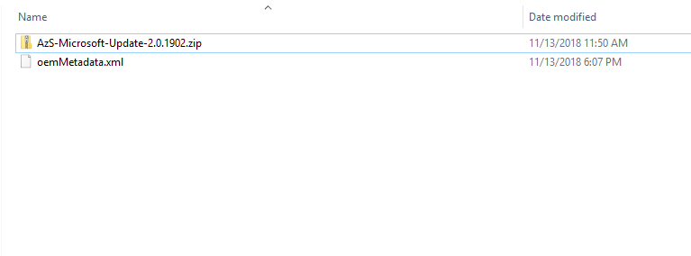
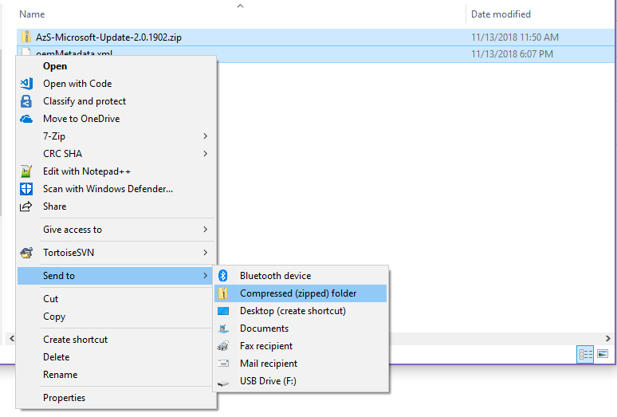
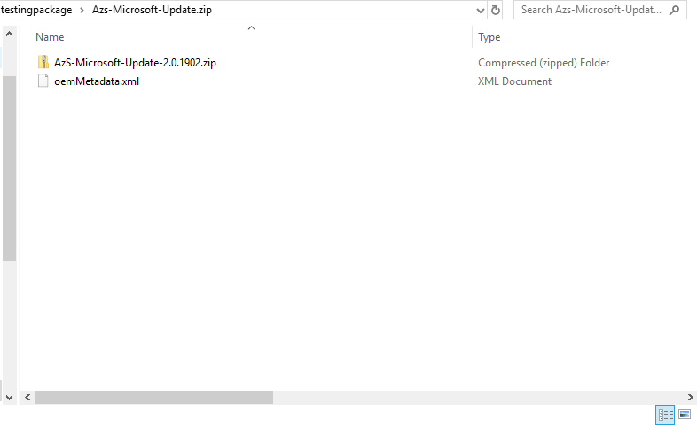

# Create an OEM package

[!INCLUDE[Azure_Stack_Partner](./includes/azure-stack-partner-appliesto.md)]

The Azure Stack OEM Extension Package is the mechanism by which OEM specific content is added to Azure Stack infrastructure, for use in deployment as well as operational processes like update, expansion, and field replacement.

## Creating the package

Once created and validated, the OEM extension package can be used in VaaS.  Before continuing, ensure that you have completed the steps for [creating an OEM package](https://microsoft.sharepoint.com/:w:/r/teams/cloudsolutions/Sacramento/_layouts/15/Doc.aspx?sourcedoc=%7BD7406069-7661-419C-B3B1-B6A727AB3972%7D&file=Azure%20Stack%20OEM%20Extension%20Package.docx&action=default&mobileredirect=true). The package is then submitted to Microsoft along with VaaS test results for signing in the Package Validation workflow. The following steps detail how to bundle the generated files into a single zip file that VaaS can consume.

1. Identify the following content for the package:
    - An executable named `<Publisher>-<Model>-<Version>.exe`
    - One or more files binary files named `<Publisher><Model>-<Version>-#.bin`, where # is a sequential number starting with 1. The number of binary files is dependent on the total size of the package content.
    - A manifest file named `oemMetadata.xml`, which should be identical in content to the metadata.xml file in the root of the package content.

2. Select the content files and create a zip file from the contents:

    
    

3. Rename the resulting file so it is descriptive enough for you to identify it.

## Verifying the contents

To validate the structure of your zip file, inspect it and check that there are no subfolders. The TLD has the zipped contents. A valid package structure is shown below.
> [!IMPORTANT]
> Zipping the parent folder instead of the contents will cause package signing to fail.

The zip file can now be uploaded to VaaS and signed by Microsoft in the Package Validation workflow.

## Next steps

- [Validate an OEM package](azure-stack-vaas-validate-oem-package.md)
