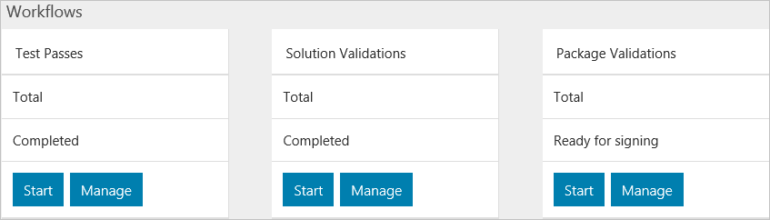

# Validation as a Service key concepts

This article describes key concepts in Validation as a Service (VaaS).

## Solutions

A VaaS solution represents a Azure Stack solution with a particular hardware bill of materials (BoM). The VaaS solution acts as a container for the workflows that run against the Azure Stack solution.

### Create a solution in the VaaS portal

1. Sign in to the [VaaS portal](https://azurestackvalidation.com).
2. On the solutions dashboard, click on **New solution**.
3. Enter a name for the solution. See [Naming convention for VaaS solutions](azure-stack-vaas-best-practice.md#naming-convention-for-vaas-solutions) for naming suggestions.
4. Click **Save** to create the solution.

## Workflows

A VaaS workflow operates within the context of a VaaS solution. It represents a set of test suites that exercise the functionality of an Azure Stack deployment. A workflow should be created for every deployment or software update of an Azure Stack solution.

Workflows are categorized by testing scenario type. In unofficial testing, the **Test Pass** workflow allows you to select tests from all available VaaS collateral. In official testing, the **validation** workflows target specific testing scenarios selected by Microsoft.

> [!NOTE]
> The **Package Validation** workflow currently supports two scenarios: [Validate OEM packages](azure-stack-vaas-validate-oem-package.md) and [Validate software updates from Microsoft](azure-stack-vaas-validate-microsoft-updates.md).

For more information on workflow types, see [What is Validation as a Service for Azure Stack?](azure-stack-vaas-overview.md).

### Getting started with VaaS workflows

1. On the solutions dashboard, create a new solution or select an existing one. This refreshes and enables the workflow tiles.
2. To create a new workflow, click on **Start** on any tile. For information specific to each workflow, see the following articles:
    - Test Pass: [Quickstart: Use the Validation as a Service portal to schedule your first test](azure-stack-vaas-schedule-test-pass.md)
    - Solution Validation: [Validate a new Azure Stack solution](azure-stack-vaas-validate-solution-new.md)
    - Package Validation: [Validate software updates from Microsoft](azure-stack-vaas-validate-microsoft-updates.md)
    - Package Validation: [Validate OEM packages](azure-stack-vaas-validate-oem-package.md)

3. To manage or monitor an existing workflow, click on **Manage** on the workflow tile. Click on the name of the workflow and use the **Edit** button to view properties or modify common test parameters.

For more information about workflow properties and parameters, see [Workflow common parameters for Azure Stack Validation as a Service](azure-stack-vaas-parameters.md).

## Tests

A test in VaaS consists of a suite of operations that run against an Azure Stack solution. Tests have different intended purposes identified by a category, such as functional or reliability, and target one or more services of Azure Stack. Each test defines its own set of parameters, some of which are specified by common parameters of the containing workflow.

For more information about managing and monitoring tests, see [Monitor and manage tests in the VaaS portal](azure-stack-vaas-monitor-test.md).

For more information about test parameters, see [Workflow common parameters for Azure Stack Validation as a Service](azure-stack-vaas-parameters.md).

## Agents

A VaaS agent drives test execution. Two types of agents execute VaaS tests:

- The **cloud agent**. This is the default agent available in VaaS. No setup is required, but this requires in-bound connectivity to your environment and Azure Stack endpoints must be resolvable from the internet. Some tests are not compatible with the cloud agent.
- A **local agent**. This enables you to perform validation in scenarios where in-bound connectivity to your environment is not feasible. Some tests require execution through the local agent.

Local agents are not tied to any particular Azure Stack or VaaS solution. As a best practice, they should run outside of an Azure Stack environment.

For instructions on adding a local agent, see [Deploy the local agent](azure-stack-vaas-local-agent.md).

## Next steps

- [Best practices for Validation as a Service](azure-stack-vaas-best-practice.md)