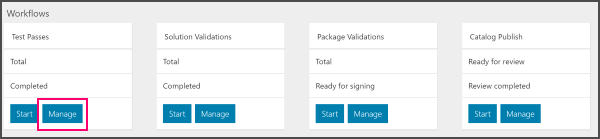

# Monitor a test with Azure Stack validation as a service

[!INCLUDE [Azure_Stack_Partner](./includes/azure-stack-partner-appliesto.md)]

The execution of a test can be monitored by viewing the **Operations** page for test suites that are in progress or completed. This page details the status of the test and its operations.

## Monitor a test

1. Select a solution.

2. Select **Manage** on any workflow tile.

3. Click a workflow to open its test summary page.

4. Expand the context menu **[...]** for any test suite instance.

5. Select **View Operations**

For tests that have finished running, logs can be downloaded from the test summary page by clicking on **Download logs** in a test's context menu **[...]**. Azure Stack partners can use these logs to debug issues for failed tests.

## Open the test pass summary

1. Open the portal. 
2. Select the name of an existing solution that contains previously run or scheduled tests.

    

3. Select **Manage** in the **Test Passes** panel.
4. Select the test pass to open the Test pass summary. You can review the test name, date created, run, how long the test took, and the result (succeeded or failed).
5. Select [ **. .  .** ].

### Test pass summary

| Column | Description |
| --- | --- |
| Test name | The name of the test. References the validation number. |
| Created | Time the test pass was created. |
| Started | Time the test past ran. |
| Duration | Length of time the time it took the test pass to run. |
| Status | The result (Succeeded or Failed) for the rest pass. |
| Agent Name | The fully qualified domain name of the agent. |
| Total operations | The total number of operations attempted in the test pass. |
| Passed operations | The number of operations that passed in the test pass. |
|  Failed Operations | The number of operations that failed. |

### Group columns in the test pass summary

You can select and drag a column into the header to create a group on the column value.

## Reschedule a test

1. [Open the test pass summary](#open-the-test-pass-summary).
2. Select **Reschedule** to reschedule the test pass.
3. Enter the Cloud Admin password for your Azure Stack instance.
4. Enter the Diagnostics Storage Connection string you defined when you set up your account.
5. Reschedule the test.

## Cancel a test

1. [Open the test pass summary](#open-the-test-pass-summary).
2. Select **Cancel**.

## Get test information

1. [Open the test pass summary](#open-the-test-pass-summary).
2. Select **View information** to reschedule the test pass.

**Test information**

| Name | Description |
| -- | -- |
| Test name | The name of the test, for example, OEM Update on Azure Stack 1806 RC Validation. |
| Test version | The version of the test, for example, 5.1.4.0. |
| Publisher | The test publisher, such as Microsoft. |
| Category | The category of test, such as **Functional** or **Reliability**. |
| Target services | The services being tested, such as VirtualMachines |
| Description | The description of the test. |
| Estimated duration (minutes) | The length of time in minutes the test took to run. |
| Links | A link to GitHub Issue Tracker. |

## Get test parameters

1. [Open the test pass summary](#open-the-test-pass-summary).
2. Select **View parameters** to reschedule the test pass.

**Parameters**

| Name | Description |
| -- | -- |
| Test name | The name of the test, for example, oemupdate1806test. |
| Test version | The version of the rest, for example, 5.1.4.0. |
| Test instance ID | A GUID identifying the specific instance of the test, for example, 20b20645-b400-4f0d-bf6f-1264d866ada9. |
| cloudAdminUser | The name of the account used as the cloud administrator, for example, **cloudadmin**. |
| DiagnosticsContainerName | The ID of the diagnostic container, for example, 04dd3815-5f35-4158-92ea-698027693080. |

## Get test operations

1. [Open the test pass summary](#open-the-test-pass-summary).
2. Select **View operations** to reschedule the test pass. The operations summary pane opens.

## Get test logs

1. [Open the test pass summary](#open-the-test-pass-summary).
2. Select **Download logs** to reschedule the test pass.  
    A zip file named ReleaseYYYY-MM-DD.zip containing the logs downloads.

## Next steps

- To learn more about [Azure Stack validation as a service](https://docs.microsoft.com/azure/azure-stack/partner).
