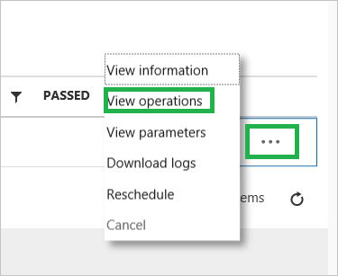

# Monitor and manage tests in the VaaS portal

[!INCLUDE [Azure_Stack_Partner](./includes/azure-stack-partner-appliesto.md)]

After scheduling tests against your Azure Stack solution, Validation as a Service (VaaS) will begin reporting test execution status. This information is available in the VaaS portal along with actions like rescheduling and cancelling tests.

## Navigate to the workflow tests summary page

1. On the solutions dashboard, select an existing solution that has at least one workflow.

    

1. Select **Manage** on the workflow tile. The next page lists the workflows created for the selected solution.

1. Select the workflow name to open its test summary.

## Change workflow parameters

Each workflow type lets you to edit the [Test parameters](azure-stack-vaas-parameters.md#test-parameters) specified during workflow creation.

1. On the tests summary page, select the **Edit** button.

1. Provide new values according to [Workflow common parameters for Azure Stack Validation as a Service](azure-stack-vaas-parameters.md).

1. Select **Submit** to save the values.

> [!NOTE]
> In the **Test Pass** workflow, you will need to finish the test selection and go to the review page before you can save the new parameter values.

### Add tests (Test Pass only)

In **Test Pass** workflows, both the **Add tests** and **Edit** buttons allow you to schedule new tests in the workflow.

> [!TIP]
> Select **Add tests** if you only want to schedule new tests and don't need to edit parameters for a **Test Pass** workflow.

## Managing test instances

For unofficial runs (i.e., the **Test Pass** workflow), the tests summary page lists the tests scheduled against the Azure Stack solution.

For official runs (i.e., the **validation** workflows), the tests summary page lists the tests required for completing validation of the Azure Stack solution. Validation tests are scheduled from this page.

Each scheduled test instance shows the following information:

| Column | Description |
| --- | --- |
| Test name | The name and version of the test. |
| Category | The purpose of the test. |
| Created | The time at which the test was scheduled. |
| Started | The time at which the test started execution. |
| Duration | The length of time the test ran. |
| Status | The state or result of the test. Pre-execution or in-progress statuses are: `Pending`, `Running`. Terminal statuses are: `Cancelled`, `Failed`, `Aborted`, `Succeeded`. |
| Agent name | The name of the agent that ran the test. |
| Total operations | The total number of operations attempted during the test. |
| Passed operations | The number of operations that succeeded during the test. |
|  Failed Operations | The number of operations that failed during the test. |

### Actions

Each test instance lists available actions you can take when you click on its context menu **[...]** in the test instances table.

#### View information about the test definition

Select **View information** from the context menu to view general information about the test definition. This is shared by each test instance with the same name and version.

| Test property | Description |
| -- | -- |
| Test name | The name of the test. |
| Test version | The version of the test. |
| Publisher | The publisher of the test. |
| Category |  The purpose of the test. |
| Target services | The Azure Stack services being tested. |
| Description | The description of the test. |
| Estimated duration (minutes) | The expected runtime of the test. |
| Links | Any relevant information about the test or points of contact. |

#### View test instance parameters

Select **View parameters** from the context menu to view the parameters provided to the test instance at schedule time. Sensitive strings like passwords are not displayed. This action is available only for tests that have been scheduled.

This window includes the following metadata for all test instances:

| Test instance property | Description |
| -- | -- |
| Test name | The name of the test. |
| Test version | The version of the test. |
| Test instance ID | A GUID identifying the specific instance of the test. |

#### View test instance operations

Select **View operations** from the context menu to view a detailed status of operations performed during the test. This action is available only for tests that have been scheduled.

#### Download logs for a completed test instance

Select **Download logs** from the context menu to download a `.zip` file of the logs output during test execution. This action is available only for tests that have completed, i.e., a test with a status of either `Cancelled`, `Failed`, `Aborted`, or `Succeeded`.

#### Reschedule a test instance or schedule a test

Scheduling tests from the management page depends on the type of workflow the test runs under.

##### Test Pass workflow

In the Test Pass workflow, **rescheduling** a test instance reuses the same set of parameters as the original test instance and *replaces* the original result, including its logs. You will need to reenter sensitive strings like passwords when you reschedule.

1. Select **Reschedule** from the context menu to open a prompt for rescheduling the test instance.

1. Enter any applicable parameters.

1. Select **Submit** to reschedule the test instance and replace the existing instance.

##### Validation workflows

[!INCLUDE [azure-stack-vaas-workflow-validation-section_schedule](includes/azure-stack-vaas-workflow-validation-section_schedule.md)]

#### Cancel a test instance

A scheduled test may be cancelled if its status is `Pending` or `Running`.  

1. Select **Cancel** from the context menu to open a prompt for cancelling the test instance.

1. Select **Submit** to cancel the test instance.

## Next steps

- [Troubleshoot Validation as a Service](azure-stack-vaas-troubleshoot.md)
