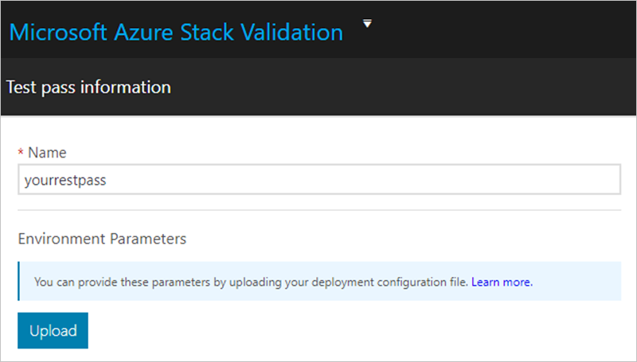

# Schedule your first test

[!INCLUDE[Azure_Stack_Partner](./includes/azure-stack-partner-appliesto.md)]

Schedule a test in the Validation as a Service (VaaS) portal for your Azure Stack solution. A VaaS solution represents an Azure Stack solution with a particular hardware bill of materials (BoM). You can schedule a test to check that your hardware can run Azure Stack.

To check your solution, create the workflow for a test. A VaaS workflow operates within the context of a VaaS solution. It represents a set of test suites that exercise the functionality of an Azure Stack deployment on your hardware. Add your solution's environmental parameters and select one or more tests to run on your solution.

While the Test Pass workflow can be used to run any test provided by VaaS, including tests from the validation workflows, results from the Test Pass workflow are not considered *official*. For information about official validation workflows, see [Workflows](azure-stack-vaas-key-concepts.md#workflows).

## Prerequisites

Before you follow this quickstart, you should finish the following items:

- [Set up your Validation as a Service resources](azure-stack-vaas-set-up-resources.md)
- [Deploy the local agent](azure-stack-vaas-local-agent.md) (Recommended)
- [Validation as a Service key concepts](azure-stack-vaas-key-concepts.md) (Recommended)

## Start a workflow

Sign in to the portal, select or creation a solution, and then select the solution.

1. Sign in to the [VaaS portal](https://azurestackvalidation.com).
2. Type the name of an existing solution or select **New solution** to create a new solution. For instructions, see [Create a solution in the VaaS portal](azure-stack-vaas-key-concepts.md#create-a-solution-in-the-vaas-portal).
3. Select **Start** on the **Test Passes** tile.

## Specify parameters

Define the workflow for your solution. The workflow has the process steps that used to test your solution.

1. [!INCLUDE [azure-stack-vaas-workflow-step_naming](includes/azure-stack-vaas-workflow-step_naming.md)]
2. [!INCLUDE [azure-stack-vaas-workflow-step_upload-stampinfo](includes/azure-stack-vaas-workflow-step_upload-stampinfo.md)]
3. [!INCLUDE [azure-stack-vaas-workflow-step_test-params](includes/azure-stack-vaas-workflow-step_test-params.md)]
4. [!INCLUDE [azure-stack-vaas-workflow-step_tags](includes/azure-stack-vaas-workflow-step_tags.md)]
5. Select **Next** to select tests to schedule.

## Select tests to run

Choose the tests you would like to run in your workflow.

1. Select the test(s) you want to run in your workflow.

    If you want to override the common parameters (that is, the parameters provided in the previous section) for any test, select on the **Edit** link next to specify new values.

1. [!INCLUDE [azure-stack-vaas-workflow-step_select-agent](includes/azure-stack-vaas-workflow-step_select-agent.md)]
1. Select **Next** to review the workflow.

## Review and submit

Review, create, and then schedule you workflow.

1. Review the displayed information.

    The services creates your workflow with the provided information and the selected tests will be scheduled.

    If anything appears incorrect, use the **Previous** buttons to go to an earlier section.

1. [!INCLUDE [azure-stack-vaas-workflow-step_submit](includes/azure-stack-vaas-workflow-step_submit.md)]

## Next steps

- [Monitor and manage tests in the VaaS portal](azure-stack-vaas-monitor-test.md)
