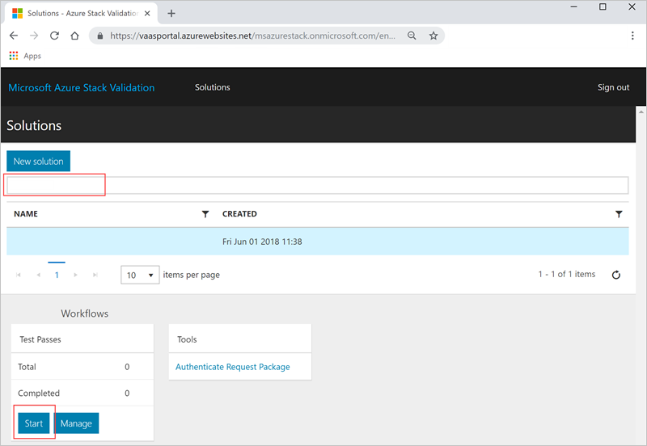

# Quickstart: Use the validation as a service portal to schedule your first test

[!INCLUDE [Azure_Stack_Partner](./includes/azure-stack-partner-appliesto.md)]

Learn how to schedule your first test with the validation as a service (VaaS) portal to check your hardware. The local agent must be deployed on the Azure Stack solution being validated prior to running validation tests.

In this quickstart you will do add your solution and run tests.

## Prerequisites

Before you follow this quickstart, you will need to have:
 - A validation as a service account. For instructions, see [Set up your validation as a service account](azure-stack-vaas-set-up-account.md).  
- The local agent installed on your system. For instructions, see [Deploy the local agent and test virtual machines](azure-stack-vaas-test-vm.md).

## Add a new solution

1. Sign in to the [validation portal](https://azurestackvalidation.com).

      

2. Select **New solution**.
3. Enter a name for the solution, and select **Save**.

## Create a solution validation workflow

1. Select the solution name.
2. Select **Manage** on the **Solution Validations** tile.

    

## Create a solution workflow

1. Select **New solution validation**.
2. Type the name of the validation.
3. Select **Minimum** or **Maximum**.  
    - **Minimum**  
    The solution is configured with the minimum supported number of nodes.  
    - **Maximum**  
    The solution is configured with the maximum supported number of nodes.
4. Add your environmental parameters. For more information, see [Add environmental parameters](#add-environmental-parameters).
5. Add your common test parameters. For more information, see [Add common test parameters](#add-common-test-parameters).

    Depending on the test definition, the test may require you to enter a value independently of the common parameters, or may allow you to override the common parameter value.
6. Click **Submit** to schedule the test.

## Add environmental parameters

Add the following environmental parameters:

| Test pass information | Required | Description |
| --- | --- | --- | --- |
| Azure Stack build | Required | Azure Stack build number (for example 20170501.1) Value must be a valid Azure Stack build number or version, for example, 1.0.170330.9 |
| Tenant ID | Required | Active Directory Tenant ID. This must be a GUID (for example ECA23256-6BA0-4F27-8E4D-AFB02F088363) |
| Region | Required | Azure Stack deployment region |
| Tenant Resource Manager endpoint | Required | Endpoint for Tenant Azure Resource Manager operations (for example https://management.loc-ext.domain.com) |
| Admin Resource Manager endpoint | Not required | Endpoint for Tenant Azure Resource Manager operations (for example https://management.loc-ext.domain.com) |
| External FQDN | Not required | External fully qualified domain name used as the suffix for endpoints. (for example local.azurestack.external or redmond.contoso.com) |
| Number of nodes | Required | The number of nodes in your solution. |

## Add common test parameters

Add the following common test parameters:

| Test pass information | Required | Description |
| --- | --- | --- |
| Tenant username | Required | Tenant username (for example tenant@contoso.onmicrosoft.com) |
| Tenant password | Required | The password for the tenant. |
| Service Administrator username | Not required | Tenant username (for example tenant@contoso.onmicrosoft.com) |
| Service Administrator password | Not required | Service Administrator username (for example serviceadmin@contoso.onmicrosoft.com) |
| Cloud Administrator username | Not required | Azure Stack domain administrator account (for example, contoso\cloudadmin) |
| Cloud Administrator password | Not required | |
|  Diagnostics connection string | Not required | SAS URI to an Azure Storage Account to which diagnostics logs will be copied during test execution. See [Create an Azure storage blob to store logs](azure-stack-vaas-set-up-account.md#create-an-azure-storage-blob-to-store-logs).   The value of the **Diagnostics connection string** common parameter will be stored by the service and provided at schedule time to all tests in the workflow that use this parameter. When the SAS URL is within 30 days of expiry, you will be prompted for a new SAS URL on the common parameters page. |
| Tag - Name | Not required |  Descriptive tags may be entered to label the workflow. This is the name of the tag. |
| Tag - Value | Not required | Descriptive tags may be entered to label the workflow. This is the value of the tag. |

## Next steps

- [Validate a new Azure Stack solution](azure-stack-vaas-validate-solution-new.md)  
- To learn more about [Azure Stack validation as a service](https://docs.microsoft.com/azure/azure-stack/partner).
