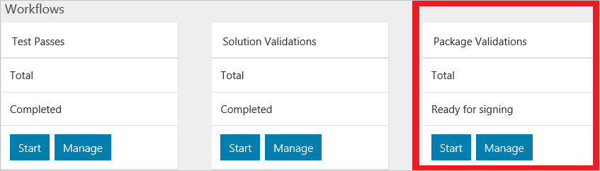

# Validate OEM packages

[!INCLUDE [Azure_Stack_Partner](./includes/azure-stack-partner-appliesto.md)]

You can test a new OEM package when there has been a change to the firmware or drivers for a completed solution validation. When your package has passed the test, it is signed by Microsoft. Your test must contain the updated OEM extension package with the drivers and firmware that have passed Windows Server logo and PCS tests.

[!INCLUDE [azure-stack-vaas-workflow-validation-completion](includes/azure-stack-vaas-workflow-validation-completion.md)]

> [!IMPORTANT]
> Before uploading or submitting packages, review [Create an OEM package](azure-stack-vaas-create-oem-package.md) for the expected package format and contents.

## Managing packages for validation

When using the **Package Validation** workflow to validate a package, you will need to provide a URL to an **Azure Storage blob**. This blob is the OEM package that was installed on the solution at deployment time. Create the blob using the Azure Storage Account you created during setup (see [Set up your Validation as a Service resources](azure-stack-vaas-set-up-resources.md)).

### Prerequisite: Provision a storage container

Create a container in your storage account for package blobs. This container can be used for all your Package Validation runs.

1. In the [Azure Portal](https://portal.azure.com), go to the storage account created in [Set up your Validation as a Service resources](azure-stack-vaas-set-up-resources.md).
2. On the left blade under **Blob Service**, select on **Containers**.
3. Select **+ Container** in the menu bar and provide a name for the container, e.g., `vaaspackages`.

### Upload package to storage account

1. Prepare the package you want to validate. If your package has multiple files, compress it into a `.zip` file.
2. In the [Azure Portal](https://portal.azure.com), select the package container and upload the package by selecting on **Upload** in the menu bar.
3. Select the package `.zip` file to upload. Keep defaults for **Blob type** (i.e., **Block Blob**) and **Block size**.

> [!NOTE]
> Please ensure that the `.zip` contents are placed at the root of the `.zip` file. There should be no sub-folders in the package.

### Generate package blob URL for VaaS

When creating a **Package Validation** workflow in the VaaS portal, you will need to provide a URL to the Azure Storage blob containing your package.

#### Option 1: Generating an account SAS URL

1. In the [Azure portal](https://portal.azure.com/), go to your storage account, and navigate to the .zip containing your package

2. Select **Generate SAS** from the context menu

3. Select **Read** from **Permissions**

4. Set **Start time** to the current time, and **End time** to at least 48 hours from **Start time**. If you will be running other tests with the same package, consider increasing **End time** for the length of your testing. Any tests scheduled through VaaS after **End time** will fail and a new SAS will need to be generated.

5. Select **Generate blob SAS token and URL**

Use **Blob SAS URL** when starting a new **Package Validation** workflow in the VaaS portal.

#### Option 2: Using public read container

> [!CAUTION]
> This option opens up your container for anonymous read-only access.

1. Grant **public read access for blobs only** to the package container by following the instructions in section [Grant anonymous users permissions to containers and blobs](https://docs.microsoft.com/azure/storage/storage-manage-access-to-resources#grant-anonymous-users-permissions-to-containers-and-blobs).

2. In the package container, select on the package blob in the container to open the properties pane.

3. Copy the **URL**. Use this value when starting a new **Package Validation** workflow in the VaaS portal.

## Apply monthly update

[!INCLUDE [azure-stack-vaas-workflow-section_update-azs](includes/azure-stack-vaas-workflow-section_update-azs.md)]

## Create a Package Validation workflow

1. Sign in to the [VaaS portal](https://azurestackvalidation.com).

2. [!INCLUDE [azure-stack-vaas-workflow-step_select-solution](includes/azure-stack-vaas-workflow-step_select-solution.md)]

3. Select **Start** on the **Package Validation** tile.

    

4. [!INCLUDE [azure-stack-vaas-workflow-step_naming](includes/azure-stack-vaas-workflow-step_naming.md)]

5. Enter the Azure Storage blob URL to the OEM package that was installed on the solution at deployment time. For instructions, see [Generate package blob URL for VaaS](#generate-package-blob-url-for-vaas).

6. [!INCLUDE [azure-stack-vaas-workflow-step_upload-stampinfo](includes/azure-stack-vaas-workflow-step_upload-stampinfo.md)]

7. [!INCLUDE [azure-stack-vaas-workflow-step_test-params](includes/azure-stack-vaas-workflow-step_test-params.md)]

    > [!NOTE]
    > Environment parameters cannot be modified after creating a workflow.

8. [!INCLUDE [azure-stack-vaas-workflow-step_tags](includes/azure-stack-vaas-workflow-step_tags.md)]

9. [!INCLUDE [azure-stack-vaas-workflow-step_submit](includes/azure-stack-vaas-workflow-step_submit.md)]
    You will be redirected to the tests summary page.

## Run Package Validation tests

In the **Package validation tests summary** page, you will see a list of the tests required for completing validation. Tests in this workflow run for approximately 24 hours.

[!INCLUDE [azure-stack-vaas-workflow-validation-section_schedule](includes/azure-stack-vaas-workflow-validation-section_schedule.md)]

When all tests have successfully completed, send the name of your VaaS Solution and Package Validation to [vaashelp@microsoft.com](mailto:vaashelp@microsoft.com) to request package signing.

## Next steps

- [Monitor and manage tests in the VaaS portal](azure-stack-vaas-monitor-test.md)