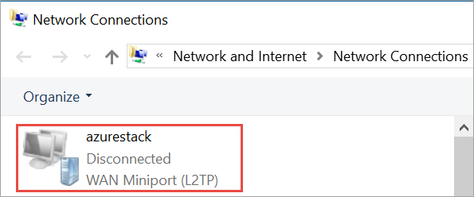

# Connect to Azure Stack

To manage resources, you must connect to the Azure Stack Development Kit. This article details the steps required to connect to the development kit. You can use either of the following connection options:

* [Remote Desktop](#connect-with-remote-desktop): lets a single concurrent user quickly connect from the development kit.
* [Virtual Private Network (VPN)](#connect-with-vpn): lets multiple concurrent users connect from clients outside of the Azure Stack infrastructure (requires configuration).

## Connect to Azure Stack with Remote Desktop
With a Remote Desktop connection, a single concurrent user can work with the portal to manage resources.

1. Open a Remote Desktop Connection and connect to the development kit. Enter **AzureStack\AzureStackAdmin** as the username, and the administrative password that you provided during Azure Stack setup.  

2. From the development kit computer, open Server Manager, click **Local Server**, turn off Internet Explorer Enhanced Security, and then close Server Manager.

3. To open the  portal, navigate to (https://portal.local.azurestack.external/) and sign in using user credentials.


## Connect to Azure Stack with VPN

You can establish a split tunnel Virtual Private Network (VPN) connection to an Azure Stack Development Kit. Through the VPN connection, you can access the administrator portal, user portal, and locally installed tools such as Visual Studio and PowerShell to manage Azure Stack resources. VPN connectivity is supported in both Azure Active Directory(AAD) and Active Directory Federation Services(AD FS) based deployments. VPN connections enable multiple clients to connect to Azure Stack at the same time. 

> [!NOTE] 
> This VPN connection does not provide connectivity to Azure Stack infrastructure VMs. 

### Prerequisites

* Install [Azure Stack compatible Azure PowerShell](azure-stack-powershell-install.md) on your local computer.  
* Download the [tools required to work with Azure Stack](azure-stack-powershell-download.md). 

### Configure VPN connectivity

To create a VPN connection to the development kit, open an elevated PowerShell session from your local Windows-based computer and run the following script (make sure to update the IP address and password values for your environment):

```PowerShell 
# Configure winrm if it's not already configured
winrm quickconfig  

Set-ExecutionPolicy RemoteSigned

# Import the Connect module
Import-Module .\Connect\AzureStack.Connect.psm1 

# Add the development kit computer’s host IP address & certificate authority (CA) to the list of trusted hosts. Make sure to update the IP address and password values for your environment. 

$hostIP = "<Azure Stack host IP address>"

$Password = ConvertTo-SecureString `
  "<Administrator password provided when deploying Azure Stack>" `
  -AsPlainText `
  -Force

Set-Item wsman:\localhost\Client\TrustedHosts `
  -Value $hostIP `
  -Concatenate

# Create a VPN connection entry for the local user
Add-AzsVpnConnection `
  -ServerAddress $hostIP `
  -Password $Password

```

If the set-up succeeds, you should see **azurestack** in your list of VPN connections.

  

### Connect to Azure Stack

Connect to the Azure Stack instance by using either of the following two methods:  

* By using the `Connect-AzsVpn ` command: 
    
  ```PowerShell
  Connect-AzsVpn `
    -Password $Password
  ```

  When prompted, trust the Azure Stack host and install the certificate from **AzureStackCertificateAuthority** onto your local computer’s certificate store. (the prompt might appear behind the PowerShell session window). 

* Open your local computer’s **Network Settings** > **VPN** > click **azurestack** > **connect**. At the sign-in prompt, enter the username (AzureStack\AzureStackAdmin) and the password.

### Test the VPN connectivity

To test the portal connection, open an Internet browser and navigate to the user portal (https://portal.local.azurestack.external/), sign in and create resources.  

## Next steps


