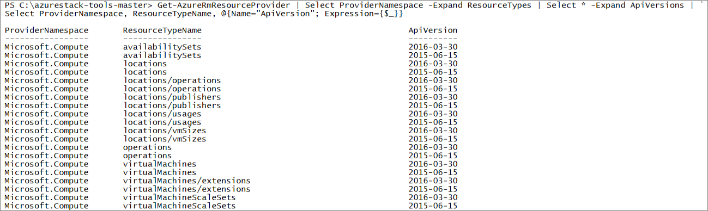

# Key considerations: Using services or building apps for Azure Stack

Before you use services or build apps for Azure Stack, you must understand the differences between Azure Stack and Azure. This article identifies the key considerations when you use Azure Stack as your hybrid cloud development environment.

## Overview

Azure Stack is a hybrid cloud platform that lets you use Azure services from your company's or service provider's datacenter. You can build an app on Azure Stack and then deploy it to Azure Stack, to Azure, or to your Azure hybrid cloud.

Your Azure Stack operator will let you know which services are available for you to use, and how to get support. They offer these services through their customized plans and offers.

The Azure technical content assumes that apps are being developed for an Azure service instead of Azure Stack. When you build and deploy apps to Azure Stack, you must understand some key differences, such as:

* Azure Stack delivers a **subset** of the services and features that are available in Azure.
* Your company or service provider can choose which services they want to offer. The available options might include customized services or applications. They may offer their own customized documentation.
* You must use the correct Azure Stack-specific endpoints (for example, the URLs for the portal address and the Azure Resource Manager endpoint).
* You must use PowerShell and API versions that are supported by Azure Stack. Using supported versions ensures that your apps will work in both Azure Stack and Azure.

## Cheat sheet: High-level differences

The following table describes the high-level differences between Azure Stack and Azure. Keep these differences in mind when you develop for Azure Stack or use Azure Stack services.
*Applies to: Azure Stack integrated systems and Azure Stack Development Kit*

| Area | Azure (global) | Azure Stack |
| -------- | ------------- | ----------|
| Who operates it? | Microsoft | Your organization or service provider.|
| Who do you contact for support? | Microsoft | For an integrated system, contact your Azure Stack operator (at your organization or service provider) for support.<br><br>For Azure Stack Development Kit support, visit the [Microsoft forums](https://social.msdn.microsoft.com/Forums/home?forum=azurestack). Because the development kit is an evaluation environment, there is no official support offered through Microsoft Customer Support Services (CSS).
| Available services | See the list of [Azure products](https://azure.microsoft.com/services/?b=17.04b). Available services vary by Azure region. | Azure Stack supports a subset of Azure services. Actual services will vary based on what your organization or service provider chooses to offer.
| Azure Resource Manager endpoint* | https://management.azure.com | For an Azure Stack integrated system, use the endpoint that your Azure Stack operator provided.<br><br>For the development kit, use: https://management.local.azurestack.external
| Portal URL* | [https://portal.azure.com](https://portal.azure.com) | For an Azure Stack integrated system, go to the URL that your Azure Stack operator provided.<br><br>For the development kit, use: https://portal.local.azurestack.external
| Region | You can select which region you want to deploy to. | For an  Azure Stack integrated system, use the region that's available on your system.<br><br>For the development kit, region will always be **local**.
| Resource groups | A resource group can span regions. | For both integrated systems and the development kit, there is only one region.
|Supported namespaces, resource types, and API versions | The latest (or earlier versions that are not yet deprecated). | Azure Stack supports specific versions. See the "Version requirements" section of this article.
| | |

*If you are an Azure Stack operator, see [Using the administrator portal](../azure-stack-manage-portals.md) and [Administration basics](../azure-stack-manage-basics.md) for more information.

## Helpful tools and best practices
 
 Microsoft provides several tools and guidance that helps you develop for Azure Stack.

| Recommendation | References | 
| -------- | ------------- | 
| Install the correct tools on your developer workstation. | - [Install PowerShell](azure-stack-powershell-install.md)<br>- [Download tools](azure-stack-powershell-download.md)<br>- [Configure PowerShell](azure-stack-powershell-configure-user.md)<br>- [Install Visual Studio](azure-stack-install-visual-studio.md) 
| Review information about the following items:<br>- Azure Resource Manager template considerations<br>- How to find QuickStart templates<br>- Use a policy module to help you use Azure to develop for Azure Stack | [Develop for Azure Stack](azure-stack-developer.md) | 
| Review and follow the best practices for templates. | [Resource Manager Quickstart Templates](https://github.com/Azure/azure-quickstart-templates/blob/master/1-CONTRIBUTION-GUIDE/best-practices.md#best-practices)
| | |

## Version requirements

Azure Stack supports specific versions of Azure PowerShell and Azure service APIs. Use supported versions to ensure that your app can deploy to both Azure Stack and to Azure.

To make sure that you use a correct version of Azure PowerShell, use [API version profiles](azure-stack-version-profiles.md). To determine the latest API version profile that you can use, find out the build of Azure Stack you're using. You can get this information from your Azure Stack administrator.

>[!NOTE]
 If you're using the Azure Stack Development Kit, and you have administrative access, see the "Determine the current version" section of [Manage updates](../azure-stack-updates.md#determine-the-current-version) to determine the Azure Stack build.

For other APIs, run the following PowerShell command to output the namespaces, resource types, and API versions that are supported in your Azure Stack subscription. Note there may still be differences at a property level. (For this command to work, you must have already [installed](azure-stack-powershell-install.md) and [configured](azure-stack-powershell-configure-user.md) PowerShell for an Azure Stack environment. You must also have a subscription to an Azure Stack offer.)

```powershell
Get-AzureRmResourceProvider | Select ProviderNamespace -Expand ResourceTypes | Select * -Expand ApiVersions | `
Select ProviderNamespace, ResourceTypeName, @{Name="ApiVersion"; Expression={$_}} 
```

Example output (truncated):

 
## Next steps

For more detailed information about differences at a service level, see:

* [Considerations for Virtual Machines in Azure Stack](azure-stack-vm-considerations.md)
* [Considerations for Storage in Azure Stack](azure-stack-acs-differences.md)
* [Considerations for Azure Stack networking](azure-stack-network-differences.md)
