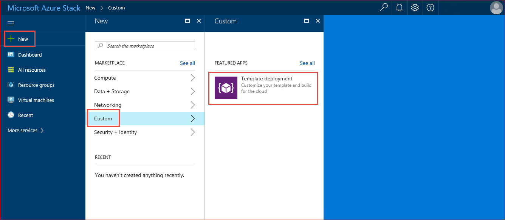
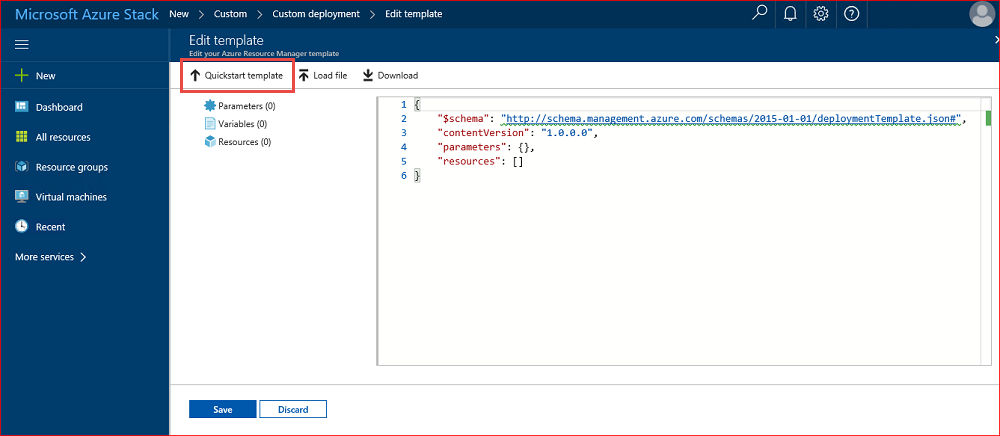
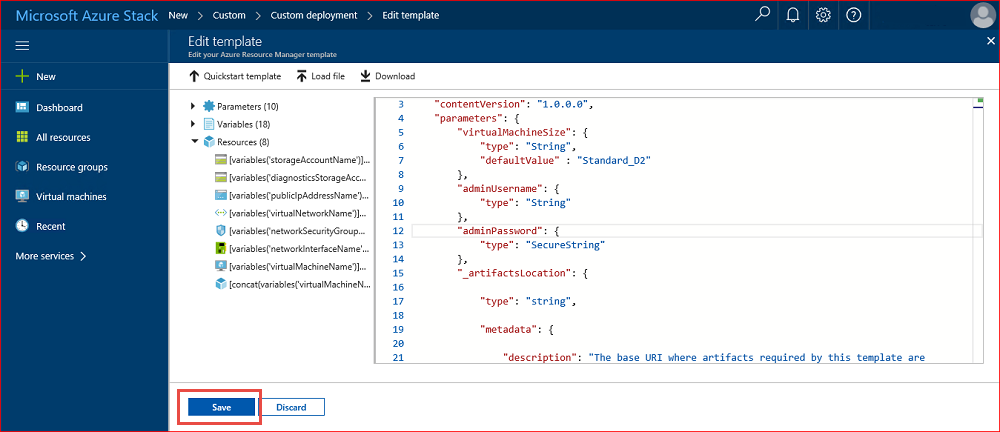
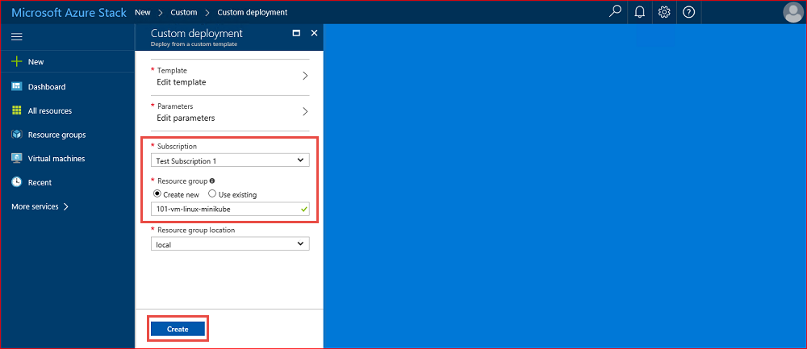
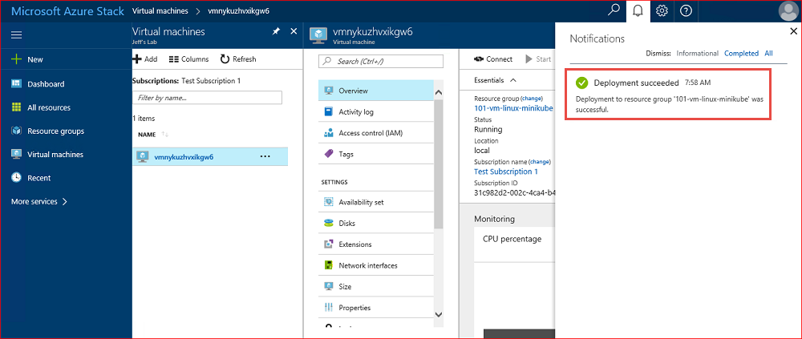
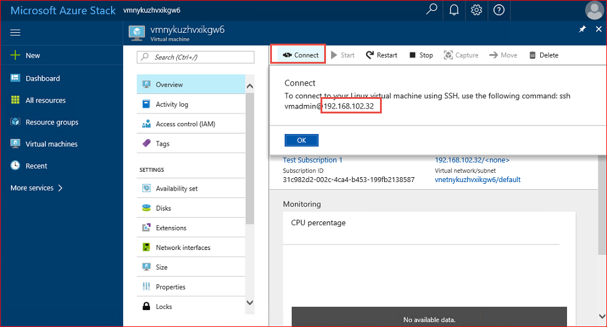
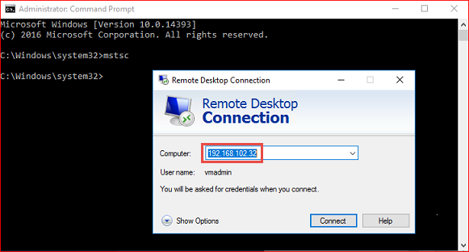
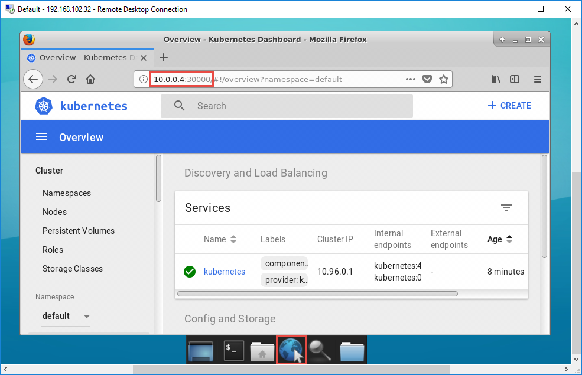

# Tutorial: create a VM using a community template

As an Azure Stack operator or user, you can create a VM using [custom GitHub quickstart templates](https://github.com/Azure/AzureStack-QuickStart-Templates) rather than deploying one manually from the Azure Stack marketplace.

In this tutorial, you learn how to:

> [!div class="checklist"]
> * Use Azure Stack quickstart templates 
> * Create a VM using a custom GitHub template
> * Start minikube and install an application

## Azure Stack quickstart templates

Azure Stack quickstart templates are stored in the [public Azure Stack QuickStart templates repository](https://github.com/Azure/AzureStack-QuickStart-Templates) on GitHub. This repository contains Azure Resource Manager deployment templates that have been tested with the Microsoft Azure Stack Development Kit (ASDK). You can use them to make it easier for you to evaluate Azure Stack and use the ASDK environment. 

Over time many GitHub users have contributed to the repository, resulting in a collection of more than 400 deployment templates. This repository is a great starting point to get a better understanding of how you can deploy various kinds of environments to Azure Stack. 

>[!IMPORTANT]
> Some of these templates are created by members of the community and not by Microsoft. Each template is licensed under a license agreement by its owner, not Microsoft. Microsoft is not responsible for these templates and does not screen for security, compatibility, or performance. Community templates are not supported under any Microsoft support program or service, and are made available "AS IS," without warranty of any kind.

If you want to contribute your Azure Resource Manager templates to GitHub, make your contribution to the [AzureStack-QuickStart-Templates](https://github.com/Azure/AzureStack-QuickStart-Templates) repository. To learn more about this repository and how to contribute to it, see the [readme file](https://github.com/Azure/AzureStack-QuickStart-Templates/blob/master/README.md). 

## Create a VM using a custom GitHub template

In this example tutorial, the [101-vm-linux-minikube](https://github.com/Azure/AzureStack-QuickStart-Templates/tree/master/101-vm-linux-minikube) Azure Stack quickstart template is used to deploy an Ubuntu 16.04 virtual machine on Azure Stack running Minikube to manage a Kubernetes cluster.

Minikube is a tool that makes it easy to run Kubernetes locally. Minikube runs a single-node Kubernetes cluster inside a VM, enabling you to try out Kubernetes or develop with it day-to-day. It supports a simple, one-node Kubernetes cluster running on a Linux VM. Minikube is the fastest and most straightforward way to get a fully functional Kubernetes cluster running. It enables developers to develop and test their Kubernetes-based application deployments on their local machines. Architecturally, the Minikube VM runs both Master and Agent Node Components locally:

- Master Node components such as API Server, Scheduler, and [etcd Server](https://coreos.com/etcd/) are run in a single Linux process called LocalKube.
- Agent Node components are run inside docker containers exactly as they would run on a normal Agent Node. From an application deployment standpoint, there is no difference between when the application is deployed on a Minikube, or in a regular Kubernetes cluster.

This template installs the following components:

- Ubuntu 16.04 LTS VM
- [Docker-CE](https://download.docker.com/linux/ubuntu) 
- [Kubectl](https://storage.googleapis.com/kubernetes-release/release/v1.8.0/bin/linux/amd64/kubectl)
- [Minikube](https://storage.googleapis.com/minikube/releases/latest/minikube-linux-amd64)
- xFCE4
- xRDP

> [!IMPORTANT]
> The Ubuntu VM image (Ubuntu Server 16.04 LTS in this example) must already have been added to the Azure Stack marketplace before performing these steps.

1.	Select **+ Create a resource**, then **Custom**, then **Template deployment**.

     

2. Select **Edit template**.

     

3.	Select **Quickstart template**.

    

4. Select **101-vm-linux-minikube** from the available templates using the **Select a template** dropdown list, and then click **OK**.	

    

5. If you want to make modifications to the template JSON you can do so. If not, or when complete, select **Save** to close the **Edit template** dialog.

     

6.	Select **Parameters**, fill in or modify the available fields as necessary, and then click **OK**. Choose the subscription to use, create or choose an existing resource group name, and then select **Create** to initiate the template deployment.

    

7. Choose the subscription to use, create or choose an existing resource group name, and then select **Create** to initiate the template deployment.

    

8. The resource group deployment takes several minutes to create the custom template-based VM. You can monitor the installation status through notifications and from the resource group properties. 

    

    >[!NOTE]
    > The VM will be running when the deployment completes. 

## Start Minikube and install an application

Now that the Linux VM has been successfully created, you can sign in to start Minikube and install an application. 

1. After the deployment completes, select **Connect** to view the public IP address that will be used to connect to the Linux VM. 

    

2. From an elevated command prompt, run **mstsc.exe** to open Remote Desktop Connection and connect to the Linux VM public IP address discovered in the previous step. When prompted to sign in to xRDP, use the credentials you specified when creating the VM.

    

3. Open Terminal Emulator and enter following commands to start Minikube:

    ```shell
    sudo minikube start --vm-driver=none
    sudo minikube addons enable dashboard
    sudo minikube dashboard --url
    ```

    

4. Open the web browser and visit the Kubernetes dashboard address. Congratulations, you now have a fully working Kubernetes installation using Minikube!

    

5. To deploy a sample application, visit the official documentation page of Kubernetes, and skip the "Create Minikube Cluster" section as you have already created one above. Jump to the section "Create your Node.js application" at https://kubernetes.io/docs/tutorials/stateless-application/hello-minikube/.

## Next steps

In this tutorial, you learned how to:

> [!div class="checklist"]
> * Learn about Azure Stack quickstart templates 
> * Create a VM using a custom GitHub template
> * Start minikube and install an application

