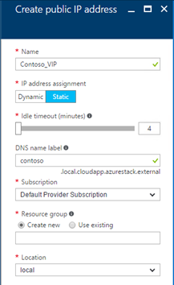

# Using DNS in Azure Stack

*Applies to: Azure Stack integrated systems and Azure Stack Development Kit*

Azure Stack supports the following Domain Name System (DNS) features:

* DNS hostname resolution
* Creating and managing DNS zones and records using the API

## Support for DNS hostname resolution

You can specify a DNS domain name label for public IP resources. Azure Stack uses **domainnamelabel.location.cloudapp.azurestack.external** for the label name and maps it to the public IP address in Azure Stack managed DNS servers.

For example, if you create a public IP resource with **contoso** as a domain name label in the local Azure Stack location, the [fully qualified domain name (FQDN)](https://en.wikipedia.org/wiki/Fully_qualified_domain_name)  **contoso.local.cloudapp.azurestack.external** resolves to the public IP address of the resource. You can use this FQDN to create a custom domain CNAME record that points to the public IP address in Azure Stack.

To learn more about name resolution, see the [DNS resolution](../../dns/dns-for-azure-services.md?toc=%2fazure%2fvirtual-machines%2fwindows%2ftoc.json) article.

> [!IMPORTANT]
> Each domain name label you create must be unique within its Azure Stack location.

The following screenshot shows the **Create public IP address** dialog for creating a public IP address using the portal:

### Example scenario

You have a load balancer processing requests from a web application. Behind the load balancer is a web site running on one or more virtual machines. You can access the load-balanced web site using a DNS name, instead of an IP address.

## Create and manage DNS zones and records using the API

You can create and manage DNS zones and records in Azure Stack.

Azure Stack provides a DNS service similar to Azure, using APIs that are consistent with the Azure DNS APIs.  By hosting your domains in Azure Stack DNS, you can manage your DNS records using the same credentials, APIs, and tools. You can also use the same billing and support as your other Azure services.

The Azure Stack DNS infrastructure is more compact than Azure. The size and location of an Azure Stack deployment affects DNS scope, scale, and performance. This also means that performance, availability, global distribution, and high-availability can vary from deployment to deployment.

## Comparison with Azure DNS

DNS in Azure Stack is similar to DNS in Azure, but there are important exceptions:

* **Does not support AAAA records**

    Azure Stack does not support AAAA records because Azure Stack does not support IPv6 addresses. This is a key difference between DNS in Azure and Azure Stack.
* **Is not multi-tenant**

    The DNS Service in Azure Stack is not multi-tenant. Each tenant cannot create the same DNS zone. Only the first subscription that attempts to create the zone succeeds, and subsequent requests fail. This is a key difference between Azure and Azure Stack DNS.
* **Tags, metadata, and Etags**

    There are minor differences in how Azure Stack handles tags, metadata, Etags, and limits.

To learn more about Azure DNS, see [DNS zones and records](../../dns/dns-zones-records.md).

### Tags

Azure Stack DNS supports using Azure Resource Manager tags on DNS zone resources. It does not support tags on DNS record sets, although as an alternative, 'metadata' is supported on DNS record sets as explained next.

### Metadata

As an alternative to record set tags, Azure Stack DNS supports annotating record sets using *metadata*. Similar to tags, metadata enables you to associate name-value pairs with each record set. For example, this can be useful to record the purpose of each record set. Unlike tags, you cannot use metadata to provide a filtered view of your Azure bill, and metadata cannot be specified in an Azure Resource Manager policy.

### Etags

Suppose two people or two processes try to modify a DNS record at the same time. Which one wins? And does the winner know that they've overwritten changes created by someone else?

Azure Stack DNS uses *Etags* to safely handle concurrent changes to the same resource. Etags are different from Azure Resource Manager *Tags*. Each DNS resource (zone or record set) has an Etag associated with it. When a resource is retrieved, its Etag is also retrieved. When updating a resource, you can choose to pass back the Etag so Azure Stack DNS can verify that the Etag on the server matches. Since each update to a resource results in the Etag being regenerated, an Etag mismatch indicates a concurrent change has occurred. Etags can also be used when creating a new resource to ensure that the resource does not already exist.

By default, Azure Stack DNS PowerShell cmdlets use Etags to block concurrent changes to zones and record sets. The optional **-Overwrite** switch can be used to suppress Etag checks, in which case any concurrent changes that have occurred are overwritten.

At the level of the Azure Stack DNS REST API, Etags are specified using HTTP headers. Their behavior is described in the following table:

| Header | Behavior|
|--------|---------|
| None   | PUT always succeeds (no Etag checks)|
| If-match| PUT only succeeds if resource exists and Etag matches|
| If-match *| PUT only succeeds if resource exists|
| If-none-match *| PUT only succeeds if resource does not exist|

### Limits

The following default limits apply when using Azure Stack DNS:

| Resource| Default limit|
|---------|--------------|
| Zones per subscription| 100|
| Record sets per zone| 5000|
| Records per record set| 20|

## Next steps

[Introducing iDNS for Azure Stack](azure-stack-understanding-dns.md)
