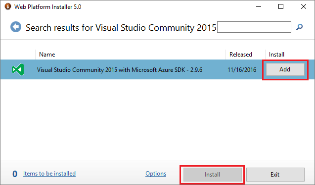
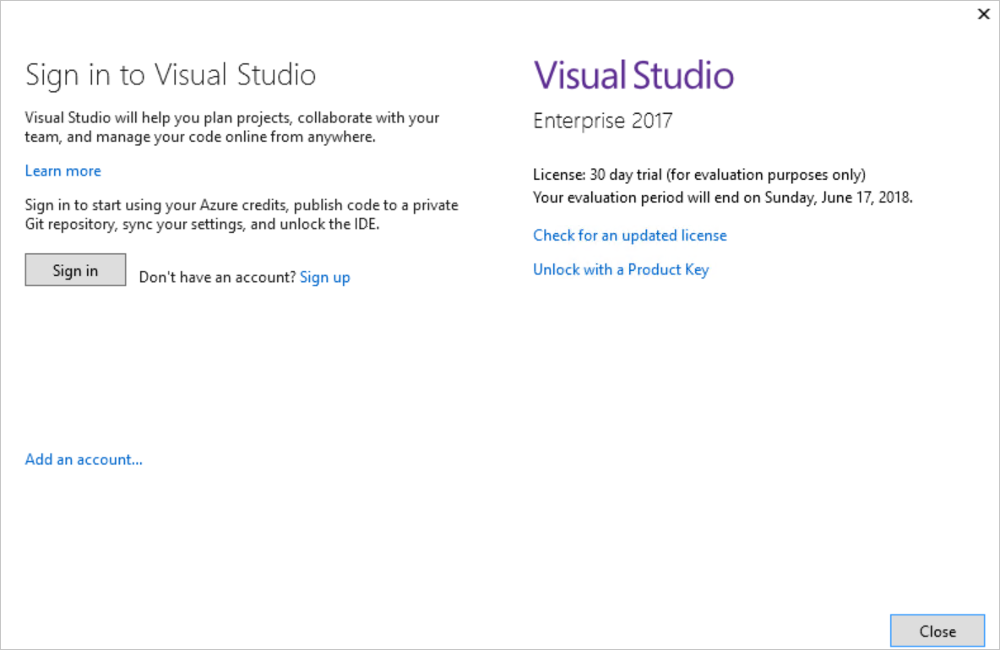
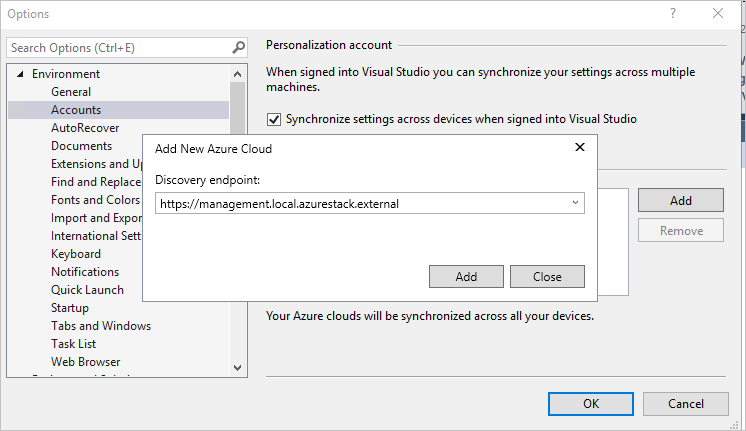
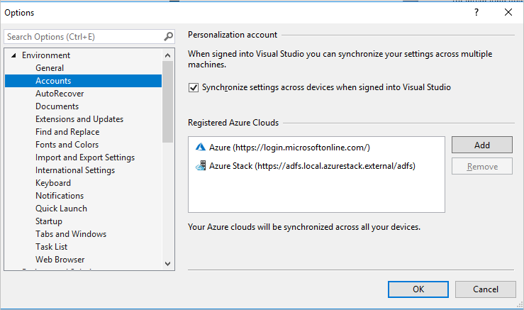
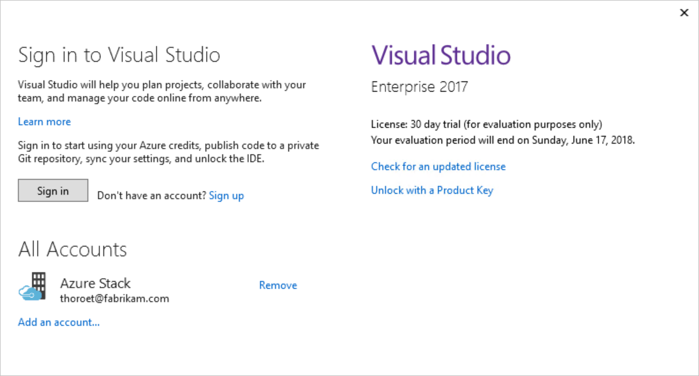
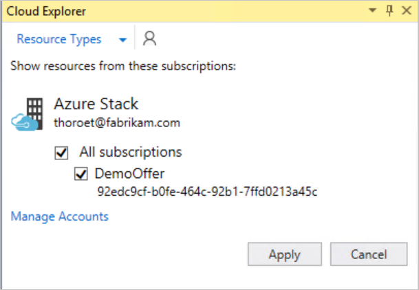

# Install Visual Studio and connect to Azure Stack

*Applies to: Azure Stack integrated systems and Azure Stack Development Kit*

You can use Visual Studio to write and deploy Azure Resource Manager [templates](azure-stack-arm-templates.md) to Azure Stack. The steps in this article walk you through installing Visual Studio on the [Azure Stack](azure-stack-connect-azure-stack.md#connect-to-azure-stack-with-remote-desktop), or on an external computer if you plan to Azure Stack through the [VPN](azure-stack-connect-azure-stack.md#connect-to-azure-stack-with-vpn).

## Install Visual Studio

1. Download and run the [Web Platform Installer](https://www.microsoft.com/web/downloads/platform.aspx).  

2. Open the **Microsoft Web Platform Installer**.

3. Search for **Visual Studio Community 2015 with Microsoft Azure SDK - 2.9.6**. Click **Add**, and **Install**.

4. Uninstall the **Microsoft Azure PowerShell** that is installed as part of the Azure SDK.

     

5. [Install PowerShell for Azure Stack](azure-stack-powershell-install.md)

6. Restart the operating system after the installation completes.

## Connect to Azure Stack with Azure AD

1. Launch Visual Studio.

2. From the **View** menu, select **Cloud Explorer**.

3. In the new pane, select **Add Account** and sign in with your Azure Active Directory (Azure AD) credentials.  

    

Once logged in, you can [deploy templates](azure-stack-deploy-template-visual-studio.md) or browse available resource types and resource groups to create your own templates.  

## Connect to Azure Stack with AD FS

1. Launch Visual Studio.

2. From **Tools**, select **Options**.

3. Expand **Environment** in the **Navigation Pane** and select **Accounts**.

4. Select **Add**, and enter the User Azure Resource Manger endpoint.  
  For the Azure Stack Development kit, the URL is: `https://management.local.azurestack/external`.  
  For Azure Stack integrated systems the URL is: `https://management.[Region}.[External FQDN]`.

    

5. Select **Add**.  

    Visual Studio calls the Azure Resource Manger and discovers the endpoints including the authentication endpoint for Azure Directory Federated Services (AD FS).

    

6. Select **Cloud Explorer** from the **View** menu.
7. Select **Add Account** and sign in with your AD FS credentials.  

    

    Cloud Explorer queries the available subscriptions. You can select one an available subscription to manage.

    

8. Browsing your existing resources, resource groups, or deploy templates.

## Next steps

 - Read more about [coexistence](https://msdn.microsoft.com/library/ms246609.aspx) with other Visual Studio versions.
 - [Develop templates for Azure Stack](azure-stack-develop-templates.md)