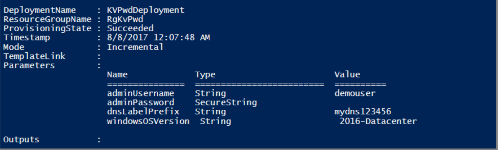

# Create a virtual machine using a secure password stored in Azure Stack Key Vault

*Applies to: Azure Stack integrated systems and Azure Stack Development Kit*

This article steps through deploying a Windows Server virtual machine using a password stored in Azure Stack Key Vault. Using a key vault password is more secure than passing a plain text password.

## Overview

You can store values such as a password as a secret in an Azure Stack key vault. After you create a secret, you can reference it in Azure Resource Manager templates. Using secrets with Resource Manager provides the following benefits:

* You don’t have to manually enter secret each time you deploy a resource.
* You can specify which users or service principals can access a secret.

## Prerequisites

* You must subscribe to an offer that includes the Key Vault service.
* [Install PowerShell for Azure Stack.](azure-stack-powershell-install.md)
* [Configure your PowerShell environment.](azure-stack-powershell-configure-user.md)

The following steps describe the process required to create a virtual machine by retrieving the password stored in a Key Vault:

1. Create a Key Vault secret.
2. Update the azuredeploy.parameters.json file.
3. Deploy the template.

> ![NOTE]  
> You can use these steps from the Azure Stack Development Kit, or from an external client if you are connected through VPN.

## Create a Key Vault secret

The following script creates a key vault, and stores a password in the key vault as a secret. Use the `-EnabledForDeployment` parameter when you're creating the key vault. This parameter makes sure that the key vault can be referenced from Azure Resource Manager templates.

```PowerShell

$vaultName = "contosovault"
$resourceGroup = "contosovaultrg"
$location = "local"
$secretName = "MySecret"

New-AzureRmResourceGroup `
  -Name $resourceGroup `
  -Location $location

New-AzureRmKeyVault `
  -VaultName $vaultName `
  -ResourceGroupName $resourceGroup `
  -Location $location
  -EnabledForTemplateDeployment

$secretValue = ConvertTo-SecureString -String '<Password for your virtual machine>' -AsPlainText -Force

Set-AzureKeyVaultSecret `
  -VaultName $vaultName `
  -Name $secretName `
  -SecretValue $secretValue

```

When you run the previous script, the output includes the secret URI. Make a note of this URI. You have to reference it in the [Deploy Windows virtual machine with password in key vault template](https://github.com/Azure/AzureStack-QuickStart-Templates/tree/master/101-vm-windows-create-passwordfromkv). Download the [101-vm-secure-password](https://github.com/Azure/AzureStack-QuickStart-Templates/tree/master/101-vm-windows-create-passwordfromkv) folder onto your development computer. This folder contains the `azuredeploy.json` and `azuredeploy.parameters.json` files, which you will need in the next steps.

Modify the `azuredeploy.parameters.json` file according to your environment values. The parameters of special interest are the vault name, the vault resource group, and the secret URI (as generated by the previous script). The following file is an example of a parameter file:

## Update the azuredeploy.parameters.json file

Update the azuredeploy.parameters.json file with the KeyVault URI, secretName, adminUsername of the virtual machine values as per your environment. The following JSON file shows an example of the template parameters file:

```json
{
    "$schema":  "http://schema.management.azure.com/schemas/2015-01-01/deploymentParameters.json#",
    "contentVersion":  "1.0.0.0",
    "parameters":  {
       "adminUsername":  {
         "value":  "demouser"
          },
         "adminPassword":  {
           "reference":  {
              "keyVault":  {
                "id":  "/subscriptions/xxxxxx/resourceGroups/RgKvPwd/providers/Microsoft.KeyVault/vaults/KvPwd"
                },
              "secretName":  "MySecret"
           }
         },
       "dnsLabelPrefix":  {
          "value":  "mydns123456"
        },
        "windowsOSVersion":  {
          "value":  "2016-Datacenter"
        }
    }
}

```

## Template deployment

Now deploy the template by using the following PowerShell script:

```PowerShell  
New-AzureRmResourceGroupDeployment `
  -Name KVPwdDeployment `
  -ResourceGroupName $resourceGroup `
  -TemplateFile "<Fully qualified path to the azuredeploy.json file>" `
  -TemplateParameterFile "<Fully qualified path to the azuredeploy.parameters.json file>"
```

When the template is deployed successfully, it results in the following output:



## Next steps

[Deploy a sample app with Key Vault](azure-stack-kv-sample-app.md)

[Deploy a VM with a Key Vault certificate](azure-stack-kv-push-secret-into-vm.md)
