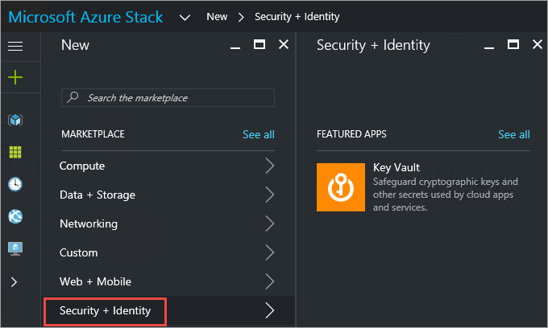

# Manage Key Vault in Azure Stack by using the portal

You can manage Key Vault in Azure Stack by using the Azure Stack portal. This article helps you get started to create and manage a key vault in Azure Stack.

## Prerequisites

You must subscribe to an offer that includes the Azure Key Vault service.

## Create a key vault

1. Sign in to the [user portal](https://portal.local.azurestack.external).

2. From the dashboard, select **+ Create a resource** > **Security + Identity** > **Key Vault**.

    

3. In the **Create Key Vault** pane, assign a **Name** for your vault. Vault names can contain only alphanumeric characters and the special-character hyphen (-). They shouldn’t start with a number.

4. Choose a **Subscription** from the list of available subscriptions. All subscriptions that offer the Key Vault service are displayed in the drop-down list.

5. Select an existing **Resource Group** or create a new one.

6. Select the **Pricing tier**.
    >[!NOTE]
    > Key vaults in the Azure Stack Development Kit support **Standard** SKUs only.

7. Choose one of the existing **Access policies** or create a new one. An access policy allows you to grant permissions for a user, application, or a security group to perform operations with this vault.

8. Optionally, choose an **Advanced access policy** to enable access to features. For example: virtual machines (VMs) for deployment, Resource Manager for template deployment, and access to Azure Disk Encryption for volume encryption.

9. After you configure the settings, select **OK**, and then select **Create**. This starts the key vault deployment.

## Manage keys and secrets

After you create a vault, use the following steps to create and manage keys and secrets within the vault.

### Create a key

1. Sign in to the [user portal](https://portal.local.azurestack.external).

2. From the dashboard, select **All resources**, select the key vault that you created earlier, and then select the **Keys** tile.

3. In the **Keys** pane, select **Add**.

4. In the **Create a key** pane, from the list of **Options**, choose the method that you want to use to create a key. You can **Generate** a new key, **Upload** an existing key, or use **Restore Backup** to select a backup of a key.

5. Enter a **Name** for your key. The key name can contain only alphanumeric characters and the special character hyphen (-).

6. Optionally, configure the **Set activation date** and **Set expiration date** values for your key.

7. Select **Create** to start the deployment.

After the key is successfully created, you can select it under **Keys** and view or modify its properties. The properties section contains the **Key Identifier**, which is a Uniform Resource Identifier (URI) that  external applications use to access this key. To limit operations on this key, configure the settings under **Permitted operations**.

### Create a secret

1. Sign in to the [user portal](https://portal.local.azurestack.external).
2. From the dashboard, select **All resources**, select the key vault that you created earlier, and then select the **Secrets** tile.

3. Under **Secrets**, select **Add**.

4. Under **Create a secret**, from the list of **Upload options**, choose an option by which you want to create a secret. You can create a secret **Manually** if you enter a value for the secret or upload a **Certificate** from your local machine.

5. Enter a **Name** for the secret. The secret name can contain only alphanumeric characters and the special character hyphen (-).

6. Optionally, specify the **Content type**, and configure values for **Set activation date** and **Set expiration date** for the secret.

7. Select **Create** to start the deployment.

After the secret is successfully created, you can select it under **Secrets** and view or modify its properties. The **Secret Identifier** is a URI that external applications can use to access this secret.

## Next steps

* [Deploy a VM by retrieving the password stored in Key Vault](azure-stack-kv-deploy-vm-with-secret.md)
* [Deploy a VM with certificate stored in Key Vault](azure-stack-kv-push-secret-into-vm.md)
