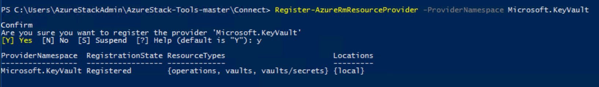

# Manage Key Vault in Azure Stack using PowerShell

*Applies to: Azure Stack integrated systems and Azure Stack Development Kit*

You can manage Key Vault in Azure Stack using PowerShell. Learn how to use Key Vault PowerShell cmdlets to:

* Create a key vault.
* Store and manage cryptographic keys and secrets.
* Authorize users or applications to invoke operations in the vault.

>[!NOTE]
>The Key Vault PowerShell cmdlets descibed in this article are provided in the Azure PowerShell SDK.

## Prerequisites

* You must subscribe to an offer that includes the Azure Key Vault service.
* [Install PowerShell for Azure Stack](azure-stack-powershell-install.md).
* [Configure the Azure Stack user's PowerShell environment](azure-stack-powershell-configure-user.md).

## Enable your tenant subscription for Key Vault operations

Before you can issue any operations against a key vault, you need to ensure that your tenant subscription is enabled for vault operations. To verify that vault operations are enabled, run the following command:

```PowerShell
Get-AzureRmResourceProvider -ProviderNamespace Microsoft.KeyVault | ft -Autosize
```

**Output**

If your subscription is enabled for vault operations, the output shows “RegistrationState” is “Registered” for all resource types of a key vault.


If vault operations are not enabled, invoke the following command to register the Key Vault service in your subscription:

```PowerShell
Register-AzureRmResourceProvider -ProviderNamespace Microsoft.KeyVault
```

**Output**

If the registration is successful, the following output is returned:


When you invoke the key vault commands, you might get an error, such as "The subscription is not registered to use namespace 'Microsoft.KeyVault'." If you get an error, confirm that you have [enabled the Key Vault resource provider](#enable-your-tenant-subscription-for-vault-operations) by following the instructions that were mentioned previously.

## Create a key vault

Before you create a key vault, create a resource group so that all of the resources related to the key vault exist in a resource group. Use the following command to create a new resource group:

```PowerShell
New-AzureRmResourceGroup -Name “VaultRG” -Location local -verbose -Force

```

**Output**


Now, use the **New-AzureRMKeyVault** command to create a key vault in the resource group that you created earlier. This command reads three mandatory parameters: resource group name, key vault name, and geographic location.

Run the following command to create a key vault:

```PowerShell
New-AzureRmKeyVault -VaultName “Vault01” -ResourceGroupName “VaultRG” -Location local -verbose
```

**Output**


The output of this command shows the properties of the key vault that you created. When an application accesses this vault, it must use the **Vault URI** property, which is "https://vault01.vault.local.azurestack.external" in this example.

### Active Directory Federation Services (AD FS) deployment

In an AD FS deployment, you might get this warning: "Access policy is not set. No user or application has access permission to use this vault." To resolve this issue, set an access policy for the vault by using the [Set-AzureRmKeyVaultAccessPolicy](azure-stack-kv-manage-powershell.md#authorize-an-application-to-use-a-key-or-secret) command:

```PowerShell
# Obtain the security identifier(SID) of the active directory user
$adUser = Get-ADUser -Filter "Name -eq '{Active directory user name}'"
$objectSID = $adUser.SID.Value

# Set the key vault access policy
Set-AzureRmKeyVaultAccessPolicy -VaultName "{key vault name}" -ResourceGroupName "{resource group name}" -ObjectId "{object SID}" -PermissionsToKeys {permissionsToKeys} -PermissionsToSecrets {permissionsToSecrets} -BypassObjectIdValidation
```

## Manage keys and secrets

After you create a vault, use the following steps to create and manage keys and secrets in the vault.

### Create a key

Use the **Add-AzureKeyVaultKey** command to create or import a software-protected key in a key vault.

```PowerShell
Add-AzureKeyVaultKey -VaultName “Vault01” -Name “Key01” -verbose -Destination Software
```

The **Destination** parameter is used to specify that the key is software protected. When the key is successfully created, the command outputs the details of the created key.

**Output**


You can now reference the created key by using its URI. If you create or import a key that has same name as an existing key, the original key is updated with the values specified in the new key. You can access the previous version by using the version-specific URI of the key. For example:

* Use "https://vault10.vault.local.azurestack.external:443/keys/key01" to always get the current version.
* Use "https://vault010.vault.local.azurestack.external:443/keys/key01/d0b36ee2e3d14e9f967b8b6b1d38938a" to get this specific version.

### Get a key

Use the **Get-AzureKeyVaultKey** command to read a key and its details.

```PowerShell
Get-AzureKeyVaultKey -VaultName “Vault01” -Name “Key01”
```

### Create a secret

Use the **Set-AzureKeyVaultSecret** command to create or update a secret in a vault. A secret is created if one doesn’t already exist. A new version of the secret is created if it already exists.

```PowerShell
$secretvalue = ConvertTo-SecureString “User@123” -AsPlainText -Force
Set-AzureKeyVaultSecret -VaultName “Vault01” -Name “Secret01” -SecretValue $secretvalue
```

**Output**


### Get a secret

Use the **Get-AzureKeyVaultSecret** command to read a secret in a key vault. This command can return all or specific versions of a secret.

```PowerShell
Get-AzureKeyVaultSecret -VaultName “Vault01” -Name “Secret01”
```

After you create the keys and secrets, you can authorize external applications to use them.

## Authorize an application to use a key or secret

Use the **Set-AzureRmKeyVaultAccessPolicy** command to authorize an application to access a key or secret in the key vault.
In the following example, the vault name is *ContosoKeyVault* and the application you want to authorize has a client ID of *8f8c4bbd-485b-45fd-98f7-ec6300b7b4ed*. To authorize the application, run the following command. Optionally, you can specify the **PermissionsToKeys** parameter to set permissions for a user, application, or a security group.

```PowerShell
Set-AzureRmKeyVaultAccessPolicy -VaultName 'ContosoKeyVault' -ServicePrincipalName 8f8c4bbd-485b-45fd-98f7-ec6300b7b4ed -PermissionsToKeys decrypt,sign
```

If you want to authorize that same application to read secrets in your vault, run the following cmdlet:

```PowerShell
Set-AzureRmKeyVaultAccessPolicy -VaultName 'ContosoKeyVault' -ServicePrincipalName 8f8c4bbd-485b-45fd-98f7-ec6300 -PermissionsToKeys Get
```

## Next steps

* [Deploy a VM with a password stored in Key Vault](azure-stack-kv-deploy-vm-with-secret.md)
* [Deploy a VM with a certificate stored in Key Vault](azure-stack-kv-push-secret-into-vm.md)
