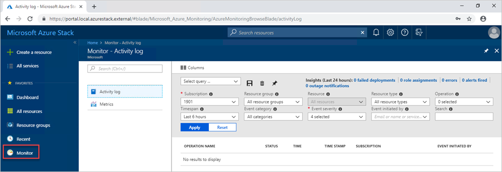
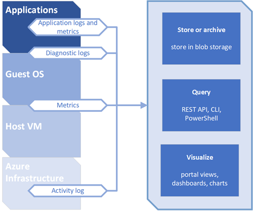
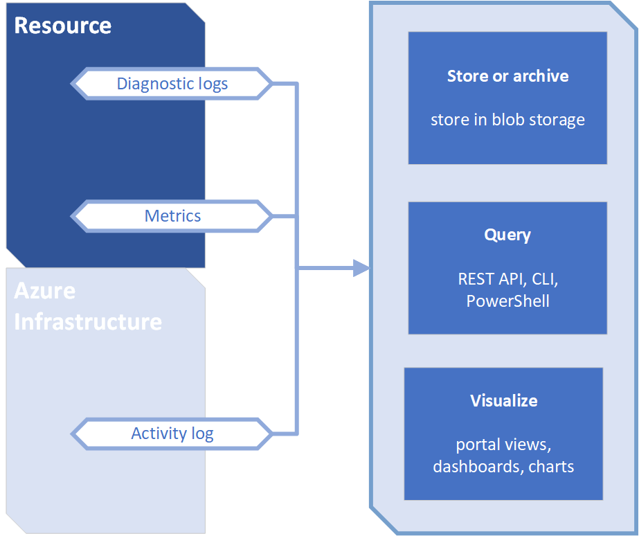

# Azure Monitor on Azure Stack

*Applies to: Azure Stack integrated systems and Azure Stack Development Kit*

This article provides an overview of the Azure Monitor service in Azure Stack. It discusses the operation of Azure Monitor and additional information on how to use Azure Monitor on Azure Stack. 

For an introduction, overview, and how to get started with Azure Monitor, see the global Azure article [Get started with Azure Monitor](https://docs.microsoft.com/azure/monitoring-and-diagnostics/monitoring-get-started).

Azure Monitor is the platform service that provides a single source for monitoring Azure resources. With Azure Monitor, you can visualize, query, route, archive, and otherwise take action on the metrics and logs coming from resources in Azure. You can work with this data by using the Azure Stack admin portal, Monitor PowerShell Cmdlets, Cross-Platform CLI, or Azure Monitor REST APIs. For the specific connectivity supported by Azure Stack, see [How to consume monitoring data from Azure Stack](azure-stack-metrics-monitor.md)

> [!Note]  
Metrics and diagnostic logs are not available for the Azure Stack Development Kit.

## Prerequisites

Register the **Microsoft.insights** resource provider on your subscription's offer resource providers settings. You can verify that the resource provider is available in your offer associated with your subscription:

1. Open the Azure Stack admin portal.
2. Select **Offers**.
3. Select the offer associated with the subscription.
4. Select **Resource providers** under **Settings.** 
5. Find **Microsoft.Insights** in the list and verify that the status is **Registered.**.

## Overview

Like Azure Monitor on Azure, Azure Monitor on Azure Stack provides base-level infrastructure metrics and logs for most services.

## Azure monitor sources: compute subset

The **Microsoft.Compute** resource provider in Azure Stack includes:
 - Virtual Machines 
 - Virtual Machines scale sets

### Application - Diagnostics logs, Application logs, and Metrics

Applications can run in the OS of a VM running with the **Microsoft.Compute** resource provider. These applications and VMs emit their own set of logs and metrics. Azure Monitor relies on the Azure diagnostics extension (Windows or Linux) to collect most application level metrics and logs. 

The types of measures include:
 - Performance counters
 - Application logs
 - Windows event logs
 - .NET event source
 - IIS logs
 - Manifest-based ETW
 - Crash dumps
 - Customer error logs

> [!Note]  
> Linux Diagnostics extension on Azure Stack are not supported.

### Host and Guest VM metrics

The previously listed compute resources have a dedicated host VM and guest OS. The host VM and guest OS are the equivalent of root VM and guest VM in Hyper-V hypervisor. You can collect metrics for both the host VM and the guest OS. In addition, you can collect diagnostics logs for the guest OS. A list of collectible metrics for Host and Guest VM metrics on Azure Stack are available at [Supported metrics with Azure Monitor on Azure Stack](azure-stack-metrics-supported.md). 

### Activity log

You can search the activity logs for information about your compute resources as seen by the Azure Stack infrastructure. The log contains information such as times when resources are created or destroyed. The activity logs on Azure Stack is consistent with Azure. For more information, see the description of [Activity log overview on Azure](https://docs.microsoft.com/azure/monitoring-and-diagnostics/monitoring-overview-activity-logs). 

## Azure monitor sources: everything else

### Resources - Metrics and Diagnostics logs

Collectible metrics and diagnostics logs vary based on the resource type. A list of collectible metrics for each resource on Azure Stack is available at supported metrics. For more information, see [Supported metrics with Azure Monitor on Azure Stack](azure-stack-metrics-supported.md).

### Activity log

The activity log is the same for compute resources. 

### Uses for monitoring data

**Store and Archive**  

Some monitoring data is already stored and available in Azure Monitor for a set amount of time. 
 - Metrics are stored for 90 days. 
 - Activity log entries are stored for 90 days. 
 - Diagnostics logs are not stored.
 - Archive the data to a storage account for longer retention.

**Query**  

You can use the Azure Monitor REST API, cross-platform Command-Line Interface (CLI) commands, PowerShell cmdlets, or the .NET SDK to access the data in the system or Azure storage. 

**Visualization**

Visualizing your monitoring data in graphics and charts helps you find trends quicker than looking through the data itself. 

A few visualization methods include:
 - Use the Azure Stack user and admin portal
 - Route data to Microsoft Power BI
 - Route the data to a third-party visualization tool using either live streaming or by having the tool read from an archive in Azure storage

## Methods of accessing Azure monitor on Azure Stack

In general, you can manipulate data tracking, routing, and retrieval using one of the following methods. Not all methods are available for all actions or data types.

 - [Azure Stack Portal](https://docs.microsoft.com/azure/azure-stack/user/azure-stack-use-portal)
 - [PowerShell](https://docs.microsoft.com/azure/monitoring-and-diagnostics/insights-powershell-samples)
 - [Cross-platform Command Line Interface(CLI)](https://docs.microsoft.com/azure/monitoring-and-diagnostics/insights-cli-samples)
 - [REST API](https://docs.microsoft.com/rest/api/monitor)
 - [.NET SDK](http://www.nuget.org/packages/Microsoft.Azure.Management.Monitor)

## Next steps

Learn more about the options of the monitoring data consumption on Azure Stack in the article [Consume monitoring data from Azure Stack](azure-stack-metrics-monitor.md).
