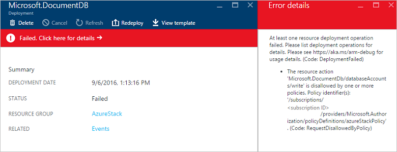

---
title: Use the Azure Stack Policy Module| Microsoft Docs
description: Learn how to constrain an Azure subscription to behave like an Azure Stack subscription
services: azure-stack
documentationcenter: ''
author: sethmanheim
manager: femila
editor: ''

ms.assetid: 937ef34f-14d4-4ea9-960b-362ba986f000
ms.service: azure-stack
ms.workload: na
ms.tgt_pltfrm: na
ms.devlang: na
ms.topic: article
ms.date: 08/15/2018
ms.author: sethm

---
# Manage Azure policy using the Azure Stack Policy Module

*Applies to: Azure Stack integrated systems and Azure Stack Development Kit*

The Azure Stack Policy module allows you to configure an Azure subscription with the same versioning and service availability as Azure Stack.  The module uses the **New-AzureRMPolicyAssignment** cmdlet to create an Azure policy, which limits the resource types and services available in a subscription.  After configuring the policy, you can use your Azure subscription to develop apps targeted for Azure Stack.

## Install the module

1. Install the required version of the AzureRM PowerShell module, as described in Step1 of [Install PowerShell for Azure Stack](azure-stack-powershell-install.md).
2. [Download the Azure Stack tools from GitHub](azure-stack-powershell-download.md)
3. [Configure PowerShell for use with Azure Stack](azure-stack-powershell-configure-user.md)

4. Import the AzureStack.Policy.psm1 module:

   ```PowerShell
   Import-Module .\Policy\AzureStack.Policy.psm1
   ```

## Apply policy to Azure subscription

You can use the following command to apply a default Azure Stack policy against your Azure subscription. Before running this command, replace *Azure Subscription Name* with your Azure subscription.

```PowerShell
Add-AzureRmAccount
$s = Select-AzureRmSubscription -SubscriptionName "<Azure Subscription Name>"
$policy = New-AzureRmPolicyDefinition -Name AzureStackPolicyDefinition -Policy (Get-AzsPolicy)
$subscriptionID = $s.Subscription.SubscriptionId
New-AzureRmPolicyAssignment -Name AzureStack -PolicyDefinition $policy -Scope /subscriptions/$subscriptionID

```

## Apply policy to a resource group

You may want to apply policies that are more granular. As an example, you might have other resources running in the same subscription. You can scope the policy application to a specific resource group, which lets you test your apps for Azure Stack using Azure resources. Before running the following command, replace *Azure Subscription Name* with your Azure subscription name.

```PowerShell
Add-AzureRmAccount
$rgName = 'myRG01'
$s = Select-AzureRmSubscription -SubscriptionName "<Azure Subscription Name>"
$policy = New-AzureRmPolicyDefinition -Name AzureStackPolicyDefinition -Policy (Get-AzsPolicy)
$subscriptionID = $s.Subscription.SubscriptionId
New-AzureRmPolicyAssignment -Name AzureStack -PolicyDefinition $policy -Scope /subscriptions/$subscriptionID/resourceGroups/$rgName

```

## Policy in action

Once you've deployed the Azure policy, you receive an error when you try to deploy a resource that prohibited by policy.



## Next steps

* [Deploy templates with PowerShell](azure-stack-deploy-template-powershell.md)
* [Deploy templates with Azure CLI](azure-stack-deploy-template-command-line.md)
* [Deploy Templates with Visual Studio](azure-stack-deploy-template-visual-studio.md)
