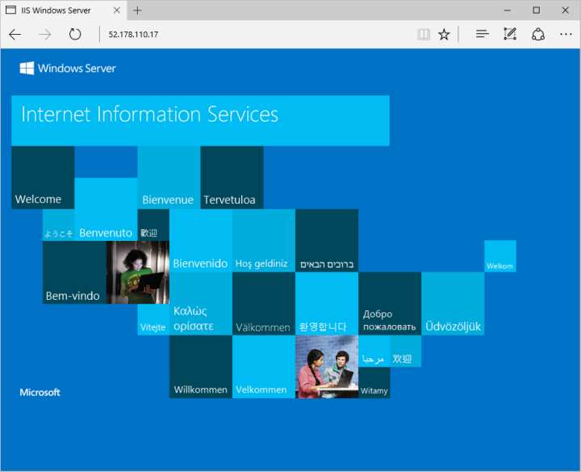

# Quickstart: create a Windows Server virtual machine by using PowerShell in Azure Stack

*Applies to: Azure Stack integrated systems and Azure Stack Development Kit*

You can create a Windows Server 2016 virtual machine by using Azure Stack PowerShell. Follow the steps in this article to create and use a virtual machine. This article also gives you the steps to:

* Connect to the virtual machine with a remote client.
* Install the IIS web server and view the default home page.
* Clean up your resources.

>[!NOTE]
 You can run the steps described in this article from the Azure Stack Development Kit, or from a Windows-based external client if you are connected over a VPN.

## Prerequisites

* Make sure that your Azure Stack operator has added the **Windows Server 2016** image to the Azure Stack marketplace.

* Azure Stack requires a specific version of Azure PowerShell to create and manage the resources. If you don't have PowerShell configured for Azure Stack, follow the steps to [install](azure-stack-powershell-install.md) PowerShell.

* With the Azure Stack PowerShell set up, you will need to connect to your Azure Stack environment. For instruction, see [Connect to Azure Stack with PowerShell as a user](azure-stack-powershell-configure-user.md).

## Create a resource group

A resource group is a logical container into which Azure Stack resources are deployed and managed. From your development kit or the Azure Stack integrated system, run the following code block to create a resource group. Values are assigned for all the variables in this document, you can use these values or assign new values.

```powershell
# Create variables to store the location and resource group names.
$location = "local"
$ResourceGroupName = "myResourceGroup"

New-AzureRmResourceGroup `
  -Name $ResourceGroupName `
  -Location $location
```

## Create storage resources

Create a storage account, and a storage container to store the Windows Server 2016 image.

```powershell
# Create variables to store the storage account name and the storage account SKU information
$StorageAccountName = "mystorageaccount"
$SkuName = "Standard_LRS"

# Create a new storage account
$StorageAccount = New-AzureRMStorageAccount `
  -Location $location `
  -ResourceGroupName $ResourceGroupName `
  -Type $SkuName `
  -Name $StorageAccountName

Set-AzureRmCurrentStorageAccount `
  -StorageAccountName $storageAccountName `
  -ResourceGroupName $resourceGroupName

# Create a storage container to store the virtual machine image
$containerName = 'osdisks'
$container = New-AzureStorageContainer `
  -Name $containerName `
  -Permission Blob
```

## Create networking resources

Create a virtual network, subnet, and a public IP address. These resources are used to provide network connectivity to the virtual machine.

```powershell
# Create a subnet configuration
$subnetConfig = New-AzureRmVirtualNetworkSubnetConfig `
  -Name mySubnet `
  -AddressPrefix 192.168.1.0/24

# Create a virtual network
$vnet = New-AzureRmVirtualNetwork `
  -ResourceGroupName $ResourceGroupName `
  -Location $location `
  -Name MyVnet `
  -AddressPrefix 192.168.0.0/16 `
  -Subnet $subnetConfig

# Create a public IP address and specify a DNS name
$pip = New-AzureRmPublicIpAddress `
  -ResourceGroupName $ResourceGroupName `
  -Location $location `
  -AllocationMethod Static `
  -IdleTimeoutInMinutes 4 `
  -Name "mypublicdns$(Get-Random)"
```

### Create a network security group and a network security group rule

The network security group secures the virtual machine by using inbound and outbound rules. Lets create an inbound rule for port 3389 to allow incoming Remote Desktop connections and an inbound rule for port 80 to allow incoming web traffic.

```powershell
# Create an inbound network security group rule for port 3389
$nsgRuleRDP = New-AzureRmNetworkSecurityRuleConfig `
  -Name myNetworkSecurityGroupRuleRDP `
  -Protocol Tcp `
  -Direction Inbound `
  -Priority 1000 `
  -SourceAddressPrefix * `
  -SourcePortRange * `
  -DestinationAddressPrefix * `
  -DestinationPortRange 3389 `
  -Access Allow

# Create an inbound network security group rule for port 80
$nsgRuleWeb = New-AzureRmNetworkSecurityRuleConfig `
  -Name myNetworkSecurityGroupRuleWWW `
  -Protocol Tcp `
  -Direction Inbound `
  -Priority 1001 `
  -SourceAddressPrefix * `
  -SourcePortRange * `
  -DestinationAddressPrefix * `
  -DestinationPortRange 80 `
  -Access Allow

# Create a network security group
$nsg = New-AzureRmNetworkSecurityGroup `
  -ResourceGroupName $ResourceGroupName `
  -Location $location `
  -Name myNetworkSecurityGroup `
  -SecurityRules $nsgRuleRDP,$nsgRuleWeb
```

### Create a network card for the virtual machine

The network card connects the virtual machine to a subnet, network security group, and public IP address.

```powershell
# Create a virtual network card and associate it with public IP address and NSG
$nic = New-AzureRmNetworkInterface `
  -Name myNic `
  -ResourceGroupName $ResourceGroupName `
  -Location $location `
  -SubnetId $vnet.Subnets[0].Id `
  -PublicIpAddressId $pip.Id `
  -NetworkSecurityGroupId $nsg.Id
```

## Create a virtual machine

Create a virtual machine configuration. This configuration includes the settings used when deploying the virtual machine. For example: credentials, size,  and the virtual machine image.

```powershell
# Define a credential object to store the username and password for the virtual machine
$UserName='demouser'
$Password='Password@123'| ConvertTo-SecureString -Force -AsPlainText
$Credential=New-Object PSCredential($UserName,$Password)

# Create the virtual machine configuration object
$VmName = "VirtualMachinelatest"
$VmSize = "Standard_A1"
$VirtualMachine = New-AzureRmVMConfig `
  -VMName $VmName `
  -VMSize $VmSize

$VirtualMachine = Set-AzureRmVMOperatingSystem `
  -VM $VirtualMachine `
  -Windows `
  -ComputerName "MainComputer" `
  -Credential $Credential

$VirtualMachine = Set-AzureRmVMSourceImage `
  -VM $VirtualMachine `
  -PublisherName "MicrosoftWindowsServer" `
  -Offer "WindowsServer" `
  -Skus "2016-Datacenter" `
  -Version "latest"

$osDiskName = "OsDisk"
$osDiskUri = '{0}vhds/{1}-{2}.vhd' -f `
  $StorageAccount.PrimaryEndpoints.Blob.ToString(),`
  $vmName.ToLower(), `
  $osDiskName

# Sets the operating system disk properties on a virtual machine.
$VirtualMachine = Set-AzureRmVMOSDisk `
  -VM $VirtualMachine `
  -Name $osDiskName `
  -VhdUri $OsDiskUri `
  -CreateOption FromImage | `
  Add-AzureRmVMNetworkInterface -Id $nic.Id

# Create the virtual machine.
New-AzureRmVM `
  -ResourceGroupName $ResourceGroupName `
  -Location $location `
  -VM $VirtualMachine
```

## Connect to the virtual machine

To remote into the virtual machine that you created in the previous step, you need its public IP address. Run the following command to get the public IP address of the virtual machine:

```powershell
Get-AzureRmPublicIpAddress `
  -ResourceGroupName $ResourceGroupName | Select IpAddress
```

Use the following command to create a Remote Desktop session with the virtual machine. Replace the IP address with the publicIPAddress of your virtual machine. When prompted, enter the username and password that you used when creating the virtual machine.

```powershell
mstsc /v <publicIpAddress>
```

## Install IIS via PowerShell

Now that you have logged in to the Azure VM, you can use a single line of PowerShell to install IIS and enable the local firewall rule to allow web traffic. Open a PowerShell prompt and run the following command:

```powershell
Install-WindowsFeature -name Web-Server -IncludeManagementTools
```

## View the IIS welcome page

With IIS installed, and with port 80 open on your VM, you can use a web browser of your choice to view the default IIS welcome page. Use the *publicIpAddress* you documented in the previous section to visit the default page.



## Delete the virtual machine

When no longer needed, use the following command to remove the resource group that contains the virtual machine and its related resources:

```powershell
Remove-AzureRmResourceGroup `
  -Name $ResourceGroupName
```

## Next steps

In this quickstart, you’ve deployed a simple Windows virtual machine. To learn more about Azure Stack virtual machines, continue to [Considerations for Virtual Machines in Azure Stack](azure-stack-vm-considerations.md).
