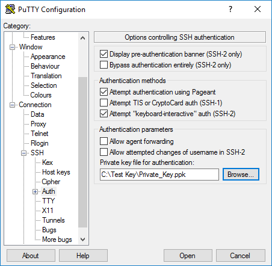

# Create a Linux virtual machine with the Azure Stack portal

*Applies to: Azure Stack integrated systems and Azure Stack Development Kit*

Azure Stack virtual machines can be created through the Azure Stack portal. This method provides a browser-based user interface to create and configure a virtual machine and all related resources. This Quickstart shows you how to quickly create a Linux virtual machine and install a web server on it.

## Prerequisites

* **A Linux image in the Azure Stack marketplace**

   The Azure Stack marketplace doesn't contain a Linux image by default. So, before you can create a Linux virtual machine, ensure that the Azure Stack operator has downloaded the **Ubuntu Server 16.04 LT** image by using the steps described in the [Download marketplace items from Azure to Azure Stack](../azure-stack-download-azure-marketplace-item.md) topic.

* **Access to an SSH client**

   If you are using the Azure Stack Development Kit (ASDK), you may not have access to an SSH client in your environment. If this is the case, you can choose among several packages that include an SSH client. For example, you can install PuTTY that includes an SSH client and SSH key generator (puttygen.exe). For more information about possible options, see the following related Azure article: [How to Use SSH keys with Windows on Azure](https://docs.microsoft.com/en-us/azure/virtual-machines/linux/ssh-from-windows#windows-packages-and-ssh-clients).

   This Quickstart uses PuTTY to generate the SSH keys and to connect to the Linux virtual machine. To download and install PuTTY, go to [http://www.putty.org/](http://www.putty.org).

## Create an SSH key pair

You need an SSH key pair to complete this Quickstart. If you have an existing SSH key pair, this step can be skipped.

1. Navigate to the PuTTY installation folder (the default location is ```C:\Program Files\PuTTY```) and run ```puttygen.exe```.
2. In the PuTTY Key Generator window, ensure the **Type of key to generate** is set to **RSA**, and the **Number of bits in a generated key** is set to **2048**. When ready, click **Generate**.

   

3. To complete the key generation process, move your mouse cursor within the PuTTY Key Generator window.
4. When the key generation completes, click **Save public key** and **Save private key** to save your public and private keys to files.

   


## Sign in to the Azure Stack portal

Sign in to the Azure Stack portal. The address of the Azure Stack portal depends on which Azure Stack product you are connecting to:

* For Azure Stack Development Kit (ASDK) go to: https://portal.local.azurestack.external.
* For an Azure Stack integrated system, go to the URL that your Azure Stack operator provided.

## Create the virtual machine

1. Click the **New** button found on the upper left-hand corner of the Azure Stack portal.

2. Select **Compute**, and then select **Ubuntu Server 16.04 LTS**.
3. Click **Create**.

4. Type the virtual machine information. For **Authentication type**, select **SSH public key**. When you paste in your SSH public key (which you saved to a file previously), take care to remove any leading or trailing white space. When complete, click **OK**.

   

5. Select a size for the virtual machine. To see more sizes, select **View all**. When done, click **Select**.

   

6. On the **Settings** page, keep the defaults and click **OK**.

7. On the **Summary** page, click **OK** to start the virtual machine deployment.


## Connect to the virtual machine

1. Click **Connect** on the virtual machine page. This displays an SSH connection string that can be used to connect to the virtual machine.

   

2. Open PuTTY.
3. On the **PuTTY Configuration** screen, under **Category**, expand **SSH** and then click **Auth**. Click **Browse** and select the private key file that you saved previously.

   
4. Under **Category**, scroll up and click **Session**.
5. In the **Host Name (or IP address)** box, paste the connection string from the Azure Stack portal that you saw previously. In this example, the string is ```asadmin@192.168.102.34```.
 
   
6. Click **Open** to open a session to the virtual machine.

   

## Install NGINX on the virtual machine

Use the following bash script to update package sources and install the latest NGINX package on the virtual machine. 

```bash 
#!/bin/bash

# update package source
sudo apt-get -y update

# install NGINX
sudo apt-get -y install nginx
```

When done, exit the SSH session and return the virtual machine Overview page in the Azure Stack portal.


## Open port 80 for web traffic 

A Network security group (NSG) secures inbound and outbound traffic. When a virtual machine is created from the Azure Stack portal, an inbound rule is created on port 22 for SSH connections. Because this virtual machine hosts a web server, an NSG rule needs to be created for port 80.

1. On the virtual machine **Overview** page, click the name of the **Resource group**.
2. Select the **network security group** for the virtual machine. The NSG can be identified using the **Type** column. 
3. On the left-hand menu, under **Settings**, click **Inbound security rules**.
4. Click **Add**.
5. In **Name**, type **http**. Make sure **Port range** is set to 80 and **Action** is set to **Allow**. 
6. Click **OK**.


## View the NGINX welcome page

With NGINX installed, and port 80 open on your virtual machine, the web server can now be accessed at the virtual machine's public IP address. The public IP address can be found on the virtual machine's Overview page in the Azure Stack portal.

Open a web browser, and browse to ```http://<public IP address>```.


## Clean up resources

When no longer needed, delete the resource group, virtual machine, and all related resources. To do so, select the resource group from the virtual machine page and click **Delete**.

## Next steps

In this quick start, you’ve deployed a simple Linux virtual machine, a network security group rule, and installed a web server. To learn more about Azure Stack virtual machines, continue to [Considerations for Virtual Machines in Azure Stack](azure-stack-vm-considerations.md).

