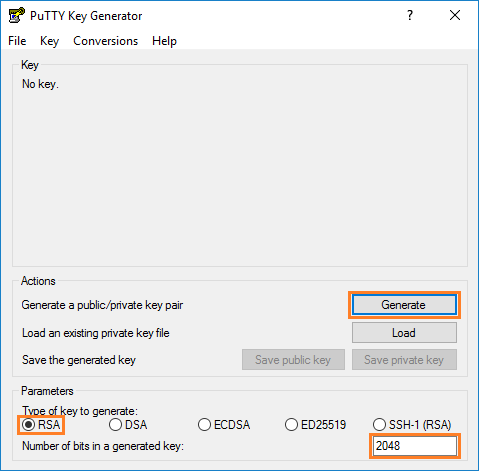
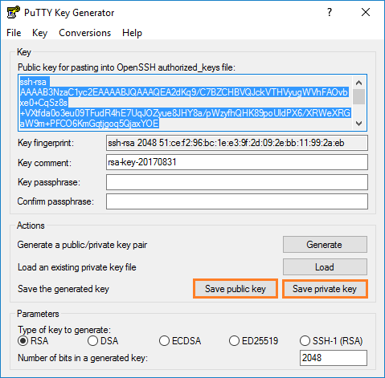
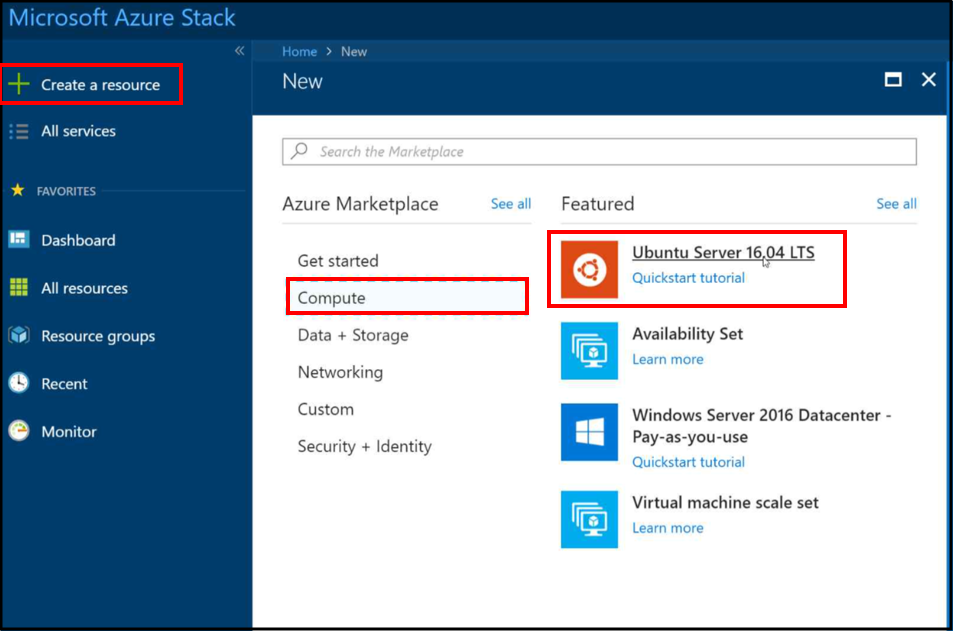
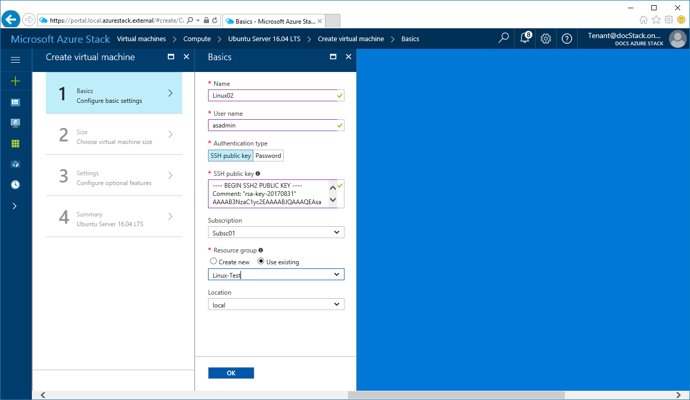
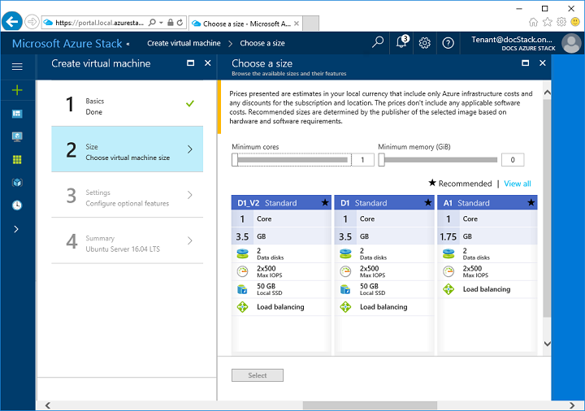
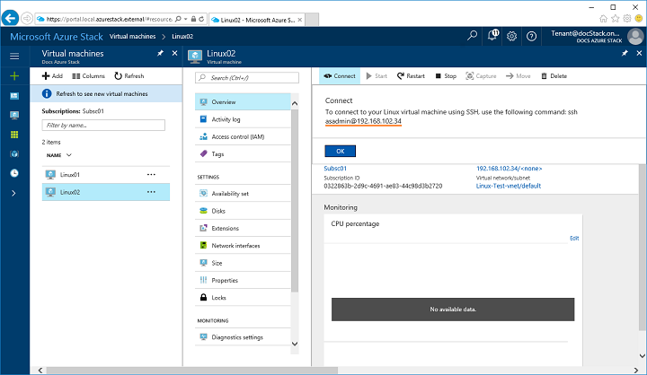
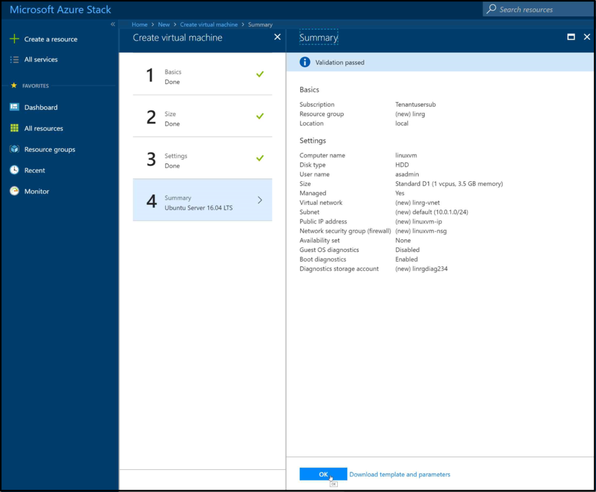
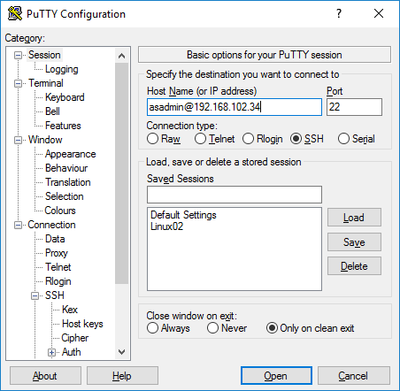
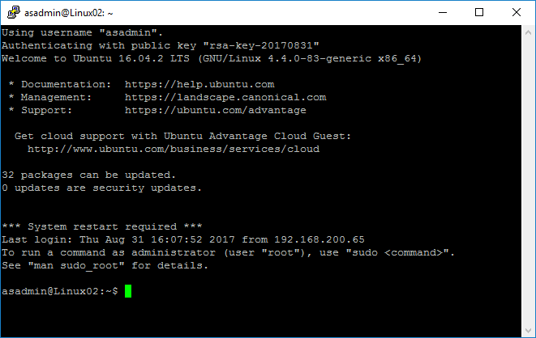

# Quickstart: create a Linux server virtual machine with the Azure Stack portal

*Applies to: Azure Stack integrated systems and Azure Stack Development Kit*

You can create a Ubuntu Server 16.04 LTS virtual machine by using the Azure Stack portal. Follow the steps in this article to create and use a virtual machine. This article also gives you the steps to:

* Connect to the virtual machine with a remote client.
* Install a NGINX web server.
* Clean up your resources.

> [!NOTE]  
> The screen images in this article are updated to match changes introduced with Azure Stack version 1808. 1808 adds support for using *managed disks* in addition to unmanaged disks. If you use an earlier version, some images for tasks like disk selection will be different than what is displayed in this article.  


## Prerequisites

* **A Linux image in the Azure Stack marketplace**

   The Azure Stack marketplace doesn't contain a Linux image by default. Before you can create a Linux server virtual machine, ensure that the Azure Stack operator provides the **Ubuntu Server 16.04 LTS** image you need. The operator can use the steps described in the [Download marketplace items from Azure to Azure Stack](../azure-stack-download-azure-marketplace-item.md) article.

* **Access to an SSH client**

   If you are using the Azure Stack Development Kit (ASDK), you might not have access to an SSH client. If you need a client, there are several packages that include an SSH client. For example, PuTTY includes an SSH client and SSH key generator (puttygen.exe). For more information about available packages,  read the following Azure article: [How to Use SSH keys with Windows on Azure](https://docs.microsoft.com/azure/virtual-machines/linux/ssh-from-windows#windows-packages-and-ssh-clients).

   This Quickstart uses PuTTY to generate the SSH keys and to connect to the Linux server virtual machine. To download and install PuTTY, go to [http://www.putty.org/](http://www.putty.org).

## Create an SSH key pair

You need an SSH key pair to finish all the steps in this article. If you have an existing SSH key pair, you can skip this step.

1. Navigate to the PuTTY installation folder (the default location is ```C:\Program Files\PuTTY```) and run ```puttygen.exe```.
2. In the PuTTY Key Generator window, ensure the **Type of key to generate** is set to **RSA**, and the **Number of bits in a generated key** is set to **2048**. When you're ready, click **Generate**.

   

3. To generate a key, move your mouse cursor randomly in the PuTTY Key Generator window.
4. When the key generation finishes, click **Save public key** and then click **Save private key** to save your keys to files.

   

## Sign in to the Azure Stack portal

Sign in to the Azure Stack portal. The address of the Azure Stack portal depends on which Azure Stack product you are connecting to:

* For Azure Stack Development Kit (ASDK) go to: https://portal.local.azurestack.external.
* For an Azure Stack integrated system, go to the URL that your Azure Stack operator provided.

## Create the virtual machine

1. Click **Create a resource** in the upper left-hand corner of the Azure Stack portal.

2. Select **Compute**, and then select **Ubuntu Server 16.04 LTS**.
   
   
1. Click **Create**.

4. Type the virtual machine information. For **Authentication type**, select **SSH public key**. Paste in the SSH public key that you saved, and then click **OK**.

   >[!NOTE]
 Make sure you remove any leading or trailing white space for they key.

   

5. Select **D1** for the virtual machine.

   

6. On the **Settings** page, make any desired changes to the defaults.
   
    - Beginning with Azure Stack version 1808, you can configure **Storage** where you can choose to use *managed disks*. Prior to version 1808 only unmanaged disks can be used.    
      
    
    When your configurations are ready, select **OK** to continue.

7. On the **Summary** page, click **OK** to start the virtual machine deployment.  
   

## Connect to the virtual machine

1. Click **Connect** on the virtual machine page. This displays an SSH connection string that you need to connect to the virtual machine. 

2. Open PuTTY.

3. On the **PuTTY Configuration** screen you will use the **Category** window to scroll up or down. Scroll down to **SSH**, expand **SSH**, and then click **Auth**. Click **Browse** and pick the private key file that you saved.
   

4. Scroll up in the **Category** window, and then click **Session**.
5. In the **Host Name (or IP address)** box, paste the connection string shown in the Azure Stack portal. In this example, the string is ```asadmin@192.168.102.34```.

   

6. Click **Open** to open a session for the virtual machine.

   

## Install the NGINX web server

Use the following bash commands to update package sources and install the latest NGINX package on the virtual machine.

```bash
#!/bin/bash

# update package source
sudo apt-get -y update

# install NGINX
sudo apt-get -y install nginx
```

When you finish installing NGINX, close the SSH session and open the virtual machine Overview page in the Azure Stack portal.

## Open port 80 for web traffic

A Network security group (NSG) secures inbound and outbound traffic. When a virtual machine is created in the Azure Stack portal, an inbound rule is created on port 22 for SSH connections. Because this virtual machine hosts a web server, an NSG rule needs to be created to allow web traffic on port 80.

1. On the virtual machine **Overview** page, click the name of the **Resource group**.
2. Select the **network security group** for the virtual machine. The NSG can be identified using the **Type** column.
3. On the left-hand menu, under **Settings**, click **Inbound security rules**.
4. Click **Add**.
5. In **Name**, type **http**. Make sure **Port range** is set to 80 and **Action** is set to **Allow**.
6. Click **OK**

## View the NGINX welcome page

With NGINX installed, and port 80 open on your virtual machine, you can access the web server using the virtual machine's public IP address. (The public IP address is shown on the virtual machine's Overview page.)

Open a web browser, and browse to ```http://<public IP address>```.


## Clean up resources

Clean up the resources that you don't need any longer. To delete the virtual machine and its resources, select the resource group on the virtual machine page and then click **Delete**.

## Next steps

In this quick start, you deployed a basic Linux server virtual machine with a web server. To learn more about Azure Stack virtual machines, continue to [Considerations for Virtual Machines in Azure Stack](azure-stack-vm-considerations.md).
