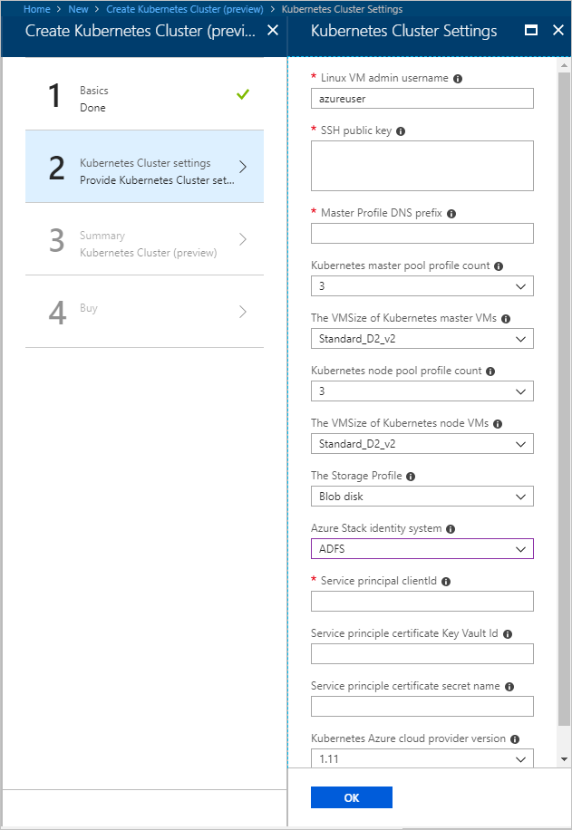

# Deploy Kubernetes to Azure Stack using Active Directory Federated Services

*Applies to: Azure Stack integrated systems and Azure Stack Development Kit*

> [!Note]  
> Kubernetes on Azure Stack is in preview.

You can follow the steps in this article to deploy and set up the resources for Kubernetes. Use these steps when Active Directory Federated Services (AD FS) is your identity management service.

## Prerequisites 

To get started, make sure you have the right permissions and that your Azure Stack is ready.

1. Generate an SSH public and private key pair to sign in to the Linux VM on Azure Stack. You need the public key when creating the cluster.

    For instructions on generating a key, see [SSH Key Generation](https://github.com/msazurestackworkloads/acs-engine/blob/master/docs/ssh.md#ssh-key-generation).

1. Check that you have a valid subscription in your Azure Stack tenant portal, and that you have enough public IP addresses available to add new applications.

    The cluster cannot be deployed to an Azure Stack **Administrator** subscription. You must use a **User** subscription. 

1. If you do not have Kubernetes Cluster in your marketplace, talk to your Azure Stack administrator.

## Create a service principal

You need to work with your Azure Stack administrator to set up your service principal when using AD FS as your identity solution. The service principal gives your application access to Azure Stack resources.

1. Your Azure Stack administrator provides you with a certificate and the information for the service principal. This information should look like:

    ```Text  
        ApplicationIdentifier : S-1-5-21-1512385356-3796245103-1243299919-1356
        ClientId              : 3c87e710-9f91-420b-b009-31fa9e430145
        Thumbprint            : 30202C11BE6864437B64CE36C8D988442082A0F1
        ApplicationName       : Azurestack-MyApp-c30febe7-1311-4fd8-9077-3d869db28342
        PSComputerName        : azs-ercs01
        RunspaceId            : a78c76bb-8cae-4db4-a45a-c1420613e01b
    ```

2. Assign your new service principal a role as a contributor to your subscription. For instructions, see [Assign a role](https://docs.microsoft.com/azure/azure-stack/azure-stack-create-service-principals#assign-role-to-service-principal#assign-role-to-service-principal).

3. Create a key vault to store your certificate for deployment.

    - You need the following pieces of information:

        | Value | Description |
        | ---   | ---         |
        | Azure Resource Manager Endpoint | The Microsoft Azure Resource Manager is a management framework that allows administrators to deploy, manage, and monitor Azure resources. Azure Resource Manager can handle these tasks as a group, rather than individually, in a single operation.<br>The endpoint in the Azure Stack Development Kit (ASDK) is: `https://management.local.azurestack.external/`<br>The endpoint in integrated systems is: `https://management.<location>.ext-<machine-name>.masd.stbtest.microsoft.com/` |
        | Your Subscription ID | The [subscription ID](https://docs.microsoft.com/azure/azure-stack/azure-stack-plan-offer-quota-overview#subscriptions) is how you access offers in Azure Stack. |
        | Your user name | Your user name. |
        | The resource group name  | The name of a new resource group or select an existing resource group. The resource name needs to be alphanumeric and lowercase. |
        | Keyvault name | Name of the vault.<br> Regex pattern: `^[a-zA-Z0-9-]{3,24}$` |
        | Resource group location | The location of the resource group. This is the region you choose for your Azure Stack installation. |

    - Open PowerShell with an elevated prompt. Run the following script with the parameters updated to your values:

    ```PowerShell  
        $armEndpoint="<Azure Resource Manager Endpoint>"
        $subscriptionId="<Your Subscription ID>"
        $username="<your user name >"
        $resource_group_name = "<the resource group name >"
        $key_vault_name = "<keyvault name>"
        $resource_group_location="<resource group location>"
        
        # Login Azure Stack Environment
        Add-AzureRmEnvironment -ARMEndpoint $armEndpoint -Name t
        $mycreds = Get-Credential
        Login-AzureRmAccount -Credential $mycreds -Environment t -Subscription $subscriptionId
        
        # Create new Resource group and key vault
        New-AzureRmResourceGroup -Name $resource_group_name -Location $resource_group_location -Force
        
        # Note, Do not omit -EnabledForTemplateDeployment flag
        New-AzureRmKeyVault -VaultName $key_vault_name -ResourceGroupName $resource_group_name -Location local -EnabledForTemplateDeployment
        
        # Obtain the security identifier(SID) of the active directory user
        $adUser = Get-ADUser -Filter "Name -eq '$username'" -Credential $mycreds
        $objectSID = $adUser.SID.Value
        # Set the key vault access policy
        Set-AzureRmKeyVaultAccessPolicy -VaultName $key_vault_name -ResourceGroupName $resource_group_name -ObjectId $objectSID -BypassObjectIdValidation -PermissionsToKeys all -PermissionsToSecrets all
    ```

4. Upload your certificate to the Key Vault.

    - You need the following pieces of information:

        | Value | Description |
        | ---   | ---         |
        | Certificate path | The FQDN or file path to the certificate. |
        | Certificate password | The certificate password. |
        | Secret name | The secret produced in the previous step. |
        | Keyvault name | The name of the keyvault crated in the previous step. |
        | Azure Resource Manager Endpoint | The endpoint in the Azure Stack Development Kit (ASDK) is: `https://management.local.azurestack.external/`<br>The endpoint in integrated systems is: `https://management.<location>.ext-<machine-name>.masd.stbtest.microsoft.com/` |
        | Your Subscription ID | The [subscription ID](https://docs.microsoft.com/azure/azure-stack/azure-stack-plan-offer-quota-overview#subscriptions) is how you access offers in Azure Stack. |

    - Open PowerShell with an elevated prompt. Run the following script with the parameters updated to your values:

    ```PowerShell  
        
    # upload the pfx to key vault
    $tempPFXFilePath = "<certificate path>"
    $password = "<certificate password>"
    $keyVaultSecretName = "<secret name>"
    $keyVaultName = "<keyvault name>"
    $armEndpoint="<Azure Resource Manager Endpoint>"
    $subscriptionId="<Your Subscription ID>"
    # Login Azure Stack Environment
    Add-AzureRmEnvironment -ARMEndpoint $armEndpoint -Name t
    $mycreds = Get-Credential
    Login-AzureRmAccount -Credential $mycreds -Environment t -Subscription $subscriptionId
    
    $certContentInBytes = [io.file]::ReadAllBytes($tempPFXFilePath)
    $pfxAsBase64EncodedString = [System.Convert]::ToBase64String($certContentInBytes)
    $jsonObject = @"
    {
    "data": "$pfxAsBase64EncodedString",
    "dataType" :"pfx",
    "password": "$password"
    }
    "@
    $jsonObjectBytes = [System.Text.Encoding]::UTF8.GetBytes($jsonObject)
    $jsonEncoded = [System.Convert]::ToBase64String($jsonObjectBytes)
    $secret = ConvertTo-SecureString -String $jsonEncoded -AsPlainText -Force
    $keyVaultSecret = Set-AzureKeyVaultSecret -VaultName $keyVaultName -Name $keyVaultSecretName -SecretValue $secret 
    ```

## Deploy Kubernetes

1. Open the [Azure Stack portal](https://portal.local.azurestack.external).

1. Select **+ Create a resource** > **Compute** > **Kubernetes Cluster**. Click **Create**.

    

### 1. Basics

1. Select **Basics** in Create Kubernetes Cluster.

    

1. Select your **Subscription** ID.

1. Enter the name of a new resource group or select an existing resource group. The resource name needs to be alphanumeric and lowercase.

1. Select the **Location** of the resource group. This is the region you choose for your Azure Stack installation.

### 2. Kubernetes Cluster Settings

1. Select **Kubernetes Cluster Settings** in Create Kubernetes Cluster.

    

1. Enter the **Linux VM Admin Username**. User name for the Linux Virtual Machines that are part of the Kubernetes cluster and DVM.

1. Enter the **SSH Public Key** used for authorization to all Linux machines created as part of the Kubernetes cluster and DVM.

1. Enter the **Master Profile DNS Prefix** that is unique to the region. This must be a region-unique name, such as `k8s-12345`. Try to chose it same as the resource group name as best practice.

    > [!Note]  
    > For each cluster, use a new and unique master profile DNS prefix.

1. Select the **Kubernetes Master Pool Profile Count**. The count contains the number of nodes in the master pool. There can be from 1 to 7. This value should be an odd number.

1. Select **The VMSize of the Kubernetes master VMs**.

1. Select the **Kubernetes Node Pool Profile Count**. The count contains the number of agents in the cluster. 

1. Select the **Storage Profile**. You can choose **Blob Disk** or **Managed Disk**. This specifies the VM Size of Kubernetes node VMs. 

1. Select **ADFS** for the **Azure Stack identity system** for your Azure Stack installation.

1. Enter the **Service Principal ClientId** This is used by the Kubernetes Azure cloud provider. The Client ID identified as the Application ID when your Azure Stack administrator created the service principal.

1. Enter the **Key Vault resource group**. 

1. Enter the **Key Vault name**.

1. Enter the **Key Vault secret**.

1. Enter the **Kubernetes Azure Cloud Provider Version**. This is the version for the Kubernetes Azure provider. Azure Stack releases a custom Kubernetes build for each Azure Stack version.

### 3. Summary

1. Select Summary. The blade displays a validation message for your Kubernetes Cluster configurations settings.

    

2. Review your settings.

3. Select **OK** to deploy your cluster.

> [!TIP]  
>  If you have questions about your deployment, you can post your question or see if someone has already answered the question in the [Azure Stack Forum](https://social.msdn.microsoft.com/Forums/azure/home?forum=azurestack). 

## Next steps

[Connect to your cluster](azure-stack-solution-template-kubernetes-deploy.md#connect-to-your-cluster)