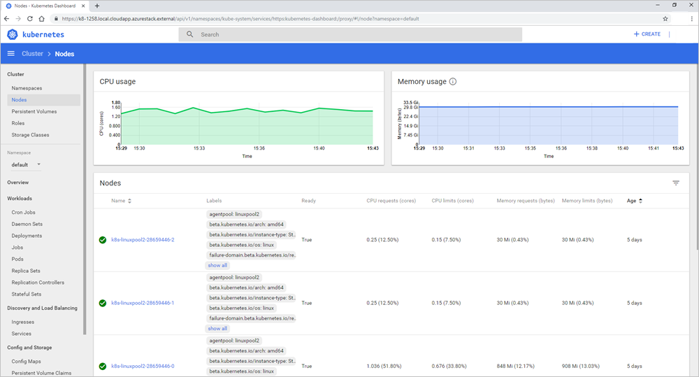

--- 
title: Enable the Kubernetes Dashboard in Azure Stack | Microsoft Docs 
description: Learn how to enable the Kubernetes Dashboard in Azure Stack 
services: azure-stack 
documentationcenter: '' 
author: mattbriggs 
manager: femila 
editor: '' 
ms.service: azure-stack 
ms.workload: na 
pms.tgt_pltfrm: na 
ms.devlang: na 
ms.topic: article 
ms.date: 02/27/2019 
ms.author: mabrigg 
ms.reviewer: waltero 
ms.lastreviewed: 02/06/2019 

# Keyword target: Azure Stack Kubernetes dashboard 
--- 
# Enable the Kubernetes Dashboard in Azure Stack 

*Applies to: Azure Stack integrated systems and Azure Stack Development Kit* 
> [!Note]   
> Kubernetes on Azure Stack is in preview. Azure Stack disconnected scenario is not currently supported by the preview. 

Kubernetes includes a web dashboard that you can use for basic management operations. This dashboard lets you view basic health status and metrics for your applications, create and deploy services, and edit existing applications. This article shows you how to enable the Kubernetes dashboard on Azure Stack.

## Prerequisites for Kubernetes Dashboard

* Azure Stack Kubernetes cluster

    You will need to have deployed a Kubernetes cluster to Azure Stack. For more information see [Deploy Kubernetes](C:\Git\MS\azure-docs-pr\articles\azure-stack\user\azure-stack-solution-template-kubernetes-deploy.md).

* SSH client

    You will need an SSH client to security connect to your master node in the cluster. If you are using Windows, you can use [Putty](https://docs.microsoft.com/azure/marketplace/cloud-partner-portal/virtual-machine/cpp-connect-vm). You will need the private key used when you deployed your Kubernetes cluster.

* FTP (PSCP)

    You may also also need an FTP client that supports SSH and SSH File Transfer Protocol to transfer the certificates from the mater node to your Azure Stack management machine. If you are using Windows or Linux, you can use [FileZilla](https://filezilla-project.org/download.php?type=client). You will need the private key used when your deployed your Kubernetes cluster.

## Enable dashboard overview

1.  Export the Kubernetes certificates from the master node in the cluster. 
2.  Import the certificates to Azure Stack your management machine.
2.  Open the Kubernetes web dashboard in Azure Kubernetes Service (AKS) 

## Export certificate from the master 

You can retrieve the URL for the dashboard from the master node in your cluster.

1. Get the public IP address and username for your cluster master from the Azure Stack dashboard. To get this information
    - Sign in to the [Azure Stack portal](https://portal.local.azurestack.external/)
    - Select **All services** > **All resources**. Find the master in your cluster resoruce group. The master is named `k8s-master-\<sequence-of-numbers>`. 

2. Open the master node in the portal. Copy the **Public IP** address. Click **Connect** to get your user name in the  **Login using VM local account** box. This is the same user name you set when creating your cluster. You will use the public IP address rather than the private IP address listed in the connect blade.

3.  Open an SSH client to connect to the master. If you are working on Windows, you can use [Putty](https://docs.microsoft.com/azure/marketplace/cloud-partner-portal/virtual-machine/cpp-connect-vm) to create the connection. You will use the public IP address for the master node, the username, and add the private key you used when creating the cluster.

4.  When the terminal connects, type `kubectl` to open the Kubernetes command-line client.

5. Run the following command:

    ```Bash   
    kubectl cluster-info 
    ``` 
    Find the URL for the dashboard. For example:  `https://k8-1258.local.cloudapp.azurestack.external/api/v1/namespaces/kube-system/services/https:kubernetes-dashboard:/proxy`

6.  Extract the self-signed cert and convert it to the PFX format. Run the following command:

    ```Bash  
    sudo su 
    openssl pkcs12 -export -out /etc/kubernetes/certs/client.pfx -inkey /etc/kubernetes/certs/client.key  -in /etc/kubernetes/certs/client.crt -certfile /etc/kubernetes/certs/ca.crt 
    ```

7.  Get the list of secrets in kube-system namespace, run the following command:

    ```Bash  
    kubectl -n kube-system get secrets
    ```

    Make note of the kubernetes-dashboard-token-\<XXXXX> value. 

8.  Get the token and save it. Update the `kubernetes-dashboard-token-<####>` with the secret value from the previous step.

    ```Bash  
    kubectl -n kube-system describe secret kubernetes-dashboard-token-<####>| awk '$1=="token:"{print $2}' 
    ```

## Import the certificate

1. Open Filezilla and connect to the master node. You will need the:

    - the master node public IP
    - the username
    - the private secret
    - Use **SFTP - SSH File Transfer Protocol**

2. Copy `/etc/kubernetes/certs/client.pfx` and  `/etc/kubernetes/certs/ca.crt` to your Azure Stack management machine.

3. Open PowerShell with an elevated prompt, and run the following cmdlets:  

    ```PowerShell   
    Import  /etc/kubernetes/certs/ca.crt -CertStoreLocation cert:\LocalMachine\Root 
    Import-Certificate -Filepath "ca.crt" -CertStoreLocation cert:\LocalMachine\Root 
    $pfxpwd = Get-Credential -UserName 'Enter password below' -Message 'Enter password below' 
    Import-PfxCertificate -Filepath "client.pfx" -CertStoreLocation cert:\CurrentUser\My -Password $pfxpwd.Password 
    ``` 

## Open the Kubernetes dashboard 

1.  Disable the the pop-up blocker on your Web browser.

2.  Point your browser to to the URL noted when your ran the command `kubectl cluster-info`. For example:
https://azurestackdomainnamefork8sdashboard/api/v1/namespaces/kube-system/services/https:kubernetes-dashboard:/proxy 
3.  Select the client certificate.
4.  Enter the token. 
5. Reconnect to the bash command line on the master node and give permissions to `kubernetes-dashboard`. Run the following command:
    ```Bash   
    kubectl create clusterrolebinding kubernetes-dashboard --clusterrole=cluster-admin --serviceaccount=kube-system:kubernetes-dashboard 
    ``` 
    The script gives `kubernetes-dashboard` Cloud administrator privileges. For more information, see [For RBAC-enabled clusters](https://docs.microsoft.com/azure/aks/kubernetes-dashboard).

For more information on the Kubernetes dashboard, see [Kubernetes Web UI Dashboard](https://kubernetes.io/docs/tasks/access-application-cluster/web-ui-dashboard/) 



## Next steps 

[Deploy Kubernetes to Azure Stack](azure-stack-solution-template-kubernetes-deploy.md)  

[Add a Kubernetes cluster to the Marketplace (for the Azure Stack operator)](../azure-stack-solution-template-kubernetes-cluster-add.md)  

[Kubernetes on Azure](https://docs.microsoft.com/azure/container-service/kubernetes/container-service-kubernetes-walkthrough)  
