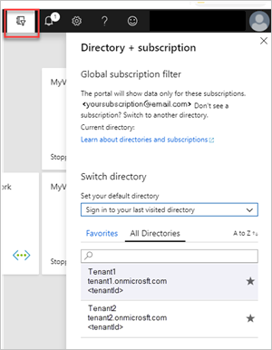
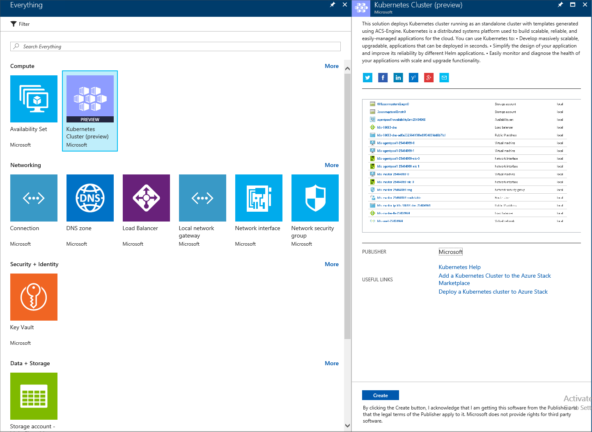
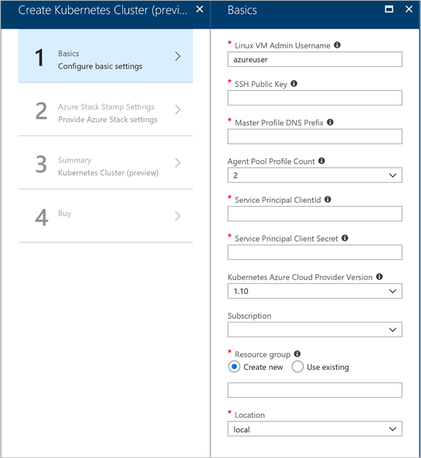
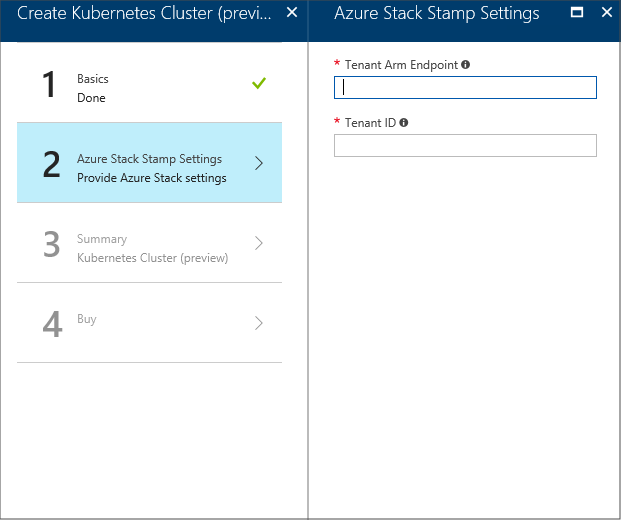
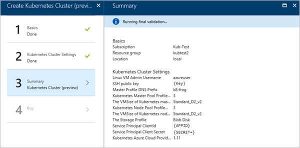

# Deploy Kubernetes to Azure Stack

*Applies to: Azure Stack integrated systems and Azure Stack Development Kit*

> [!Note]  
> Kubernetes on Azure Stack is in preview.

The following article looks at using an Azure Resource Manager solution template to deploy and provision the resources for Kubernetes in a single, coordinated operation. You will need to collect the required information about your Azure Stack installation, generate the template, and then deploy to your cloud. Note the template is not the same managed AKS service offered in global Azure.

## Kubernetes and containers

You can install Kubernetes using Azure Resource Manager templates generated by the ACS-Engine on Azure Stack. [Kubernetes](https://kubernetes.io) is an open-source system for automating deployment, scaling, and managing of applications in containers. A [container](https://www.docker.com/what-container) is contained in an image, similar to a VM. Unlike a VM, the container image just includes the resources it needs to run an application, such as the code, runtime to execute the code, specific libraries, and settings.

You can use Kubernetes to:

- Develop massively scalable, upgradable, applications that can be deployed in seconds. 
- Simplify the design of your application and improve its reliability by different Helm applications. [Helm](https://github.com/kubernetes/helm) is an open-source packaging tool that helps you install and manage the lifecycle of Kubernetes applications.
- Easily monitor and diagnose the health of your applications with scale and upgrade functionality.

You will only be charged for the compute usage required by the nodes supporting your cluster. For more information, see [Usage and billing in Azure Stack](https://docs.microsoft.com/azure/azure-stack/azure-stack-billing-and-chargeback).

## Prerequisites 

To get started, make sure you have the right permissions and that your Azure Stack is ready.

1. Verify that you can create applications in your Azure Active Directory (Azure AD) tenant. You need these permissions for the Kubernetes deployment.

    For instructions on checking your permissions, see [Check Azure Active Directory permissions](https://docs.microsoft.com/azure/azure-resource-manager/resource-group-create-service-principal-portal#check-azure-active-directory-permissions).

1. Generate an SSH public and private key pair to sign in to the Linux VM on Azure Stack. You will need the public key when creating the cluster.

    For instructions on generating a key, see [SSH Key Generation](https://github.com/msazurestackworkloads/acs-engine/blob/master/docs/ssh.md#ssh-key-generation).

1. Check that you have a valid subscription in your Azure Stack tenant portal, and that you have enough public IP addresses available to add new applications.

    The cluster cannot be deployed to an Azure Stack **Administrator** subscription. You must use a **User** subscription. 

1. If you do not have Kubernetes Cluster in your marketplace, talk to the administrator of Azure Stack.

## Create a service principal in Azure AD

1. Sign in to the global [Azure portal](http://portal.azure.com).

1. Check that you signed in using the Azure AD tenant associated with the Azure Stack instance. You can switch your sign-in by clicking the filter icon in the Azure toolbar.

    

1. Create an Azure AD application.

    a. Select **Azure Active Directory** > **+ App Registrations** > **New Application Registration**.

    b. Enter a **Name** of the application.

    c. Select **Web app / API**.

    d. Enter `http://localhost` for the **Sign-on URL**.

    c. Click **Create**.

1. Make note of the **Application ID**. You will need the ID when creating the cluster. The ID is referenced as **Service Principal Client ID**.

1. Select **Settings** > **Keys**.

    a. Enter the **Description**.

    b. Select **Never expires** for **Expires**.

    c. Select **Save**. Make note the key string. You will need the key string when creating the cluster. The key is referenced as the **Service Principal Client Secret**.

## Give the service principal access

Give the service principal access to your subscription so that the principal can create resources.

1.  Sign in to the [Azure Stack portal](https://portal.local.azurestack.external/).

1. Select **All services** > **Subscriptions**.

1. Select the subscription created by your operator for using the Kubernetes Cluster.

1. Select **Access control (IAM)** > Select **+ Add**.

1. Select the **Contributor** role.

1. Select the application name created for your service principal. You may have to type the name in the search box.

1. Click **Save**.

## Deploy a Kubernetes

1. Open the [Azure Stack portal](https://portal.local.azurestack.external).

1. Select **+ Create a resource** > **Compute** > **Kubernetes Cluster**. Click **Create**.

    

### 1. Basics

1. Select **Basics** in Create Kubernetes Cluster.

    

1. Select your **Subscription** ID.

1. Enter the name of a new resource group or select an existing resource group. The resource name needs to be alphanumeric and lowercase.

1. Select the **Location** of the resource group. This is the region you choose for your Azure Stack installation.

### 2. Kubernetes Cluster Settings

1. Select **Kubernetes Cluster Settings** in Create Kubernetes Cluster.

    

1. Enter the **Linux VM Admin Username**. User name for the Linux Virtual Machines that are part of the Kubernetes cluster and DVM.

1. Enter the **SSH Public Key** used for authorization to all Linux machines created as part of the Kubernetes cluster and DVM.

1. Enter the **Master Profile DNS Prefix** that is unique to the region. This must be a region-unique name, such as `k8s-12345`. Try to chose it same as the resource group name as best practice.

    > [!Note]  
    > For each cluster, use a new and unique master profile DNS prefix.

1. Select the **Kubernetes Master Pool Profile Count**. The count contains the number of nodes in the master pool. There can be from 1 to 7. This value should be an odd number.

1. Select **The VMSize of the Kubernetes master VMs**.

1. Select the **Kubernetes Node Pool Profile Count**. The count contains the number of agents in the cluster. 

1. Select the **Storage Profile**. You can choose **Blob Disk** or **Managed Disk**. This specifies the VM Size of Kubernetes node VMs. 

1. Enter the **Service Principal ClientId** This is used by the Kubernetes Azure cloud provider. The Client ID identified as the Application ID when your created your service principal.

1. Enter the **Service Principal Client Secret** that you created when creating your service principal.

1. Enter the **Kubernetes Azure Cloud Provider Version**. This is the version for the Kubernetes Azure provider. Azure Stack releases a custom Kubernetes build for each Azure Stack version.

### 3. Summary

1. Select Summary. The blade displays a validation message for your Kubernetes Cluster configurations settings.

    

2. Review your settings.

3. Select **OK** to deploy your cluster.

> [!TIP]  
>  If you have questions about your deployment, you can post your question or see if someone has already answered the question in the [Azure Stack Forum](https://social.msdn.microsoft.com/Forums/azure/home?forum=azurestack). 

## Connect to your cluster

You are now ready to connect to your cluster. The master can be found in your cluster resource group, and is named `k8s-master-<sequence-of-numbers>`. Use an SSH client to connect to the master. On the master, you can use **kubectl**, the Kubernetes command-line client to manage your cluster. For instructions, see [Kubernetes.io](https://kubernetes.io/docs/reference/kubectl/overview).

You may also find the **Helm** package manager useful for installing and deploying apps to your cluster. For instructions on installing and using Helm with your cluster, see [helm.sh](https://helm.sh/).

## Next steps

[Add a Kubernetes to the Marketplace (for the Azure Stack operator)](..\azure-stack-solution-template-kubernetes-cluster-add.md)

[Kubernetes on Azure](https://docs.microsoft.com/azure/container-service/kubernetes/container-service-kubernetes-walkthrough)
