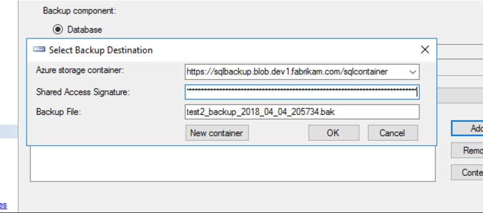

# Optimize SQL Server performance

This article provides guidance for optimizing SQL Server performance in Microsoft Azure Stack virtual machines. When running SQL Server in Azure Stack virtual machines, use the same database performance-tuning options applicable to SQL Server in an on-premises server environment. The performance of a relational database in an Azure Stack cloud depends on many factors. Factors include the family size of a virtual machine, and the configuration of the data disks.

When creating SQL Server images, [consider provisioning your virtual machines in the Azure Stack portal](https://docs.microsoft.com/azure/virtual-machines/windows/sql/virtual-machines-windows-portal-sql-server-provision). Download the SQL IaaS Extension from Marketplace Management in the Azure Stack Admin Portal and download your choice of SQL virtual machine virtual hard drives (VHDs). These include SQL2014SP2, SQL2016SP1, and SQL2017.

> [!NOTE]  
> While the article describes how to provision a SQL Server virtual machine using the global Azure portal, the guidance also applies to Azure Stack with the following differences: SSD is not available for the operating system disk, managed disks are not available, and there are minor differences in storage configuration.

Getting the *best* performance for SQL Server on Azure Stack virtual machines is the focus of this article. If your workload is less demanding, you might not require every recommended optimization. Consider your performance needs and workload patterns as you evaluate these recommendations.

> [!NOTE]  
> For performance guidance for SQL Server in Azure virtual machines, refer to [this article](https://docs.microsoft.com/azure/virtual-machines/windows/sql/virtual-machines-windows-sql-performance).

## Before you begin
The following checklist is for optimal performance of SQL Server on Azure Stack virtual machines:


|Area|Optimizations|
|-----|-----|
|Virtual machine size |[DS3](https://docs.microsoft.com/azure/azure-stack/user/azure-stack-vm-sizes) or higher for SQL Server Enterprise edition.<br><br>[DS2](https://docs.microsoft.com/azure/azure-stack/user/azure-stack-vm-sizes) or higher for SQL Server Standard edition and Web edition.|
|Storage |Use a virtual machine family that supports [Premium storage](https://docs.microsoft.com/azure/azure-stack/user/azure-stack-acs-differences).|
|Disks |Use a minimum of two data disks (one for log files and one for data file and TempDB), and choose the disk size based on your capacity needs. Set the default data file locations to these disks during the SQL Server install.<br><br>Avoid using operating system or temporary disks for database storage or logging.<br>Stripe multiple Azure data disks to get increased IO throughput using Storage Spaces.<br><br>Format with documented allocation sizes.|
|I/O|Enable instant file initialization for data files.<br><br>Limit autogrow on the databases with reasonably small fixed increments (64 MB-256 MB).<br><br>Disable autoshrink on the database.<br><br>Set up default backup and database file locations on data disks, not the operating system disk.<br><br>Enable locked pages.<br><br>Apply SQL Server service packs and cumulative updates.|
|Feature-specific|Back up directly to blob storage (if supported by the SQL Server version in use).|
|||

For more information on *how* and *why* to make these optimizations, please review the details and guidance provided in the following sections.

## Virtual machine size guidance

For performance-sensitive applications, the following [virtual machine sizes](https://docs.microsoft.com/azure/azure-stack/user/azure-stack-vm-sizes) are recommended:

- **SQL Server Enterprise edition:** DS3 or higher

- **SQL Server Standard edition and Web edition:** DS2 or higher

With Azure Stack there is no performance difference between the DS and DS_v2 virtual machine family series.

## Storage guidance

DS-series (along with DSv2-series) virtual machines in Azure Stack provide the maximum operating system disk and data disk throughput (IOPS). A virtual machine from the DS or DSv2 series provides up to 1,000 IOPS for the operating system disk and up to 2,300 IOPS per data disk, no matter the type or size of the chosen disk.

Data disk throughput is determined uniquely based on the virtual machine family series. You can [refer to this article](https://docs.microsoft.com/azure/azure-stack/user/azure-stack-vm-sizes) to identify the data disk throughput per virtual machine family series.

> [!NOTE]  
> For production workloads, select a DS-series or DSv2-series virtual machine to provide the maximum possible IOPS on the operating system disk and data disks.

When creating a storage account in Azure Stack, the geo-replication option has no effect because this capability is not available in Azure Stack.

## Disks guidance

There are three main disk types on an Azure Stack virtual machine:

- **Operating system disk:** When you create an Azure Stack virtual machine, the platform attaches at least one disk (labeled as the **C** drive) to the virtual machine for your operating system disk. This disk is a VHD stored as a page blob in storage.

- **Temporary disk:** Azure Stack virtual machines contain another disk called the temporary disk (labeled as the **D** drive). This is a disk on the node that can be used for scratch space.

- **Data disks:** You can attach additional disks to your virtual machine as data disks, and these disks are stored in storage as page blobs.

The following sections describe recommendations for using these different disks.

### Operating system disk

An operating system disk is a VHD that you can boot and mount as a running version of an operating system and is labeled as **C** drive.

### Temporary disk

The temporary storage drive, labeled as the **D** drive, is not persisted. Do not store any data you are unwilling to lose, such as your user database files or user transaction log files, on the **D** drive.

We recommend storing TempDB on a data disk as each data disk provides a maximum of up to 2,300 IOPS per data disk.

### Data disks

- **Use data disks for data and log files.** If you are not using disk striping, use two data disks from a virtual machine that supports Premium storage, where one disk contains the log files and the other contains the data and TempDB files. Each data disk provides a number of IOPS and bandwidth (MB/s) depending on the virtual machine family, as described in [Virtual machine sizes supported in Azure Stack](https://docs.microsoft.com/azure/azure-stack/user/azure-stack-vm-sizes). If you are using a disk-striping technique, such as Storage Spaces, place all data and log files on the same drive (including TempDB). This configuration gives you the maximum number of IOPS available for SQL Server to consume, no matter which file needs them at any particular time.

> [!NOTE]  
> When you provision a SQL Server virtual machine in the portal, you have the option of editing your storage configuration. Depending on your configuration, Azure Stack configures one or more disks. Multiple disks are combined into a single storage pool. Both the data and log files reside together in this configuration.

- **Disk striping:** For more throughput, you can add additional data disks and use disk striping. To determine the number of data disks you need, analyze the number of IOPS and bandwidth required for your log files and for your data and TempDB files. Notice that IOPS limits are per data disk based on the virtual machine series family, and not based on the virtual machine size. Network bandwidth limits, however, are based on the virtual machine size. See the tables on [Virtual machine sizes in Azure Stack](https://docs.microsoft.com/azure/azure-stack/user/azure-stack-vm-sizes) for more detail. Use the following guidelines:

    - For Windows Server 2012 or later, use [Storage Spaces](https://technet.microsoft.com/library/hh831739.aspx) with the following guidelines:

        1.  Set the interleave (stripe size) to 64 KB (65,536 bytes) for online transaction processing (OLTP) workloads and 256 KB (262,144 bytes) for data warehousing workloads to avoid performance impact due to partition misalignment. This must be set with PowerShell.

        2.  Set column count = number of physical disks. Use PowerShell when configuring more than eight disks (not Server Manager UI).

            For example, the following PowerShell creates a new storage pool with the interleave size set to 64 KB and the number of columns to 2:

          ```PowerShell  
          $PoolCount = Get-PhysicalDisk -CanPool $True
          $PhysicalDisks = Get-PhysicalDisk | Where-Object {$_.FriendlyName -like "*2" -or $_.FriendlyName -like "*3"}

          New-StoragePool -FriendlyName "DataFiles" -StorageSubsystemFriendlyName "Storage Spaces*" -PhysicalDisks $PhysicalDisks | New-VirtualDisk -FriendlyName "DataFiles" -Interleave 65536 -NumberOfColumns 2 -ResiliencySettingName simple –UseMaximumSize |Initialize-Disk -PartitionStyle GPT -PassThru |New-Partition -AssignDriveLetter -UseMaximumSize |Format-Volume -FileSystem NTFS -NewFileSystemLabel "DataDisks" -AllocationUnitSize 65536 -Confirm:$false
          ```

- Determine the number of disks associated with your storage pool based on your load expectations. Keep in mind that different virtual machine sizes allow different numbers of attached data disks. For more information, see [Virtual machine sizes supported in Azure Stack](https://docs.microsoft.com/azure/azure-stack/user/azure-stack-vm-sizes).
- In order to get the maximum possible IOPS for data disks, the recommendation is to add the maximum number of data disks supported by your [virtual machine size](https://docs.microsoft.com/azure/azure-stack/user/azure-stack-vm-sizes) and use disk striping.
- **NTFS allocation unit size:** When formatting the data disk, it is recommended that you use a 64-KB allocation unit size for data and log files as well as TempDB.
- **Disk management practices:** When removing a data disk, stop the SQL Server service during the change. Also, don't change cache settings on the disks as it doesn't provide any performance improvements.

> [!WARNING]  
> Failure to stop the SQL Service during these operations can cause database corruption.

## I/O guidance

- Consider enabling instant file initialization to reduce the time that is required for initial file allocation. To take advantage of instant file initialization, you grant the SQL Server (MSSQLSERVER) service account with **SE_MANAGE_VOLUME_NAME** and add it to the **Perform Volume Maintenance Tasks** security policy. If you are using a SQL Server platform image for Azure, the default service account (**NT Service\MSSQLSERVER**) isn’t added to the **Perform Volume Maintenance Tasks** security policy. In other words, instant file initialization is not enabled in a SQL Server Azure platform image. After adding the SQL Server service account to the **Perform Volume Maintenance Tasks** security policy, restart the SQL Server service. There could be security considerations for using this feature. For more information, see [Database File Initialization](https://msdn.microsoft.com/library/ms175935.aspx).
- **Autogrow** is a contingency for unexpected growth. Do not manage your data and log growth on a day-to-day basis with autogrow. If autogrow is used, pre-grow the file using the **Size** switch.
- Make sure **autoshrink** is disabled to avoid unnecessary overhead that can negatively affect performance.
- Setup default backup and database file locations. Use the recommendations in this article and make the changes in the Server properties window. For instructions, see [View or Change the Default Locations for Data and Log Files (SQL Server Management Studio)](https://msdn.microsoft.com/library/dd206993.aspx). The following screenshot demonstrates where to make these changes:

    > 

- Enable locked pages to reduce IO and any paging activities. For more information, see [Enable the Lock Pages in Memory Option (Windows)](https://msdn.microsoft.com/library/ms190730.aspx).

- Consider compressing any data files when transferring in/out of Azure Stack, including backups.

## Feature-specific guidance

Some deployments may achieve additional performance benefits using more advanced configuration techniques. The following list highlights some SQL Server features that may help you achieve better performance:

- **Back up to Azure** **storage.** When performing backups for SQL Server running in Azure Stack virtual machines, you can use SQL Server Backup to URL. This feature is available starting with SQL Server 2012 SP1 CU2 and recommended for backing up to the attached data disks.

    When your backup or restore using Azure storage, follow the recommendations provided in [SQL Server Backup to URL Best Practices and Troubleshooting](https://msdn.microsoft.com/library/jj919149.aspx) and [Restoring From Backups Stored in Microsoft Azure](https://docs.microsoft.com/sql/relational-databases/backup-restore/restoring-from-backups-stored-in-microsoft-azure?view=sql-server-2017). You can also automate these backups using [Automated Backup for SQL Server in Azure Virtual Machines](https://docs.microsoft.com/azure/virtual-machines/windows/sql/virtual-machines-windows-sql-automated-backup).

-   **Back up to Azure Stack storage.** You can back up to Azure Stack storage in a similar fashion as with backing up to Azure Storage. When you create a backup inside SQL Server Management Studio (SSMS), you need to enter the configuration information manually. You cannot use SSMS to create the storage container or the Shared Access Signature. SSMS only connects to Azure subscriptions, not Azure Stack subscriptions. Instead, you need to create the storage account, container, and Shared Access Signature in the Azure Stack portal or with PowerShell.

    When you place the information into the SQL Server Backup dialog:

    

    > [!NOTE]  
    > The Shared Access Signature is the SAS token from the Azure Stack portal, without the leading ‘?’ in the string. If you use the copy function from the portal, you need to delete the leading ‘?’ for the token to work within SQL Server.

    Once you have the Backup Destination set up and configured in SQL Server, you can then back up to the Azure Stack blob storage.

## Next steps

[Using services or building apps for Azure Stack](azure-stack-considerations.md)