# Connect storage explorer to an Azure Stack subscription or a storage account

*Applies to: Azure Stack integrated systems and Azure Stack Development Kit*

In this article, you'll learn how to connect to your Azure Stack subscriptions and storage accounts using storage explorer. Azure storage explorer is a standalone app that enables you to easily work with Azure Stack storage data on Windows, macOS, and Linux.

> [!NOTE]  
> There are several tools available to move data to and from Azure Stack storage. For more information, see [Data transfer tools for Azure Stack storage](azure-stack-storage-transfer.md).

If you haven't installed storage explorer yet, [download storage explorer](http://www.storageexplorer.com/) and install it.

After you connect to an Azure Stack subscription or a storage account, you can use the [Azure storage explorer articles](../../vs-azure-tools-storage-manage-with-storage-explorer.md) to work with your Azure Stack data. 

## Prepare for connecting to Azure Stack

You need direct access to the Azure Stack or a VPN connection for storage explorer to access the Azure Stack subscription. To learn how to set up a VPN connection to Azure Stack, see [Connect to Azure Stack with VPN](azure-stack-connect-azure-stack.md#connect-to-azure-stack-with-vpn).

For the Azure Stack Development Kit, you need to export the Azure Stack authority root certificate.

### Export and then import the Azure Stack certificate

1. Open `mmc.exe` on an Azure Stack host machine, or a local machine with a VPN connection to Azure Stack. 

2. In **File**, select **Add/Remove Snap-in**, and then add **Certificates** to manage **My user account**.

3. Under **Console Root\Certificated (Local Computer)\Trusted Root Certification Authorities\Certificates** find **AzureStackSelfSignedRootCert**.

    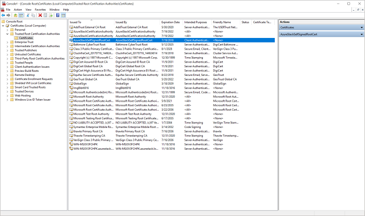

4. Right-click the certificate, select **All Tasks** > **Export**, and then follow the instructions to export the certificate with **Base-64 encoded X.509 (.CER)**.

    The exported certificate will be used in the next step.

5. Start storage explorer, and if you see the **Connect to Azure Storage** dialog box, cancel it.

6. On the **Edit** menu, point to **SSL Certificates**, and then select **Import Certificates**. Use the file picker dialog box to find and open the certificate that you exported in the previous step.

    After importing the certificate, you're prompted to restart storage explorer.

    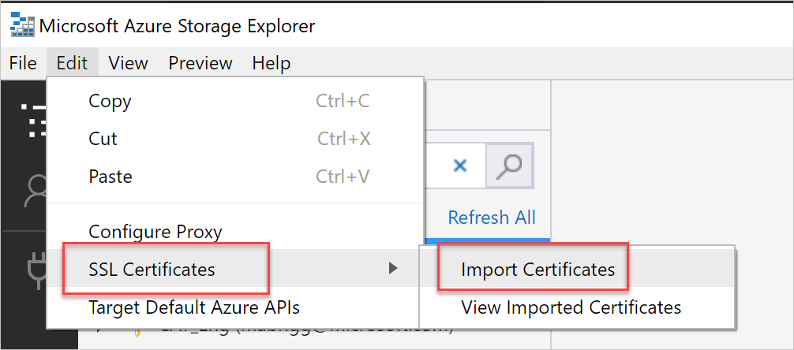

7. After storage explorer restarts, select the **Edit** menu, and check to see if **Target Azure Stack** is selected. If it isn't, select **Target Azure Stack**, and then restart storage explorer for the change to take effect. This configuration is required for compatibility with your Azure Stack environment.

    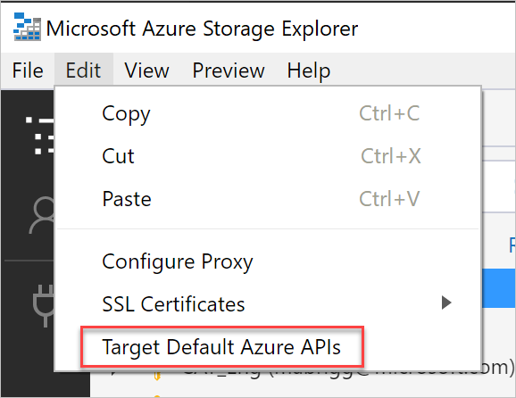

## Connect to an Azure Stack subscription with Azure AD

Use the following steps to connect storage explorer to an Azure Stack subscription, which belongs to an Azure Active Directory (Azure AD) account.

1. In the left pane of storage explorer, select **Manage Accounts**. 
    All the Microsoft subscription that you signed in are displayed.

2. To connect to the Azure Stack subscription, select **Add an account**.

    

3. In the Connect to Azure Storage dialog box, under **Azure environment**, select **Azure** or **Azure China**, which depends on the Azure Stack account that is being used, select **Sign in** to sign in with the Azure Stack account associated with at least one active Azure Stack subscription.

    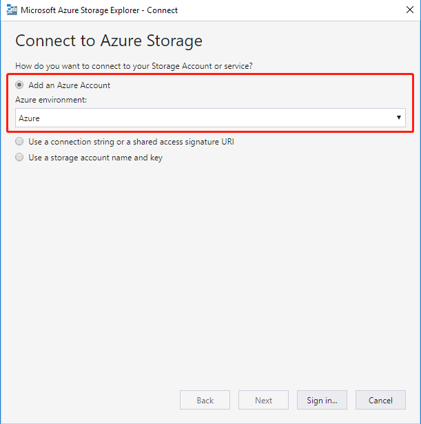

4. After you successfully sign in with an Azure Stack account, the left pane is populated with the Azure Stack subscriptions associated with that account. Select the Azure Stack subscriptions that you want to work with, and then select **Apply**. (Selecting or clearing the **All subscriptions** check box toggles selecting all or none of the listed Azure Stack subscriptions.)

    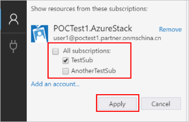

    The left pane displays the storage accounts associated with the selected Azure Stack subscriptions.

    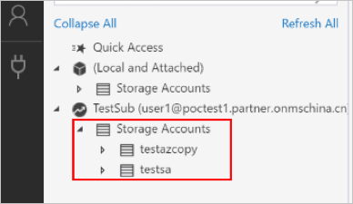

## Connect to an Azure Stack subscription with AD FS account

> [!Note]  
> The Azure Federated Service (AD FS) sign-in experience supports Storage Explorer 1.2.0 or newer versions with Azure Stack 1804 or newer update.
Use the following steps to connect storage explorer to an Azure Stack subscription which belongs to an AD FS account.

1. Select **Manage Accounts**. The explorer lists the Microsoft subscriptions that you signed in to.
2. Select **Add an account** to connect to the Azure Stack subscription.

    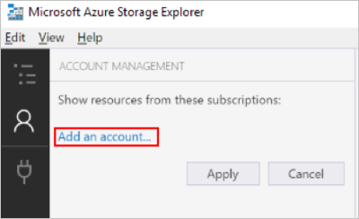

3. Select **Next**. In the Connect to Azure Storage dialog box, under **Azure environment**, select **Use Custom Environment**, then click **Next**.

    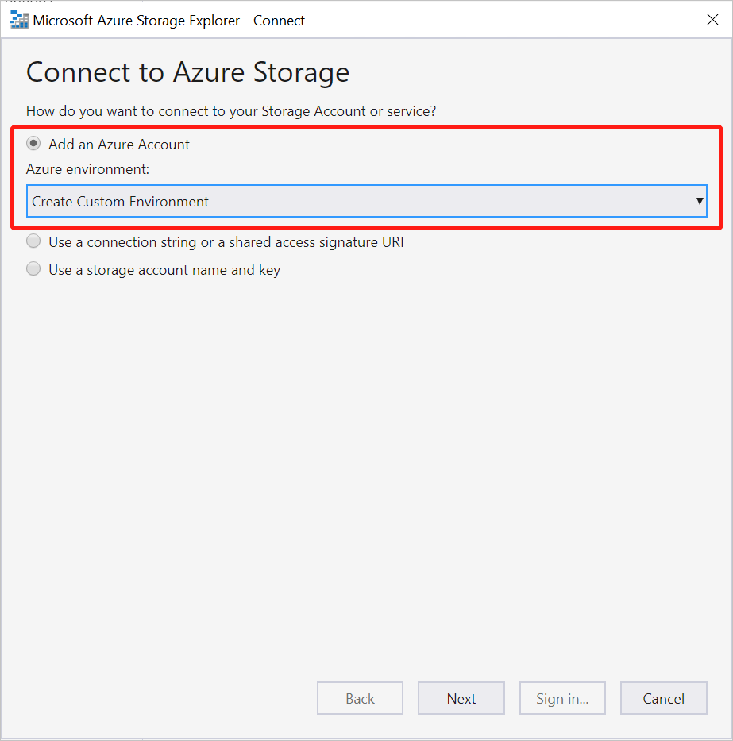

4. Enter the required information of Azure Stack custom environment. 

    | Field | Notes |
    | ---   | ---   |
    | Environment name | The field can be customized by user. |
    | Azure Resource Manager endpoint | The samples of Azure Resource Manager resource endpoints of Azure Stack Development Kit. For operators: https://adminmanagement.local.azurestack.external   For users: https://management.local.azurestack.external |

    If you are working on Azure Stack integrated system and don't know your management endpoint, contact your operator.

    

5. Select **Sign in**, to connect to the Azure Stack account that associated with at least one active Azure Stack subscription.

6. Select the Azure Stack subscriptions that you want to work with. Select **Apply**.

    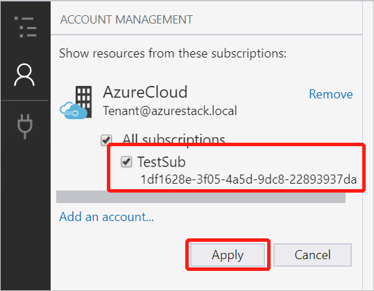

    The left pane displays the storage accounts associated with the selected Azure Stack subscriptions.

    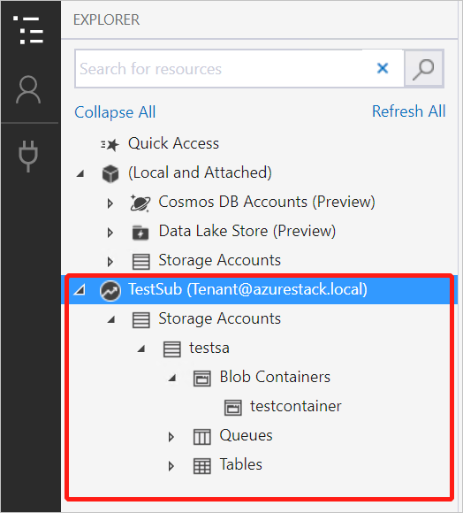

## Connect to an Azure Stack storage account

You can also connect to an Azure Stack storage account using storage account name and key pair.

1. In the left pane of storage explorer, select Manage Accounts. All the Microsoft accounts that you signed in are displayed.

    

2. To connect to the Azure Stack subscription, select **Add an account**.

    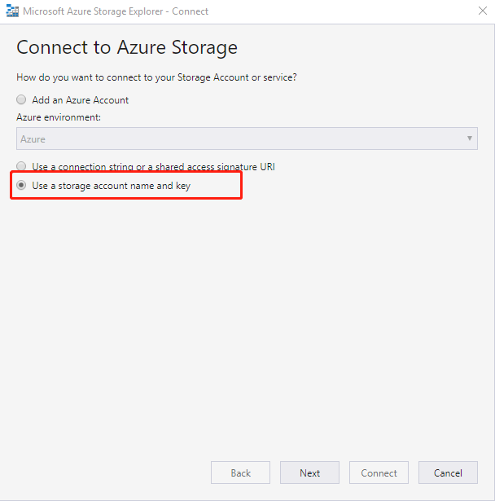

3. In the Connect to Azure Storage dialog box, select **Use a storage account name and key**.

4. Input your account name in the **Account name**, paste account key into the **Account key** text box, select **Other (enter below)** in **Storage endpoints domain** and input the Azure Stack endpoint.

    An Azure Stack endpoint includes two parts: the name of a region and the Azure Stack domain. In the Azure Stack Development Kit, the default endpoint is **local.azurestack.external**. Contact your cloud administrator if you’re not sure about your endpoint.

    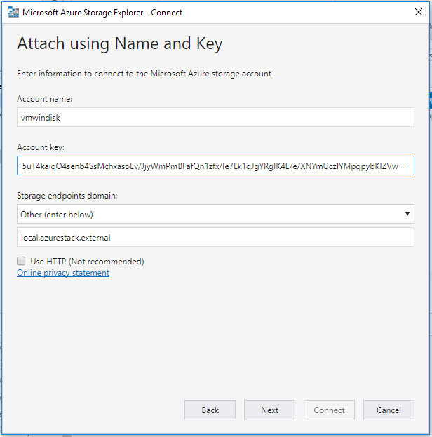

5. Select **Connect**.
6. After the storage account is successfully attached, the storage account is displayed with (**External, Other**) appended to its name.

    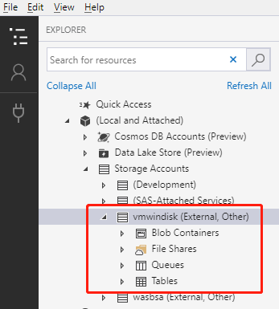

## Next steps

* [Get started with storage explorer](../../vs-azure-tools-storage-manage-with-storage-explorer.md)
* [Azure Stack storage: differences and considerations](azure-stack-acs-differences.md)
* To learn more about Azure storage, see [Introduction to Microsoft Azure storage](../../storage/common/storage-introduction.md)
