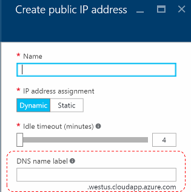

# Introducing iDNS for Azure Stack

*Applies to: Azure Stack integrated systems and Azure Stack Development Kit*

iDNS is an Azure Stack networking feature that enables you to resolve external DNS names (for example, http://www.bing.com.) It also allows you to register internal virtual network names. By doing so, you can resolve VMs on the same virtual network by name rather than IP address. This approach removes the need to provide custom DNS server entries. for more information about DNS, see the [Azure DNS Overview](https://docs.microsoft.com/azure/dns/dns-overview).

## What does iDNS do?

With iDNS in Azure Stack, you get the following capabilities, without having to specify custom DNS server entries:

- Shared DNS name resolution services for tenant workloads.
- Authoritative DNS service for name resolution and DNS registration within the tenant virtual network.
- Recursive DNS service for resolution of Internet names from tenant VMs. Tenants no longer need to specify custom DNS entries to resolve Internet names (for example, www.bing.com.)

You can still bring your own DNS and use custom DNS servers. However, by using iDNS, you can resolve Internet DNS names and connect to other VMs in the same virtual network, you don’t need to create custom DNS entries.

## What doesn't iDNS do?

What iDNS does not allow you to do, is create a
DNS record for a name that can be resolved from outside the virtual network.

In Azure, you have the option of specifying a DNS name label that is associated with a public IP address. You can choose the label (prefix), but Azure chooses the suffix, which is based on the region in which you create the public IP address.

As the previous image shows, Azure will create an “A” record in DNS for the DNS name label specified under the zone **westus.cloudapp.azure.com**. The prefix and the suffix are combined to compose a [fully qualified domain name](https://en.wikipedia.org/wiki/Fully_qualified_domain_name) (FQDN) that can be resolved from anywhere on the public Internet.

Azure Stack only supports iDNS for internal name
registration, so it cannot do the following:

- Create a DNS record under an existing hosted DNS zone (for example, local.azurestack.external.)
- Create a DNS zone (such as Contoso.com.)
- Create a record under your own custom DNS zone.
- Support the purchase of domain names.

## Next steps

[Using DNS in Azure Stack](azure-stack-dns.md)
